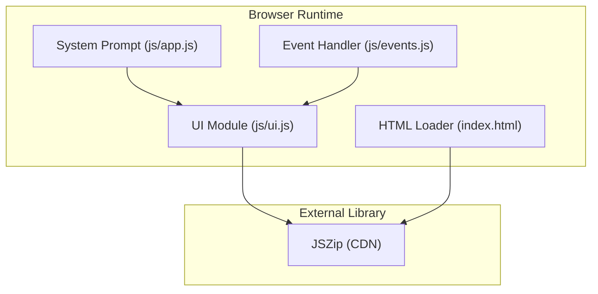
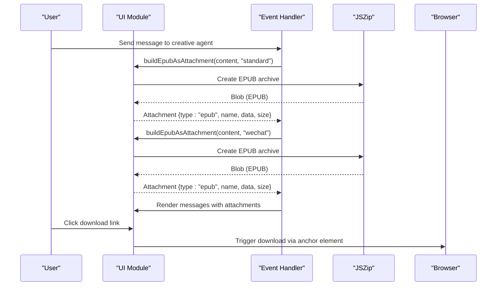
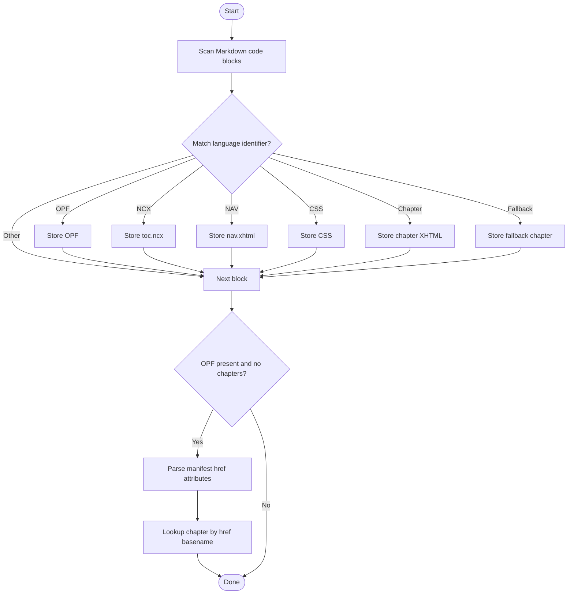
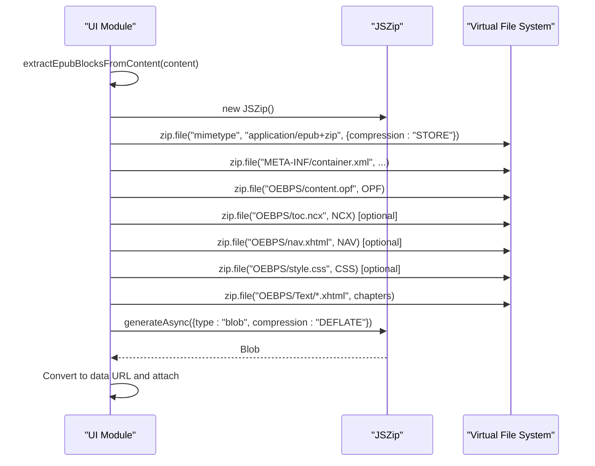
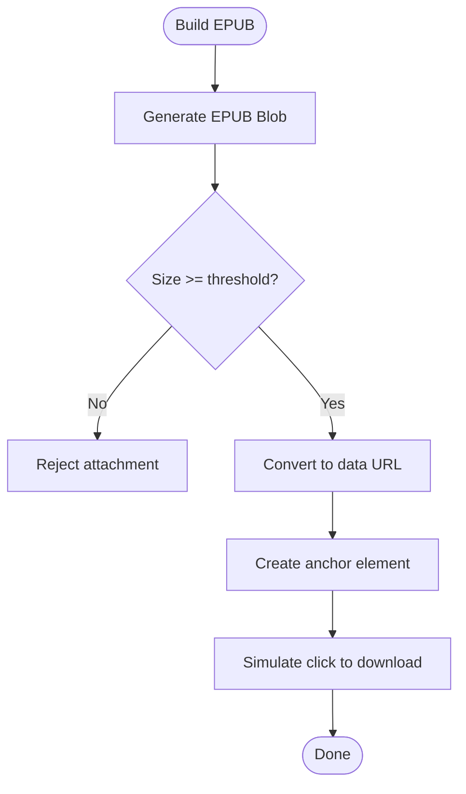
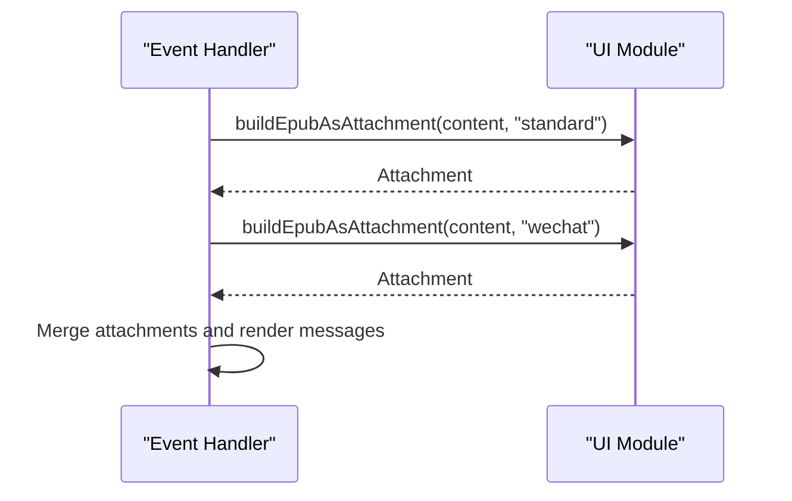
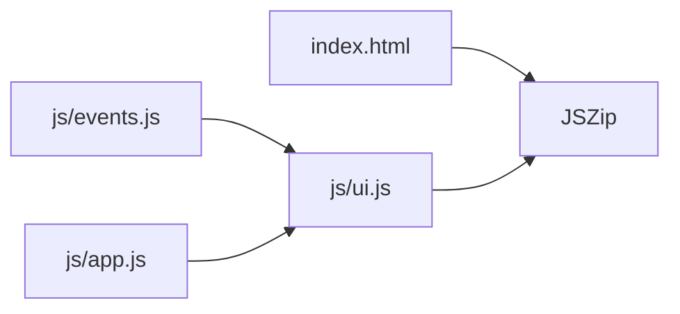

# EPUB Generation & Export

<cite>
**Referenced Files in This Document**
- [index.html](file://index.html)
- [ui.js](file://js/ui.js)
- [events.js](file://js/events.js)
- [app.js](file://js/app.js)
</cite>

## Table of Contents
1. [Introduction](#introduction)
2. [Project Structure](#project-structure)
3. [Core Components](#core-components)
4. [Architecture Overview](#architecture-overview)
5. [Detailed Component Analysis](#detailed-component-analysis)
6. [Dependency Analysis](#dependency-analysis)
7. [Performance Considerations](#performance-considerations)
8. [Troubleshooting Guide](#troubleshooting-guide)
9. [Conclusion](#conclusion)
10. [Appendices](#appendices)

## Introduction
This document describes the EPUB generation and export system implemented in the project. It covers:
- Content parsing to extract EPUB blocks (OPF, NCX/NAV, CSS, XHTML chapters)
- ZIP packaging using JSZip to produce EPUB files
- Metadata and mimetype handling
- Standard EPUB versus WeChat-specific variants
- Attachment creation, file size validation, and download functionality
- API documentation for the key functions: extractEpubBlocksFromContent(), buildEpubAsAttachment(), and downloadEpubAttachment()

## Project Structure
The EPUB pipeline spans several modules:
- UI rendering and EPUB utilities live in js/ui.js
- Event orchestration and automatic EPUB attachment creation live in js/events.js
- EPUB output specifications and platform guidance live in js/app.js
- JSZip library is loaded via index.html

**Diagram sources**
- [index.html:740](file://index.html#L740)
- [ui.js:536](file://js/ui.js#L536)
- [events.js:1158](file://js/events.js#L1158)

**Section sources**
- [index.html:740](file://index.html#L740)
- [ui.js:536](file://js/ui.js#L536)
- [events.js:1158](file://js/events.js#L1158)

## Core Components
- EPUB block extraction algorithm: Parses Markdown code blocks to identify OPF, NCX/NAV, CSS, and XHTML chapters
- EPUB builder: Uses JSZip to assemble mimetype, container.xml, and all EPUB files into a downloadable EPUB attachment
- Download handler: Creates a temporary anchor element to trigger browser downloads
- Automatic EPUB attachment creation: When the creative agent produces EPUB-ready content, the system generates both standard and WeChat variants

Key APIs:
- extractEpubBlocksFromContent(content): Extracts EPUB components from a message’s content
- buildEpubAsAttachment(content, epubType): Builds an EPUB attachment (standard or WeChat)
- downloadEpubAttachment(dataUrl, filename): Triggers download of an EPUB attachment

**Section sources**
- [ui.js:536](file://js/ui.js#L536)
- [ui.js:592](file://js/ui.js#L592)
- [ui.js:646](file://js/ui.js#L646)
- [events.js:1158](file://js/events.js#L1158)

## Architecture Overview
The EPUB generation workflow integrates with the messaging UI and event handlers. When the creative agent responds with EPUB-ready content, the system automatically builds two EPUB attachments (standard and WeChat) and attaches them to the message for user download.

**Diagram sources**
- [events.js:1158](file://js/events.js#L1158)
- [ui.js:592](file://js/ui.js#L592)
- [ui.js:646](file://js/ui.js#L646)

## Detailed Component Analysis

### EPUB Block Extraction Algorithm
The extractor identifies EPUB components by scanning Markdown code blocks and matching language identifiers and content patterns:
- OPF: Matches content.opf or opf blocks containing XML package metadata
- NCX: toc.ncx blocks for EPUB 2
- NAV: nav.xhtml or nav blocks for EPUB 3
- CSS: style.css or css blocks
- XHTML chapters: chapter-NN.xhtml, appendix-NN.xhtml, copyright.xhtml, or generic xhtml blocks
- **H5/Promotion exclusion (v8.4.3)**: Blocks with promotion/H5 content (推广简介, 推广页, viewport, 响应式单页, etc.) are excluded from EPUB chapters; they are rendered as standalone .html deliverables
- Fallback: If OPF is present but no chapters were matched, attempts to locate chapter files by parsing href attributes in the OPF manifest

### XHTML Structure Normalization (v8.4.3)
Before adding XHTML files to the EPUB archive, `ensureXhtmlStructure()` normalizes each chapter and nav.xhtml:
- Removes BOM
- Ensures `<?xml version="1.0" encoding="UTF-8"?>` declaration
- Ensures `<!DOCTYPE html>` when missing
- Improves EPUB reader compatibility

**Diagram sources**
- [ui.js:536](file://js/ui.js#L536)

**Section sources**
- [ui.js:536](file://js/ui.js#L536)

### EPUB Builder and ZIP Packaging
The builder performs the following steps:
- Validates presence of OPF and at least one chapter
- Initializes a JSZip instance
- Adds mimetype (stored compression) and META-INF/container.xml
- Adds OPF, NCX/NAV, CSS, and all chapter files under OEBPS or OEBPS/Text
- Generates a compressed EPUB blob
- Validates minimum file size and converts to a data URL for attachment

**Diagram sources**
- [ui.js:592](file://js/ui.js#L592)

**Section sources**
- [ui.js:592](file://js/ui.js#L592)

### Download Attachment Creation and Validation
- Size validation: EPUBs smaller than a threshold are rejected
- Data URL conversion: Uses FileReader to convert the generated blob to a data URL
- Download trigger: Creates a temporary anchor element and simulates a click to initiate download

**Diagram sources**
- [ui.js:625](file://js/ui.js#L625)
- [ui.js:646](file://js/ui.js#L646)

**Section sources**
- [ui.js:625](file://js/ui.js#L625)
- [ui.js:646](file://js/ui.js#L646)

### Automatic EPUB Attachment Creation in Events
When the creative agent responds with EPUB-ready content, the system automatically:
- Builds a standard EPUB attachment
- Builds a WeChat-specific EPUB attachment
- Attaches both to the message and re-renders the UI

**Diagram sources**
- [events.js:1158](file://js/events.js#L1158)

**Section sources**
- [events.js:1158](file://js/events.js#L1158)

### API Documentation

#### extractEpubBlocksFromContent(content)
- Purpose: Parse a message’s content and extract EPUB components into a structured object
- Parameters:
  - content: string, the message content to parse
- Returns:
  - object with keys: opf, toc, nav, css, chapters (Record<string, string>)
- Behavior:
  - Scans Markdown code blocks and matches language identifiers and content patterns
  - Supports fallback parsing from OPF manifest href attributes when no chapters are found
- Complexity:
  - Time: O(n) over content length plus regex scans
  - Space: O(k) for extracted blocks where k is number of blocks

**Section sources**
- [ui.js:536](file://js/ui.js#L536)

#### buildEpubAsAttachment(content, epubType)
- Purpose: Build an EPUB attachment from extracted blocks
- Parameters:
  - content: string, the message content
  - epubType: "standard" | "wechat", selects variant naming
- Returns:
  - Promise resolving to an attachment object { type, name, data, size } or null
- Behavior:
  - Validates JSZip availability
  - Calls extractEpubBlocksFromContent
  - Creates mimetype and container.xml
  - Adds OPF, NCX/NAV/CSS, and chapters
  - Generates EPUB blob, validates size, converts to data URL
- Notes:
  - WeChat variant appends a suffix to the filename
  - Minimum file size enforced before attachment creation

**Section sources**
- [ui.js:592](file://js/ui.js#L592)

#### downloadEpubAttachment(dataUrl, filename)
- Purpose: Trigger browser download of an EPUB attachment
- Parameters:
  - dataUrl: string, base64 data URL of the EPUB
  - filename: string, desired filename (defaults to "电子书.epub")
- Behavior:
  - Creates a temporary anchor element and triggers a click to download

**Section sources**
- [ui.js:646](file://js/ui.js#L646)

## Dependency Analysis
- JSZip dependency: Loaded from CDN in index.html and used by the UI module to create EPUB archives
- Event orchestration: The events module invokes the UI EPUB builder and attaches results to messages
- Output specifications: The app module defines EPUB structure expectations and platform guidance

**Diagram sources**
- [index.html:740](file://index.html#L740)
- [ui.js:592](file://js/ui.js#L592)
- [events.js:1158](file://js/events.js#L1158)

**Section sources**
- [index.html:740](file://index.html#L740)
- [ui.js:592](file://js/ui.js#L592)
- [events.js:1158](file://js/events.js#L1158)

## Performance Considerations
- JSZip compression: Uses DEFLATE compression for EPUB blobs; consider memory usage for large chapters
- File size validation: Prevents creation of tiny EPUBs, reducing unnecessary network overhead
- Data URL conversion: FileReader is synchronous in callbacks; keep EPUB sizes reasonable to avoid UI blocking
- Regex scanning: Extraction algorithm iterates through code blocks; ensure content is not excessively fragmented

## Troubleshooting Guide
Common issues and resolutions:
- Missing JSZip: The builder returns null if JSZip is unavailable; ensure CDN loading succeeds
- Missing OPF or chapters: The builder returns null if OPF is absent or no chapters are found; verify content structure
- EPUB too small: If the generated EPUB is below the minimum size, the builder rejects it; increase content volume
- Download fails: Verify the data URL is valid and the anchor element click is triggered; check browser download permissions

**Section sources**
- [ui.js:594](file://js/ui.js#L594)
- [ui.js:596](file://js/ui.js#L596)
- [ui.js:627](file://js/ui.js#L627)
- [ui.js:646](file://js/ui.js#L646)

## Conclusion
The EPUB generation system provides a robust pipeline for extracting EPUB components from AI-generated content, packaging them into EPUB archives via JSZip, and offering both standard and WeChat-specific variants. The automatic attachment creation and download mechanism integrate seamlessly with the messaging UI, enabling users to quickly export and share EPUBs.

## Appendices

### EPUB Content Structure and Template Guidance
- OPF: Must include metadata, manifest entries, and spine order
- Chapters: XHTML files with complete HTML structure; each chapter is a separate file
- NCX/NAV: Choose NCX for EPUB 2 or NAV for EPUB 3
- CSS: Optional styling file
- Mimetype: application/epub+zip

These guidelines are embedded in the system prompts and enforced during EPUB building.

**Section sources**
- [app.js:1715](file://js/app.js#L1715)
- [app.js:1726](file://js/app.js#L1726)
- [app.js:1728](file://js/app.js#L1728)