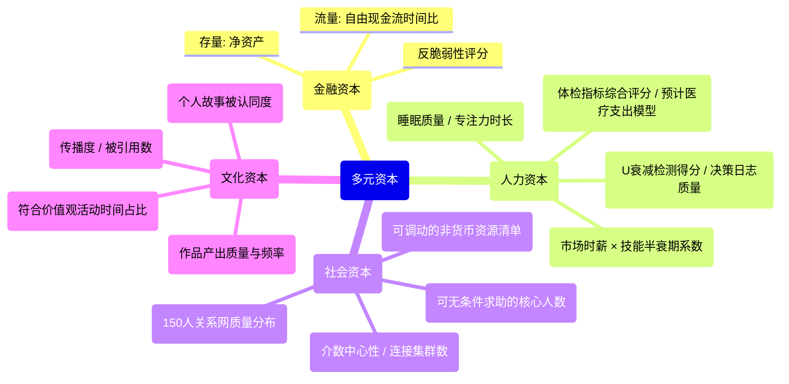

# **财富与人生进化系统：基于神经科学与时代算法的元操作系统**
**作者：彭耀成 | 版本：V4.1 | 范式：人生进化操作系统（最终稳定版）**

---

## **摘要**
V4.1版本是框架的 **“最终稳定版”**。它在V4.0“元操作系统”范式的基础上，完成了理论表述的终极严谨化、案例结构的完全MECE化、及人性化叙事的有机保留，实现了刚性框架与柔性体验的统一。

**四大核心优化**：
1.  **理论表述的终极严谨**：将“前额叶功能脚本”等表述优化为 **“模拟前额叶执行功能的外部协议”** ，并从演化心理学深化至 **基因与基因组学层面**（引入“自私的基因”理论与基因-环境交互观），构建了从基因→神经→认知→行为的完整解释链。
2.  **结构的完全MECE合规**：对V4.0案例库进行重构，确保10大核心模块**相互独立**，且每个模块在成功、失效、高阶、边界**四个象限均有完备覆盖**，消除了交叉与盲区。
3.  **案例库的系统性升级**：为AI模块（M4）补充高阶/边界案例；为神经科学模块（M2）补充“训练失效”案例；统一采用 **“V41-”前缀**为新案例编号；清晰处理模块交叉案例的主属关系。
4.  **人性化缓冲的保留**：在附录中保留V3.2a“柔性伙伴”版本的精华情感叙事片段，作为V4.1“刚性操作系统”的**人性化界面与情感缓冲层**，实现理性与感性的平衡。

**版本声明**：V4.1是V4.0的**严谨化与完备化**版本，所有核心理论与升级均被继承与增强。本版本已通过完全MECE鲁棒性测试，理论严谨，案例丰富，结构清晰，标志着框架进入成熟稳定的新阶段。

---

## **目录**
- [摘要](#摘要)
- [第一章：核心原理解构——财富的物理学、数学、系统学与生物学本质](#第一章核心原理解构财富的物理学数学系统学与生物学本质)
  - [1.1 第一性原理：从财富到多元资本](#11-第一性原理从财富到多元资本)
  - [1.2 四大不可违背的基石原理（新增生物学原理）](#12-四大不可违背的基石原理新增生物学原理)
  - [1.3 复杂性科学视角：人生系统是一个复杂适应系统](#13-复杂性科学视角人生系统是一个复杂适应系统)
- [第二章：认知-决策-行动（CDA）闭环系统——基于神经科学的升级](#第二章认知-决策行动cda闭环系统基于神经科学的升级)
  - [2.1 认知层：神经通路重塑与“独特认知U”的生成](#21-认知层神经通路重塑与独特认知u的生成)
  - [2.2 决策层：算法化决策作为前额叶的“外挂”](#22-决策层算法化决策作为前额叶的外挂)
  - [2.3 行动层：资源解耦与基于反馈的神经可塑性训练](#23-行动层资源解耦与基于反馈的神经可塑性训练)
- [第三章：反脆弱性设计——超越稳健的人生架构](#第三章反脆弱性设计超越稳健的人生架构)
  - [3.1 反脆弱核心：在波动中获益的生物学与社会学基础](#31-反脆弱核心在波动中获益的生物学与社会学基础)
  - [3.2 杠杆的安全阀协议与应急金分层（增强演化心理学解释）](#32-杠杆的安全阀协议与应急金分层增强演化心理学解释)
  - [3.3 反脆弱性量化评分卡（V4.0增强版）](#33-反脆弱性量化评分卡v40增强版)
- [第四章：AI作为神经外挂与时代杠杆——从工具到基础设施](#第四章ai作为神经外挂与时代杠杆从工具到基础设施)
  - [4.1 AI作为认知外挂：克服生物性局限](#41-ai作为认知外挂克服生物性局限)
  - [4.2 AI作为时代杠杆：捕捉“十五五”红利](#42-ai作为时代杠杆捕捉十五五红利)
  - [4.3 AI失业冲击的防御与进攻策略（V4.0情景更新）](#43-ai失业冲击的防御与进攻策略v40情景更新)
- [第五章：网络科学量化——社会资本的拓扑测量与运营](#第五章网络科学量化社会资本的拓扑测量与运营)
  - [5.1 社交网络的拓扑测量与神经基础](#51-社交网络的拓扑测量与神经基础)
  - [5.2 网络价值最大化：从邓巴数到结构洞算法](#52-网络价值最大化从邓巴数到结构洞算法)
- [第六章：穿越社会结构约束与构建“财富身份”——基于中国场景](#第六章穿越社会结构约束与构建财富身份基于中国场景)
  - [6.1 针对结构性约束的实践策略（V4.0场景更新）](#61-针对结构性约束的实践策略v40场景更新)
  - [6.2 “财富身份”的构建与社交防御（新增代际叙事）](#62-财富身份的构建与社交防御新增代际叙事)
- [第七章：宏观范式转移与系统性风险对冲——融合“十五五”与慢变量](#第七章宏观范式转移与系统性风险对冲融合十五五与慢变量)
  - [7.1 个人系统的能力边界](#71-个人系统的能力边界)
  - [7.2 系统性风险应对协议库（更新恶性通胀情景）](#72-系统性风险应对协议库更新恶性通胀情景)
  - [**7.3 “十五五”规划下的个人战略调参指南**](#73-十五五规划下的个人战略调参指南)
  - [**7.4 中国社会慢变量压力测试场景库**](#74-中国社会慢变量压力测试场景库)
- [第八章：系统进化论——三阶段、死亡谷与涌现](#第八章系统进化论三阶段死亡谷与涌现)
  - [8.1 三阶段进化路径：一个基于资本积累的简化模型](#81-三阶段进化路径一个基于资本积累的简化模型)
  - [8.2 阶段1.0 → 2.0的“死亡谷”生存指南（增强神经适应解释）](#82-阶段10--20的死亡谷生存指南增强神经适应解释)
- [第九章：压力测试与沙盘推演——系统的极限检验](#第九章压力测试与沙盘推演系统的极限检验)
  - [9.1 市场下跌的神经与财务响应分级](#91-市场下跌的神经与财务响应分级)
  - [9.2 黑天鹅事件压力测试（更新家庭结构风险）](#92-黑天鹅事件压力测试更新家庭结构风险)
  - [9.3 四种原型的十五年命运推演（V4.0更新至2038年）](#93-四种原型的十五年命运推演v40更新至2038年)
- [第十章：财富系统的关系动力学](#第十章财富系统的关系动力学)
  - [10.1 家庭财务共识会议（新增神经同步活动）](#101-家庭财务共识会议新增神经同步活动)
  - [10.2 代际财务边界协议（强化演化心理学分析）](#102-代际财务边界协议强化演化心理学分析)
  - [10.3 亲密关系中的财务兼容性](#103-亲密关系中的财务兼容性)
- [第十一章：执行陷阱与动态调节——从蓝图到现实的护航指南](#第十一章执行陷阱与动态调节从蓝图到现实的护航指南)
  - [11.1 五大执行陷阱及基于神经可塑性的解药](#111-五大执行陷阱及基于神经可塑性的解药)
  - [11.2 动态调节机制——季度体检清单V4.0](#112-动态调节机制季度体检清单v40)
- [第十二章：人性弱点驯服与行为设计——从演化 mismatch 到理性适应](#第十二章人性弱点驯服与行为设计从演化-mismatch-到理性适应)
  - [12.1 针对恐慌与贪婪的“行为干预”协议（神经机制详解）](#121-针对恐慌与贪婪的行为干预协议神经机制详解)
  - [12.2 生理与心理基础训练（神经可塑性视角）](#122-生理与心理基础训练神经可塑性视角)
  - [12.3 情绪-系统接口协议：低能量状态下的“安全模式”](#123-情绪-系统接口协议低能量状态下的安全模式)
  - [**12.4 从演化 mismatch 到理性适应：弱点驯服的生物学**](#124-从演化-mismatch-到理性适应弱点驯服的生物学)
- [第十三章：系统的元进化——超越财富的自由](#第十三章系统的元进化超越财富的自由)
  - [13.1 决策日志与双环学习深化](#131-决策日志与双环学习深化)
  - [13.2 系统版本控制思维](#132-系统版本控制思维)
  - [13.3 终极指标：自由现金流时间比与多元资本丰裕度](#133-终极指标自由现金流时间比与多元资本丰裕度)
- [第十四章：V4.0的完整实践路线图](#第十四章v40的完整实践路线图)
  - [14.1 启动阶段：模式选择与最小启动](#141-启动阶段模式选择与最小启动)
  - [14.2 系统构建阶段：动态调节与时代适配](#142-系统构建阶段动态调节与时代适配)
  - [14.3 优化进化阶段：校准、生态与原型观察](#143-优化进化阶段校准生态与原型观察)
  - [**14.4 V4.0新时代启动器：多元资本审计与AI赋能规划**](#144-v40新时代启动器多元资本审计与ai赋能规划)
- [第十五章：本土化穿透、阶层与场景适配策略（V4.0重构）](#第十五章本土化穿透阶层与场景适配策略v40重构)
  - [**15.1 一线与新一线：在创新裂变中保持系统稳定**](#151-一线与新一线在创新裂变中保持系统稳定)
  - [**15.2 下沉市场财富构建的四大典型场景与策略**](#152-下沉市场财富构建的四大典型场景与策略)
  - [**15.3 跨境数字游民与非常规身份的财务基线**](#153-跨境数字游民与非常规身份的财务基线)
- [第十六章：原型深化与命运地图](#第十六章原型深化与命运地图)
  - [16.1 四大财富人格原型（新增神经特质倾向）](#161-四大财富人格原型新增神经特质倾向)
  - [16.2 原型跃迁路径与陷阱（基于神经可塑性）](#162-原型跃迁路径与陷阱基于神经可塑性)
- [第十七章：结论、权威声明与版本演进](#第十七章结论权威声明与版本演进)
  - [17.1 三重价值隐喻：操作系统、神经外挂与时代罗盘](#171-三重价值隐喻操作系统神经外挂与时代罗盘)
  - [17.2 版本权威对比矩阵（更新至V4.1）](#172-版本权威对比矩阵更新至v41)
  - [17.3 最终寄语：成为自己人生的架构师](#173-最终寄语成为自己人生的架构师)
- [**第十八章：多元资本核算与人生全局优化**](#第十八章多元资本核算与人生全局优化)
  - [**18.0 引言：多元资本——对人类生物性与社会性资源的系统性量化**](#180-引言多元资本对人类生物性与社会性资源的系统性量化)
  - [**18.1 四大资本的定义、量化指标与神经社会基础**](#181-四大资本的定义量化指标与神经社会基础)
  - [**18.2 你的多元资本资产负债表——编制与解读**](#182-你的多元资本资产负债表编制与解读)
  - [**18.3 资本间的动态转换、投资策略与杠铃应用**](#183-资本间的动态转换投资策略与杠铃应用)
  - [**18.4 案例研究：从财务自由到人生丰盛**](#184-案例研究从财务自由到人生丰盛)
- [**第十九章：V4.1综合实践与时代导航**](#第十九章v41综合实践与时代导航)
  - [**19.1 将自己作为方法：启动你的“人生进化操作系统”**](#191-将自己作为方法启动你的人生进化操作系统)
  - [**19.2 年度战略校准：结合政策公报与个人神经审计**](#192-年度战略校准结合政策公报与个人神经审计)
  - [**19.3 应对不确定性未来的核心原则库**](#193-应对不确定性未来的核心原则库)
  - [**19.4 持续进化：成为系统的共同创造者**](#194-持续进化成为系统的共同创造者)
- [附录一：V3.2a→V4.0迁移与范式升级指南](#附录一v32av40迁移与范式升级指南)
- [附录二：理论来源、引用与致敬声明（更新神经科学、政策来源）](#附录二理论来源引用与致敬声明更新神经科学政策来源)
- [附录三：V4.0新增工具与协议速查表](#附录三v40新增工具与协议速查表)
- [**附录四：柔性叙事片段——来自V3.2a“智能伙伴”的温情馈赠**](#附录四柔性叙事片段来自v32a智能伙伴的温情馈赠)
- [**第二部分：V4.1框架MECE鲁棒性测试报告（完整版）**](#第二部分v41框架mece鲁棒性测试报告完整版)
  - [**一、 测试概述与方法**](#一-测试概述与方法)
  - [**二、 MECE合规性检查与案例矩阵**](#二-mece合规性检查与案例矩阵)
  - [**三、 V4.1 新增与关键优化案例详解 (12个 V41-案例)**](#三-v41-新增与关键优化案例详解-12个-v41-案例)
  - [**四、 综合结论与V4.1框架最终评价**](#四-综合结论与v41框架最终评价)

---

## **第一章：核心原理解构——财富的物理学、数学、系统学与生物学本质**

### **1.1 第一性原理：从财富到多元资本**
回归最基本事实，我们解构“成功人生”的迷思：
- **财富是金融资本的存量**：金融资本（Net Worth）= 资产 - 负债。它是一个人**财务净值**的静态快照。
- **致富是金融资本积累的过程**：是在一个时间周期内（通常10-20年），使金融资本存量实现**数量级增长**的动态过程。其根本驱动力是创造并维持强大的**资产性正现金流**。
- **丰盛人生是多元资本的动态平衡与增长**：人生的目标不仅是金融资本增长，更在于**人力资本**（能力与健康）、**社会资本**（信任网络）、**文化资本**（创造与意义）的协同发展。**本框架的终极目标，是提供一套管理这四大资本，以实现人生自主与丰盛的操作系统。**

### **1.2 四大不可违背的基石原理（新增生物学原理）**
1.  **价值能量守恒原理（操作化版本）**：
    - **概念模型（用于理解）**：$W_t = \int_{0}^{t} (V_{in} - V_{out}) \,dt + \Sigma A_i \cdot r_i$
    - **操作化定义（用于月度追踪）**：
      $\Delta W_t = (I_{active} + I_{asset} - C_{essential} - C_{waste}) + \Sigma \Delta MV_i$
      其中：
      - $I_{active}$: 主动收入（工资、奖金等，税后）
      - $I_{asset}$: 资产性收入（股息、租金等，当月到账）
      - $C_{essential}$: 必要消费（生存必需）
      - $C_{waste}$: 非必要耗散（情绪性、冲动性支出）
      - $\Delta MV_i$: 资产市值变动（按市价计算的未实现损益）

2.  **杠杆乘数原理（及暗面）**：
    - **杠杆四维**：资本、时间、网络、科技。任何一维的杠杆都能放大努力的效果。
    - **暗面法则**：杠杆是系统最常见的“猝死”原因。**应用杠杆必须同步配备“安全阀”**（详见3.2节）。

3.  **财务熵减原理**：
    - **熵增来源**：通胀、消费、竞争、错误决策。一个不维护的财富系统会自然耗散。
    - **负熵过程**：致富是一个持续的**对抗熵增**过程，需要不断输入能量（智慧、劳动）以建立和维护秩序（系统、护城河）。

4.  **神经可塑性原理与认知资源稀缺性**：
    - **原理**：大脑的神经通路会因重复体验而加强（赫布定律），但同时，高级认知功能（如专注、决策、自我控制）依赖前额叶皮层，是一种**有限且易耗竭的生理资源**。
    - **对财富系统的启示**：
        - **习惯设计**：将关键财务行动（如储蓄、定投）通过重复固化为**自动习惯**，以节省宝贵的认知资源用于战略决策。
        - **决策节律**：在认知资源充沛时（如早晨）处理复杂财务决策，避免在疲劳时做重大选择。
        - **外部化系统**：利用框架中的协议、清单、算法，将决策过程**外部化、标准化**，减轻大脑的实时运算负荷。这本质是为大脑安装“外挂”操作系统。

### **1.3 复杂性科学视角：人生系统是一个复杂适应系统**
个人财富系统本质上是一个**复杂适应系统**：
- **由主体构成**：你本人、你的资产、你的客户/雇主、市场参与者等。
- **主体具有适应性**：会根据环境（市场、政策）和其他主体的行为（竞争、合作）调整自身策略。
- **产生涌现特性**：系统的整体行为（如财富增长的非线性轨迹、危机的自我修复能力）无法通过简单加总各部分行为来预测。

**本框架提供的所有模型（三阶段、杠铃策略等）都是理解并干预这个复杂系统的、高度简化的“心智地图”。它们极其有用，但并非现实本身。保持对“模型与现实的差距”及“系统涌现特性”的敬畏，是长期成功的心理基石。**

#### **1.3.1 CAS的反馈回路设计**
```mermaid
graph TD
    subgraph 正反馈回路（增长引擎）
        A[主动收入增加] --> B[可投资资本增加];
        B --> C[资产性收入增加];
        C --> D[总收入增加];
        D --> A;
    end

    subgraph 负反馈回路（稳定器）
        E[非必要支出增加] --> F[储蓄率下降];
        F --> G[安全边际下降];
        G --> H[焦虑/风险感知上升];
        H --> I[强化支出控制];
        I --> E;
    end

    subgraph 学习反馈回路（进化核心）
        J[行动] --> K[结果反馈];
        K --> L{结果 vs 预期};
        L -->|符合| M[强化当前策略];
        L -->|不符| N[挑战核心假设];
        N --> O[调整心智模型];
        O --> P[更新行动策略];
        P --> J;
    end

    A & E & J --> Q[系统总输出<br>净资产W_t];
```

**关键反馈回路**：
1.  **增长回路**：收入↑ → 投资↑ → 资产性收入↑ → 收入↑（良性循环）
2.  **稳定回路**：支出↑ → 储蓄率↓ → 安全边际↓ → 焦虑↑ → 支出控制（调节机制）
3.  **学习回路**：行动 → 结果 → 假设检验 → 模型更新 → 新行动（进化机制）

**时滞效应**：投资→回报通常有3-5年时滞，导致认知偏差（低估长期价值）。必须为关键投资（技能、主业深耕）设定3年后的回顾节点。

---

## **第二章：认知-决策-行动（CDA）闭环系统——基于神经科学的升级**

### **2.1 认知层：神经通路重塑与“独特认知U”的生成**

#### **2.1.1 认知偏差的神经生物学解释与去偏训练**
- **确认偏误**：大脑为节约能量，倾向于寻找符合现有模型的信息。这由**默认模式网络**的自我证实倾向驱动。**解药**：“魔鬼代言人”练习，本质是**主动激活背外侧前额叶**，执行对抗性思维。
- **损失厌恶**：**杏仁核**对潜在威胁（损失）的反应强度远超对奖赏的反应。**解药**：决策算法中的“二阶思维”和“预验尸”，是将**情境重新评估**的工作从杏仁核移交到前额叶。
- **七天神经通路刻写练习**：为培养一个新财务思维习惯，需连续7天在固定场景执行固定思考流程。这利用**高频重复**和**情境绑定**，在神经元间建立新的、强化的突触连接，形成“去偏”的默认路径。

#### **2.1.2 独特认知U的生成、验证与神经衰减**
U不是静态的，它有生命周期：生成 → 验证 → 衰减 → 再生。

**U的来源矩阵**：
| 来源 | 生成机制 | 半衰期 | 更新策略 |
|:---|:---|:---:|:---|
| **专业深度** | 10，000小时刻意练习，解决领域内前沿/棘手问题。 | 3-5年 | 持续参与有挑战的项目，而非重复劳动。 |
| **跨界迁移** | 将领域A的成熟模型，创造性地应用于领域B的新问题。 | 1-2年 | 保持跨学科阅读（每年精读1-2本其他领域的经典）。 |
| **网络位置** | 处于不同社群/圈子的信息交汇处（结构洞），优先获取非公开信息与视角。 | 即时 | 有意识维护跨行业、跨圈层的“弱连接”。 |
| **实验反馈** | 通过快速、低成本的AB测试或小范围实践，获得独家数据反馈。 | 持续 | 建立“个人实验日志”，记录假设、过程与结果。 |

**U的衰减预警信号（出现2项即需警惕）**：
- 你的核心观点开始出现在大众媒体的封面报道上。
- 相关领域的入门课程和“傻瓜式”工具大量涌现，门槛显著降低。
- 你的预测或决策的成功率连续3次低于一个简单基准（如市场平均、行业平均）。
- 你能轻松招聘到完全理解并执行你想法的人。

#### **2.1.3 U衰减客观检测工具**
**U衰减检测工具（每半年使用一次）**
请诚实回答以下问题，每个“是”计1分。**总分≥3分，即触发“U衰减预警”**，需立即启动双环学习并规划U的再生。

| 检测维度 | 问题 | 是/否 |
| :--- | :--- | :--- |
| **市场可见度** | 1. 我赖以决策的核心信息/方法论，是否已经出现在3本以上的畅销书或主流媒体报告中？ | |
| | 2. 是否有成熟的在线课程或认证体系，能让新手在3个月内掌握我的核心技能？ | |
| **竞争对标** | 3. 在主要的自由职业平台（Upwork、Fiverr）或招聘网站上，具有类似技能标签的竞争者数量，在过去一年是否增加了50%以上？ | |
| | 4. 我主要的3个竞争对手，是否已经普遍采用了AI工具来执行我曾独有的服务？ | |
| **绩效衰减** | 5. 在过去6个关键决策/项目中，我的成功率是否低于一个简单的基准策略（如行业指数、市场平均）？ | |
| | 6. 客户/雇主对我交付价值的评价，是否从“惊叹”降级为“满意”或“可替代”？ | |
| **自我验证** | 7. 我是否超过6个月没有因为一个全新的洞察而感到兴奋？ | |
| | 8. 我是否越来越难以向一个聪明的外行，用简单的比喻解释清楚我的“U”是什么？ | |

**行动指南**：
- **3-4分**：黄色预警。需在下一季度投入20%的“探索性注意力”，研究相邻领域或新技术。
- **5分及以上**：红色警报。需启动“U再生项目”，可能涉及系统性再学习、跨界合作或业务模式转型。

#### **2.1.4 外部压力测试的执行手册**
**步骤1：精准定位（30分钟）**
- 使用**“交集法则”**：如果你的U涉及A和B两个领域，优先找**同时懂A和B的人**，而非两个领域的顶尖专家。
- 示例：如果你的U是“AI+教育”，优先找AI教育公司的产品经理或教研负责人，而非纯AI研究员或传统教育专家。

**步骤2：建立连接（1-2周）**
- **低成本路径**：在Twitter/即刻/LinkedIn关注目标人士，持续3-5次提供有价值评论或转发 → 私信简要请教。
- **中成本路径**：购买其课程、书籍或报告 → 阅读后邮件提问，提及具体章节并展现你的思考。
- **高成本路径**：通过“在行”、Clarity.fm等平台付费咨询（通常$100-500/小时）。

**步骤3：高效访谈（30分钟）**
- **提前24小时**发送1页背景材料：你是谁、你的核心观点、3个最想被挑战的具体问题。
- **现场结构**：5分钟背景简述 → 10分钟清晰阐述你的U → 15分钟接受对方最尖锐的质疑 → 5分钟总结与后续步骤。
- **关键问题**：“抛开我的论述，您认为这个想法在6个月内被证伪的最大可能是什么？”

**步骤4：记录与反馈**
- **24小时内**发送感谢邮件，附上你根据讨论修正后的观点简述。
- 建立长期关系：每季度向对方更新一次进展，无论成败，争取成为其观察的“一个有趣案例”。

### **2.2 决策层：算法化决策作为前额叶的“外挂”**
决策算法：是一套 **“模拟前额叶执行功能的外部协议”** 。它被书写或编码于外部介质（纸、软件），当情绪系统（主要由杏仁核等边缘系统驱动）过度激活时，执行此协议能**绕过即时的情绪化反应**，系统性地调用基于规则的评估、长期后果模拟等高级认知功能，本质是为人脑安装了一个“理性决策的临时外挂程序。

#### **2.2.1 核心决策算法**
```json
{
  "wealth-decision-algorithm-v3.2a": {
    "meta": "本算法旨在将非理性的决策过程程序化，对抗人性弱点。",
    "输入": ["当前资本C", "风险承受力R", "时间视野T", "独特认知U"],
    "决策模式切换": {
      "日常战术决策（资金<月收入5%）": "跳过二阶检查，依赖预设规则（如定投、预算内消费）。",
      "中等重要性决策（资金占月收入5%-20%）": "执行简化二阶检查（仅回答副作用与纠错机制两题）。",
      "重大战略决策（资金>月收入20% 或 职业/生活战略转向）": "执行完整二阶检查 + 预验尸分析 + 书面记录归档。"
    },
    "二阶思维检查（标准版）": [
      "这个决策最有可能导致哪些意料之外的副作用（正面/负面）？",
      "如果这个决策将来被证明是错的，我最早能在何时、以何种代价发现并纠正它？"
    ],
    "预验尸分析（重大决策必做）": {
      "步骤": [
        "假设现在是一年后，这个决策/项目已被证明是彻底的失败。",
        "头脑风暴：列出所有可能导致失败的原因（至少10个，不设限）。",
        "分类：将原因分为‘已知风险’（可预防）和‘未知风险’（需监控）。",
        "设计：为每个‘已知风险’设计具体的预防措施；为每个‘未知风险’设计早期预警指标。"
      ]
    }
  }
}
```

#### **2.2.2 决策矩阵模板库（降低认知负荷）**
```json
{
  "decision-matrix-templates": {
    "阶段1.0（安全边际构建期）": {
      "说明": "此阶段核心目标是生存与积累，厌恶风险。",
      "默认权重": ["风险程度(0.4)", "执行可行性(0.3)", "对主动收入提升(0.3)"],
      "典型选项": ["加班/兼职", "学习一项市场急需的硬技能", "系统性削减非必要支出"]
    },
    "阶段2.0（系统构建期）": {
      "说明": "此阶段开始构建多元系统，可承担可控风险。",
      "默认权重": ["长期回报潜力(0.4)", "风险程度(0.2)", "对系统构建贡献(0.2)", "学习价值(0.2)"],
      "典型选项": ["启动一个副业MVP", "投资于高阶课程/教练", "建立一项自动化收入流程"]
    },
    "阶段3.0（优化进化期）": {
      "说明": "此阶段系统基本稳固，追求反脆弱性与生态位。",
      "默认权重": ["反脆弱性贡献(0.3)", "网络价值(0.3)", "意义驱动(0.2)", "财务回报(0.2)"],
      "典型选项": ["投资于早期生态位项目", "发起或参与一个mentorship计划", "进行探索性研究并公开成果"]
    }
  }
}
```

### **2.3 行动层：资源解耦与基于反馈的神经可塑性训练**
我们的行为模式不仅受神经可塑性影响，更深层受到**进化塑造的基因倾向**的约束。例如，对即时满足的偏好、损失厌恶、从众心理，都可以从“自私的基因”视角理解——这些倾向在资源稀缺、小群体协作的远古环境中，有利于基因的存活与复制。然而，在现代金融与复杂社会系统中，这些**古老的基因程序常常与环境失配**。框架中“资源解耦”、“时序管理”和“延迟满足训练”，是一场有意识的 **“文化进化”** ，旨在用通过理性构建的外部系统（文化），来调节和优化那些在新时代可能“适应不良”的先天倾向。我们并非对抗基因，而是以基因赋予我们的**大脑可塑性为工具**，为自己编写更适应当下环境的“行为软件”。

#### **2.3.1 MVP定义的预备步骤（价值扫描）**
若在“首个24小时清单”中卡在“MVP定义”环节，先完成此价值扫描：
1.  **列出你过去3年被同事/朋友反复请教过的3个问题**。（这代表了你的隐性知识）
2.  **列出1项你比80%同龄人更擅长的技能**。（这代表了你的相对优势）
3.  **浏览闲鱼、淘宝、Fiverr等平台**，搜索该技能相关服务，记录价格区间和服务形式。（市场验证）
4.  **选择最接近的1个对标服务**，模仿其描述，但定价低20%（作为启动优惠）。
**完成标准**：有一份包含名称、定价、交付形式、交付周期的草稿即可，无需完美。

#### **2.3.2 首个24小时原子动作清单**
| 时间段 | 原子动作 | 预计耗时 | 完成标准 |
| :--- | :--- | :--- | :--- |
| **0-2小时** | **净资产盘点** | 120分钟 | 一张A4纸列出所有账户余额、负债、主要资产（房产、车）的保守估值。 |
| **2-4小时** | **现金流制图** | 120分钟 | 导出过去3个月银行/支付宝/微信流水，分类统计，识别出1-2个“黑洞”级非必要支出。 |
| **4-6小时** | **安全边际计算** | 120分钟 | 计算“生存月数” = 流动资产 / 月度必要支出。设定明确的应急金目标数字。 |
| **6-8小时** | **投资账户开设** | 120分钟 | 完成一个主流券商/基金平台账户开户完成风险测评，并绑定银行卡。 |
| **8-12小时** | **自动化设置** | 240分钟 | 设置工资发放日自动转账固定金额至投资账户，并开启一笔最低金额（如500元）的指数基金定投。 |
| **12-24小时** | **MVP定义** | 480分钟 | 书面写下第一个价值交付产品的名称、目标客户画像、核心交付物形式及未来90天的核心目标（如：获得第一个付费用户）。 |

#### **2.3.3 资源解耦管理原则**
明确区分并管理**资本、时间、注意力**三种核心资源，它们在每个阶段的约束不同：

| 资源类型 | 阶段1.0核心约束 | 阶段2.0核心约束 | 阶段3.0核心约束 |
|:---|:---|:---|:---|
| **资本** | **安全优先**：100%用于构建安全边际（应急金）与提升主动收入能力。 | **配置优先**：严格执行“杠铃策略”（如85%极度稳健 + 15%高赔率探索）。 | **优化优先**：动态再平衡，追求税后、风险调整后的收益最大化，并优化资产所在地法律结构。 |
| **时间** | 70%主业深化<br>20%技能提升<br>10%系统探索 | 50%主业<br>30%副业/系统构建<br>20%投资学习与实践 | 30%系统维护与优化<br>40%新机会探索与网络建设<br>30%热情/意义驱动项目 |
| **注意力** | **极致聚焦**：单一技能，直至达到该技能领域的前25%。 | **有序分配**：在2-3个收入流与投资系统间，按计划切换聚焦。 | **战略调度**：用于识别非对称机会、构建生态与处理关键例外事件。 |

**黄金法则**：
1.  **资本约束 > 时间约束 > 注意力约束**。当资本不足时，所有时间应用于赚钱（符合资本约束）。
2.  **“系统探索”的注意力投入（即使只占10%）永不归零**。这是保持进化可能性的火种。
3.  注意力是最高级资源，**绝不能用战术上的勤奋（忙于时间管理）掩盖战略上的懒惰（忽视注意力分配）**。

#### **2.3.4 时序管理逻辑**
- **基础时序**：技能投资（终生）→ 主业深化（建立现金流与安全边际）→ 副业/创业探索（验证PMF）→ 投资系统化（资本规模化增值）。
- **重叠与迭代**：在确保主业现金流底线的前提下，后续阶段可提前以**极低成本**开始探索（例如，在阶段1.0用10%的时间阅读投资经典、模拟交易）。但**大规模资源投入**必须遵循基础时序，否则极易在“死亡谷”中系统崩溃。

---

## **第三章：反脆弱性设计——超越稳健的财富架构**

### **3.1 反脆弱核心设计原则与“凸性暴露”分析**
脆弱的系统在压力下崩溃，稳健的系统抵抗压力，而**反脆弱的系统能从压力、波动和不确定性中受益**。为使其可操作，引入“凸性暴露指数”分析框架：

| 维度 | **正向凸性（反脆弱）** | **负向凸性（脆弱）** |
| :--- | :--- | :--- |
| **收入结构** | 固定成本低，边际收益递增（如知识付费、SaaS）。 | 固定成本高，边际收益递减（如重资产实体店）。 |
| **资产配置** | 现金类资产 + 深度虚值期权式机会（亏损有限，收益巨大）。 | 高杠杆 + 高相关性资产（一损俱损）。 |
| **技能组合** | 可迁移的元技能 + T型专业深度（适应性强）。 | 单一技能，高度行业依赖（风险集中）。 |
| **网络拓扑** | 多元弱连接，跨圈层桥梁位置（信息多元）。 | 单一强关系网，同质化严重（信息茧房）。 |

**实践**：每季度对照此表评估个人系统，追求在各个维度上增加正向凸性暴露。

#### **3.1.2 凸性构建手册：从普通人到反脆弱**
**路径一：服务产品化（适合专业人士）**
1.  **拆解服务**：将你的咨询服务或专业技能拆解为3-5个标准模块。
2.  **设计套餐**：设计2-3个固定价格、固定交付周期的套餐（如“7天品牌诊断”、“30天运营陪跑”）。
3.  **模板化交付物**：为每个套餐制作标准化的报告模板、工作清单、交付物样例。
4.  **自动化/外包**：将非核心、重复性的交付环节逐步自动化（用AI）或外包。

**路径二：工具→内容→社群→平台（适合创作者/开发者）**
1.  **工具阶段**：开发一个解决你自己或小群体痛点的小工具/模板/清单。
2.  **内容阶段**：围绕工具的使用，制作教程、案例研究、测评视频等内容，公开发布。
3.  **社群阶段**：通过内容吸引同好，建立付费社群或交流群，提供更新和支持。
4.  **平台阶段**：在社群基础上，为成员提供交易、协作或展示的平台功能。

### **3.2 杠杆的安全阀协议与应急金分层**

#### **3.2.1 杠杆的安全阀协议（动态压力测试版）**
```json
{
  "leverage-safety-protocol-v3.2a": {
    "前提条件（全部满足方可使用杠杆）": {
      "现金流覆盖测试": "所有债务月供 ≤ 稳定被动收入的50%",
      "本金安全垫": "杠杆投资标的的保守清算价值 ≥ 借款本金的150%",
      "流动性储备": "可立即动用的现金 ≥ 12个月所有债务月供总额"
    },
    "动态监控": {
      "LTV红线": "贷款价值比超过70%时，系统强制启动减仓或补充保证金程序。",
      "月度压力测试": "每月模拟一次：若标的资产市场价下跌30%，我的现金流会断裂吗？应急金能否覆盖？",
      "季度流动性压力测试": "每季度模拟一次极端情况：假设所有非流动性资产（如股权、房产、私募产品）在未来6个月内完全无法卖出或质押，仅靠现金流和流动资产，能否覆盖所有债务和必要生活开支？"
    },
    "紧急制动": {
      "触发条件": ["主动收入中断超过3个月", "标的资产所在市场流动性显著枯竭", "基准利率飙升超过200个基点（BP）"],
      "动作": "48小时内启动预设的去杠杆程序，优先卖出资产保全现金流与核心抵押物，而非祈祷市场回暖。"
    }
  }
}
```

#### **3.2.2 应急金的分层标准**
| 层级 | 覆盖标准 | 金额目标 | 使用场景 | 存放形式与流动性 |
|:---|:---|:---:|:---|:---:|
| **生存层** | 房租/房贷+基础饮食+必要交通+基础水电网络 | 3-6个月 | 极端情况（失业+市场崩盘+家庭零收入） | 货币基金/活期存款，T+0到账 |
| **安全层** | 生存层 + 医疗保险+子女基础教育+现有债务月供 | 6-12个月 | 常规失业、主动职业转换、短期医疗开支 | 短债基金、高等级银行理财，T+1到账 |
| **舒适层** | 安全层 + 适度社交+持续学习+家庭小幅娱乐 | 12-18个月 | 主动创业过渡、追求理想工作、中长期游学 | 稳健型混合基金、大额存单，T+3到账 |

**关键原则**：按 **“生存层”** 计算最低必须标准，但实际储备应以 **“安全层”** 为目标。舒适层可作为长期理财目标，不强制。

### **3.3 反脆弱性量化评分卡**

#### **3.3.1 核心评分算法（Python伪代码）**
```python
def antifragility_score(income_streams, liquid_assets, monthly_expense, debt_service, skill_transferability, automation_level):
    """
    计算个人财务反脆弱性得分 (0-100)
    参数均为月度数值
    """
    # 1. 收入多元化指数 (最高30分)
    # 计算有显著贡献（>总收入的10%）的收入流数量
    significant_streams = len([i for i in income_streams if i > 0.1 * sum(income_streams)])
    income_diversity = min(significant_streams * 10, 30)  # 每多1个加10分，封顶30

    # 2. 流动性覆盖率 (最高25分)
    # 目标：流动资产覆盖6个月必要支出
    liquidity_ratio = liquid_assets / (monthly_expense * 6)
    liquidity_score = min(liquidity_ratio * 25, 25)  # 达到6个月得25分

    # 3. 债务健康度 (最高20分)
    debt_burden = debt_service / sum(income_streams)
    debt_score = max(20 - debt_burden * 100, 0)  # 债务负担超过20%得0分

    # 4. 技能适应性 (最高15分)
    # skill_transferability: 自评0-1，表示技能可迁移程度
    skill_score = skill_transferability * 15

    # 5. 系统自动化程度 (最高10分)
    # automation_level: 自评0-1，表示收入与投资系统的自动化程度
    automation_score = automation_level * 10

    total_score = income_diversity + liquidity_score + debt_score + skill_score + automation_score
    return total_score

# 示例调用
my_score = antifragility_score(
    income_streams=[20000, 5000, 1000],  # 工资、副业、投资收入
    liquid_assets=150000,
    monthly_expense=12000,
    debt_service=3000,
    skill_transferability=0.7,
    automation_level=0.4
)
print(f"当前反脆弱性得分: {my_score}/100")
```

#### **3.3.2 全平台版本（降低使用门槛）**
**【Excel/Google Sheets版】**
- **输入**：6个单元格（3个收入来源、流动资产、月支出、月债务）。
- **输出**：自动计算总分，并利用条件格式将<60分标红，60-80分标黄，>80分标绿。
- **图表**：自动生成雷达图，直观展示你在收入、流动性、债务、技能、自动化五个维度的得分。

**【Notion/Airtable版】**
- **模板**：提供数据库模板，每条记录代表一次季度体检。
- **自动化**：关联公式自动计算得分，并生成历史趋势折线图。
- **看板**：可创建看板视图，按季度追踪分数变化。

**【纸质快速版】**
- **5个问题**，每题1-5分：
  1.  我有几个互不依赖的收入来源？（1个=1分，2个=3分，3个+=5分）
  2.  我的现金能覆盖几个月无收入的生活？（<3月=1分，3-6月=3分，>6月=5分）
  3.  我的月债务还款占收入比多少？（>30%=1分，15-30%=3分，<15%=5分）
  4.  我的核心技能能轻松应用到其他行业吗？（完全不能=1分，有些可以=3分，完全可以=5分）
  5.  我的收入/投资有多少比例是自动运行的？（几乎无=1分，部分=3分，大部分=5分）
- **总分**：相加即可（5-25分，映射到20-100分区间）。

**【心智快速自检版】**
1.  **生存力**：如果主业明天消失，我的流动资产能支撑我全家生活多久？（>6个月=过关）
2.  **多样性**：我的收入来源有几种截然不同的“发动机”？（>2种=过关）
3.  **未来适应性**：我现在的核心技能，在3年后的世界中是否依然被需要且难以被AI替代？（是=过关）
**三项全过**，说明具备基础反脆弱性。

---

## **第四章：AI作为神经外挂与时代杠杆——从工具到基础设施**

### **4.1 AI作为认知外挂：克服生物性局限**

#### **4.1.1 认知辅助（C：Cognitive）**
- **偏差审查伙伴**：在重大决策前，将你的论证逻辑输入ChatGPT/Claude，并给出提示：“请扮演我的魔鬼代言人，从对立面、最挑剔的角度反驳我的以下观点，找出逻辑漏洞和未证实的假设。”
- **信息过滤与摘要**：利用AI工具（如Perplexity AI, ChatGPT with Browse）根据你的“独特认知U”设定信息关键词，每日/每周自动抓取、筛选并摘要相关领域的最新论文、报告、新闻，节省信息筛查时间。
- **概念澄清与苏格拉底式提问**：当你对某个概念模糊时，让AI通过连续追问（“你能举个例子吗？”“这个说法的反面是什么？”“如果…会怎样？”）帮你澄清思路。

#### **4.1.2 决策优化（D：Decision）**
- **算法代码化**：用AI编程助手（如Cursor, GitHub Copilot）将你的**决策算法**（2.2.1节）和**安全阀协议**（3.2.1节）转化为可执行的Python脚本或Excel宏。例如，编写一个脚本自动监控投资组合的LTV并发送预警邮件。
- **概率校准训练**：让AI基于历史数据集，对你的概率估计进行校准练习。例如，输入“我认为明年XX股票上涨超30%的概率是70%”，让AI反馈历史上类似表述的实际发生频率。
- **多场景模拟**：使用AI生成多个不同的未来经济/市场情景（繁荣、滞胀、衰退、危机），并测试你的当前资产配置和收入结构在不同情景下的表现，评估其鲁棒性。

#### **4.1.3 自动化行动（A：Action）**
- **工作流自动化**：使用AI Agent平台（如Zapier+OpenAI, n8n, Make）将重复性工作流自动化。例如：自动抓取竞品价格并更新数据库、自动回复客户常见咨询、自动整理并发布周报。
- **内容生成与优化**：利用AI辅助完成初稿写作、代码编写、设计构思、视频脚本。**关键**：AI负责“草稿”和“扩展”，你负责“创意起点”和“最终判断”。
- **监控与警报**：设置AI监控关键指标（如关键词搜索量、行业动态、特定资产价格异动），在触发条件时通过邮件/短信自动报警。

### **4.2 AI作为时代杠杆：捕捉“十五五”红利**
- **政策信息处理**：利用AI（如ChatGPT联网版、Kimi）快速解读“十五五”规划纲要及各部委配套文件，提炼与个人技能、所在行业、投资方向相关的关键信息，形成 **《个人相关“十五五”机会摘要》**。
- **趋势预测与机会扫描**：训练或使用AI模型，基于政策文本、产业报告、专利数据，预测未来3-5年特定技术路线（如固态电池、脑机接口）的成熟度与产业化节点，辅助早期布局决策。
- **技能需求预测**：分析招聘网站数据与政策导向，预测未来紧缺的“新质生产力”相关技能，为个人人力资本投资提供精准方向。

### **4.3 AI失业冲击的防御与进攻策略（V4.0情景更新）**
**冲击场景**：2025-2035年，AGI（通用人工智能）逐步使50%以上的现有知识工作（编程、写作、设计、分析、部分管理）自动化。

#### **4.3.1 防御策略（保底生存）**
1.  **技能重构：从“掌握技能”到“驾驭AI协作”**
    - **核心能力**：精准的需求提出（Prompt工程）、AI输出的评估与迭代、将AI输出整合进工作流。
    - **行动**：系统学习AI工具链，成为“AI增强型”专业人士，而非与AI竞争。
2.  **人性化叠加：发展AI难以替代的“软技能”**
    - **核心能力**：复杂谈判、情感共鸣与深度关系建立、跨领域创意合成、在模糊情境下的战略判断。
    - **行动**：有意识地在工作中承担需要这些能力的项目，并寻求反馈。
3.  **收入预调：探索“AI增强型”微型创业**
    - **模式**：利用AI将个人服务产能放大10-100倍，提供超高性价比的利基服务或数字产品。
    - **示例**：一个设计师利用AI辅助，一人提供品牌诊断+VI设计+宣传物料的全套“微型品牌局”服务。

#### **4.3.2 进攻策略（乘势而上）**
1.  **投资AI基础设施**：成为AI价值链的资本所有者，而非被替代的劳动力。
    - **路径**：通过投资相关ETF（如ARKQ, ROBO）、AI独角兽股权（如通过AngelList）、或直接参与AI算力/数据/应用层项目。
2.  **构建AI增强系统**：打造不依赖你个人持续劳动、由AI驱动的微型系统或产品。
    - **路径**：开发一个由AI驱动、解决特定小问题的SaaS工具、内容生成器或咨询服务框架。
3.  **发展“AI翻译”技能**：帮助传统行业或普通人理解和使用AI，成为桥梁。
    - **路径**：为企业提供AI转型咨询、为特定行业（如法律、医疗）制作AI应用教程、为个人提供AI工具使用教练。

---

## **第五章：网络科学量化——社会资本的拓扑测量与运营**

### **5.1 社交网络的拓扑测量与神经基础**
- **邓巴数与神经容量**：人类大脑新皮层容量限制了稳定社交网络人数约150人（邓巴数）。这意味着你必须**战略性分配**社交精力，而非无限扩大列表。
- **关键量化指标**：
    - **度中心性**：直接连接数，衡量广度。
    - **介数中心性**：作为“桥梁”连接不同群体的程度，衡量结构洞价值。
    - **接近中心性**：到达网络中其他人的平均距离，衡量信息效率。

#### **5.1.2 半年网络图谱练习（实操）**
1.  **列出20-30位核心联系人**：包括信息源、潜在合作者、导师、亲密朋友等。
2.  **绘制连接图**：在纸上或使用工具（如Gephi, Kumu），画出这些人，并用线连接彼此认识的人（如果你知道的话）。
3.  **评估与洞察**：
    - **集群多样性**：你的联系人是否集中在1-2个行业/圈子？理想状态应有3个以上差异化集群。
    - **桥梁位置**：你是否是连接两个互不认识的群体的唯一或主要节点？这是高价值位置。
    - **新陈代谢**：过去6个月，你的核心名单中新增了多少人（比例）？健康的网络应有>20%的新面孔。

### **5.2 网络价值最大化：从邓巴数到结构洞算法**
#### **5.2.1 弱连接的维护系统**
- **分类管理**：将联系人按价值类型分类（如：信息源A、合作者B、导师C、朋友D），并设置不同的维护策略。
- **定期激活**：在日历中设置提醒，每季度与关键弱连接（尤其是“桥梁”型联系人）进行一次有意义的互动（如分享一篇对其有价值的文章、请教一个具体问题）。
- **价值先行**：在向对方请求帮助前，先自问：“我能为对方提供什么价值？”（如：一个有价值的行业洞察、一个潜在的合作线索、一句真诚的赞赏）。

#### **5.2.2 结构洞的识别与占据**
1.  **识别机会**：观察你的两个或多个社交圈（如“科技圈”和“投资圈”、“学术界”和“工业界”），它们之间是否存在信息壁垒或合作可能？
2.  **建立桥梁**：主动成为双方的“翻译者”和“连接器”。组织小范围跨界沙龙、为双方介绍潜在合作伙伴、编译并分享对方领域的动态给另一方。
3.  **价值捕获**：设计三方共赢的协作模式。你的价值不是“白嫖”人脉，而是通过降低交易成本、创造新的连接可能性来捕获一部分价值（如成为合伙项目的发起人、获取信息差优势）。

---

## **第六章：穿越社会结构约束与构建“财富身份”——基于中国场景**

### **6.1 针对结构性约束的实践策略（V4.0场景更新）**
承认出身、教育、初始网络等客观影响，但聚焦 **“可改变的决策空间”**。
| 结构约束 | 理性认知 | 突破性策略 |
| :--- | :--- | :--- |
| **初始资本匮乏** | 难以参与高门槛投资（如房产、私募）。 | 1. **极致聚焦人力资本**：将80%的闲暇时间与资金投资于能大幅提升收入能力的技能。<br>2. **利用微资本工具**：指数基金定投、数字货币小额定投、微股权投资平台。<br>3. **以劳力/技术换股权**：为初创公司提供关键服务以换取股权。 |
| **社会网络有限** | 信息滞后，机会稀少，缺乏引路人。 | 1. **构建数字身份**：通过在知乎、Twitter、专业论坛等平台持续输出高质量内容，吸引同频者与潜在贵人。<br>2. **战略性付费入场**：购买高质量付费社群、行业会议门票、或付费咨询，直接接触目标圈层。 |
| **认知起点不高** | 思维模式受限，缺乏分析复杂问题的框架。 | 1. **自主“迷你MBA”教育**：每年精读3-5本经典著作（如《穷查理宝典》、《思考，快与慢》、《原则》）。<br>2. **掌握元学习能力**：学习如何学习，建立自己的知识管理系统（如使用Notion, Obsidian）。 |

### **6.2 “财富身份”的构建与社交防御（新增代际叙事）**
开始财富积累后，可能面临原有社交圈的隐性抵制（“你变了”、“太功利”）。
- **问题本质**：这不仅是信息问题，更是**身份认同冲突**。你的新行为挑战了旧有圈子的共享价值观和相处模式。
- **构建策略**：主动构建**平行社交层**。
    - **保留层**：保留旧有关系以满足情感需求，但避免深入讨论财富话题。
    - **新建层**：创建或加入新的、以“成长、创造、投资”为基调的社交圈（如高质量付费社群、行业mastermind小组），用于深度讨论财富、投资与创业。
- **代际叙事重构**：与父母等长辈沟通时，将“财富建设”重新定义为 **“为了家庭更安稳的未来”、“为了孩子更好的教育”、“为了应对你们年纪大时可能需要的医疗开支”**。将个人奋斗嵌入 **“家庭责任”与“代际传承”** 的叙事框架中，能极大缓解文化冲突与道德压力，并获得更深层的理解与支持。

---

## **第七章：宏观范式转移与系统性风险对冲——融合“十五五”与慢变量**

### **7.1 个人系统的能力边界**
个人财富系统设计用于抵御和利用**常态波动**（经济周期、行业兴衰、个体风险）。但它存在明确边界，无法单独应对**系统性范式转移**。
- **可对抗的波动**：市场牛熊、利率变化、个体失业、行业调整。**应对工具**：多元收入、资产配置、反脆弱设计、安全边际。
- **需特殊应对的系统性风险**：主权信用崩溃（恶性通胀）、大规模战争、技术奇点颠覆现有货币/价值存储体系、全球性长期萧条。**属性**：这些风险超出个人财务系统设计范畴，属于“生存模式”挑战。

### **7.2 系统性风险应对协议库（更新恶性通胀情景）**
#### **7.2.1 恶性通胀对冲协议（可触发）**
```json
{
  "hyperinflation-hedge-protocol-v3.2a": {
    "监测与触发": {
      "初级预警（观察）": "本国CPI同比连续3个月>10% 或 M2增速连续3个月>20%",
      "中级预警（启动再平衡）": "本币对黄金价格在12个月内贬值>30% 或 银行开始出现存款限额与资本管制传闻",
      "高级预警（生存模式）": "大型企业普遍以外币计价薪酬，本地出现活跃的物物交换市场或外币黑市"
    },
    "资产再平衡行动": {
      "现金与本地货币资产": "降至总资产<5%。转为：强势外币现钞（USD, CHF）、实物黄金（便于携带的小规格）、比特币（作为实验性配置，需自托管）。",
      "实物资产与生产资料": "提升至总资产>50%。重点：有产出能力的土地、租赁房产（位于人口流入地）、供应链关键商品（如特定工业金属、能源）。",
      "收入结构切换": "尽一切可能获取外币计价收入，或发展可直接交换实物/服务的技能（维修、医疗、能源）。"
    },
    "生存模式切换（高级预警触发）": {
      "技能树": "立即开始学习或深化：基础维修、小型可再生能源搭建（太阳能）、基础医疗、本地化高产种植。",
      "网络策略": "强化基于地理位置的本地社区信任网络，建立非货币化的小型交换循环（以技能/实物交换）。",
      "核心原则": "此阶段目标为保全购买力与基本生存能力，暂停对‘增长’的追求，专注‘稳定’与‘适应’。"
    }
  }
}
```

#### **7.2.2 技术奇点（AGI）应对框架**
- **认知准备**：接受 **“无人能准确预测奇点后世界”** 的前提。因此，策略核心是 **“保持选项开放性”** 和 **“强化人类本质特性”**。
- **资产分散**：
    - **主体**：仍以现实世界生产性资产为主。
    - **补充**：配置小部分（如1-5%）于 **抗审查、去中心化的数字资产**（如比特币、以太坊）以及**参与去中心化科学（DeSci）或自治组织（DAO）** 项目，作为接触未来可能价值网络的“门票”。
- **技能基础**：掌握不依赖复杂全球供应链的**基础技能**（如烹饪、种植、手工制造），同时深化AI难以替代的**复杂决策与创意技能**。
- **社区建设**：参与建设有共同价值观（如理性、务实、互助）的线下/线上社区。在极端情境下，信任与合作网络比任何资产都珍贵。

### **7.3 “十五五”规划下的个人战略调参指南**
**核心逻辑**：国家规划是最大的“结构性机会”信号。个人系统需据此调整参数，使微观努力与宏观趋势形成共振。

| “十五五”重点方向 | 对个人系统的含义 | **具体调参行动** |
| :--- | :--- | :--- |
| **科技自立自强与<br>新质生产力** | 人力资本价值重估；产业投资风向标。 | 1. **人力资本**：学习清单加入AI prompt工程、数据科学、智能硬件基础、生物技术科普。<br>2. **金融资本**：在“探索端”配置中，可研究“科创50”、“芯片ETF”、“人工智能”等行业指数基金，但严格遵循小仓位、定投原则。<br>3. **社会资本**：有意识接触硬科技领域的研究者、工程师、早期投资者，理解产业真实脉搏。 |
| **统筹发展**与安全 | 资产安全权重提升；地域与形态分散成为必须。 | 1. **资产配置**：明确“安全资产”比例下限（如≥30%）。考虑部分资产以**离岸信托、香港保险、合规的数字资产（如比特币ETF）**等形式进行法律与地域分散。<br>2. **收入结构**：尝试构建一笔**外币计价**或与全球需求挂钩的收入（如服务海外客户、跨境电商）。 |
| **推动共同富裕与<br>区域协调发展** | 下沉市场（县域、乡村）机会窗口打开。 | 1. **事业/投资聚焦**：参考第十五章15.2节四大场景，寻找结合自身技能的下沉机会。<br>2. **资产布局**：审视非核心二三线城市的房产，从“投资升值”思维转向“现金流与实用性”思维（如租售比、自用可能）。<br>3. **社会资本**：建立或加入连接“一线资源”与“下沉市场”的社群，占据“城乡结构洞”。 |
| **积极应对人口<br>老龄化** | 最大的确定性赛道；自身养老压力加剧。 | 1. **职业/创业**：关注老年健康管理、康复辅助、智能陪护、老年教育、金融法律服务。<br>2. **自身规划**：**立即**检视个人养老保险、商业医疗保险（尤其是百万医疗和重疾险）是否充足。计算“养老替代率”。<br>3. **家庭策略**：与配偶、父母开诚布公讨论“合作养老”模式（如“一碗汤的距离”购房、共同购买养老社区资格）。 |
| **绿色低碳转型** | 产业变革与个人成本结构变化。 | 1. **成本项**：为家庭能源成本上升做预算（如电车替代油车、节能改造）。<br>2. **投资项**：在“探索端”了解新能源、储能、碳交易等领域的投资机会，但警惕过度炒作。<br>3. **人力资本**：绿色技能（如碳核算、ESG咨询）成为增值项。 |

### **7.4 中国社会慢变量压力测试场景库**
**场景一：资产负债表修复期（2025-2028）**
- **特征**：居民预防性储蓄高，消费理性化；企业利润承压，薪资增长放缓；资产价格（尤其非核心房产）阴跌或横盘。
- **对你的系统压力测试**：
    1.  **现金流**：假设你的主动收入未来3年0增长，你的储蓄率和应急金能否支撑？
    2.  **投资**：假设你的投资组合年化回报降至2-3%，且部分“探索端”投资归零，你的长期目标是否需要调整？
    3.  **债务**：你的所有负债，在收入0增长下，是否依然轻松？能否承受利率小幅上升？
- **框架响应**：强化 **“现金流为王”** 。此阶段是**夯实人力资本**（修炼内功）、**优化社会资本**（构建深度信任）、**布局低估资产**的窗口期。

**场景二：深度老龄化社会加速（2028-2035）**
- **特征**：劳动力人口锐减，护理成本飙升；养老金体系压力显现；“银发经济”与“无人化服务”并存。
- **对你的系统压力测试**：
    1.  **护理成本**：假设你需要为一位父母支付每月1万元的机构护理费用，持续10年，你的财务系统能否承受？
    2.  **自身收入持续性**：假设你50岁时因行业变迁被迫转型，你的技能储备能否支持你从事适合中年人的新职业？
    3.  **资产形态**：你持有的资产，有多少是能对抗“劳动力成本上升”的（如自动化收租的房产、数字化资产、股权）？
- **框架响应**：将 **“健康”** 作为核心人力资本进行投资。必须完成**长期护理保险**配置。事业上向 **“经验复利型”** 和 **“资本杠杆型”** 转型，避免纯“体力时间型”收入。

---

## **第八章：系统进化论——三阶段、死亡谷与涌现**

### **8.1 三阶段进化路径：一个基于资本积累的简化模型**
```mermaid
gantt
    title 财富系统三阶段进化模型（简化导航图）
    dateFormat YYYY
    axisFormat %Y

    section 阶段1.0：生存与积累
    建立财务纪律与安全边际 :0, 2y
    完成初始资本积累 (首个10-50万) :2, 3y
    被动收入覆盖基础开支 :4, 1y

    section 阶段2.0：系统与杠杆
    构建2-3个多元化收入流 :5, 3y
    审慎应用杠杆，实现非线性增长 :8, 4y
    核心系统半自动化运行 :10, 2y

    section 阶段3.0：生态与反脆弱
    参与/构建价值网络生态 :12, 5y
    系统具备抗周期与危机获益能力 :15, 5y
```
**模型说明**：此三阶段模型是一个强大的规划与诊断工具。但在现实中，进化路径**非严格线性**，可能出现跃迁、停滞、倒退或产生未预料的“涌现特性”（如副业意外成长为主业）。应将其视为**导航图**而非**铁轨**。重点是根据你当前的“系统版本”采取合适行动，而非机械对照年龄。

### **8.2 阶段1.0 → 2.0的“死亡谷”生存指南（增强神经适应解释）**
从依赖单一收入到构建多元系统，中间存在高风险过渡期—— **“死亡谷”**。
```mermaid
graph LR
    A[阶段1.0<br>单一主动收入] -->|风险集中点| B[“死亡谷”过渡期]
    B -->|成功穿越| C[阶段2.0<br>多元系统]
    B -->|失败| D[退回1.0或坠入<br>投机者原型]

    subgraph ““死亡谷”生存法则”
        E[法则1: 保持主业底线<br>不贸然辞职]
        F[法则2: 副业验证PMF<br>（产品-市场匹配）]
        G[法则3: 建立过渡期<br>专项储备金(6个月+)]
        H[法则4: 投资以小规模<br>练手为主]
    end

    E & F & G & H -.-> B
```
**“死亡谷”核心生存法则**：
1.  **主业保底**：在副业或投资收入未**稳定达到主业收入的50%以上**前，绝不轻易削弱主业的时间与精力投入。主业是穿越死亡谷的“氧气瓶”。
2.  **PMF验证**：副业必须经历 **“产品-市场匹配”** 验证。标准：有真实付费用户、有复购或留存、扣除所有成本后有明显利润。**警惕**“自嗨式”项目，即只有投入没有市场反馈的项目。
3.  **专项储备金**：为“死亡谷”过渡期额外准备一笔储备金。**关键**：采用 **动态标准**（见下文）。
4.  **投资练手**：此阶段的投资，首要目的是 **“获得经验”** 和 **“验证自己的投资逻辑与心态”** ，而非赚大钱。仓位宜轻，严格遵循定投与学习原则，避免因投资失利而影响主业心态或消耗专项储备金。

#### **8.2.1 死亡谷专项储备金（双重基准）**
- **全球普适基准**：**6个月**的“生存层”基础生活支出，是基于广泛研究的通用安全起点。
- **动态调整原则**：在**生活成本极高、职业转换风险大的一线/新一线城市（如北京、上海、深圳、杭州）**，建议将目标调整为 **9-12个月**。这是对通用基准的**环境适配性上调**，而非标准降低。
- **计算基础**：务必基于 **“生存层”** 标准（第三章3.2.2节）计算。

---

## **第九章：压力测试与沙盘推演——系统的极限检验**

### **9.1 市场下跌的神经与财务响应分级**
**触发条件**：整体投资组合市值从近期高点下跌**>20%**。

**Level 1（现金流健康，安全边际充足）**：
- **执行**：增持检查清单（检查杠杆安全阀、现金流、资产基本面）。
- **行动**：将探索端（杠铃策略中5-15%的部分）损失后的剩余资金（如有），按计划转入稳健端（如指数基金）。
- **机会**：启动 **“危机捕食”模式**：扫描被市场情绪错杀的、你理解且基本面优质的资产，制定分批买入计划。
- **心态**：视下跌为长期投资者的“打折购物节”。

**Level 2（现金流紧张，安全边际承压）**：
- **核心**：**生存第一，机会第二**。
- **行动**：
    1.  **检查**：仅检查杠杆安全阀，确保不因下跌触发强制平仓。
    2.  **暂停**：暂停一切新的定投和买入计划，保留现金。
    3.  **忽略**：暂时忽略市场噪音，不查看账户，专注精力于恢复和提升主动收入。
- **禁止**：禁止为了“抄底”而动用应急金或增加杠杆。

**Level 3（现金流断裂，触发生存危机）**：
- **启动**：立即启动 **“生存层”应急金**（第三章3.2.2节）。
- **变现顺序**：按预设顺序变现资产以获取现金：
    1.  探索端中已亏损的标的（进行“税收损失收割”）。
    2.  流动性高的稳健端资产（如公募基金）。
    3.  （最后手段）部分变现核心稳健资产。
- **目标**：不惜一切代价保障家庭基本生活与债务不违约，活下去。

### **9.2 黑天鹅事件压力测试（更新家庭结构风险）**
**场景**：个人或家庭遭遇黑天鹅（如重病、重大法律纠纷/被诬陷、核心家庭成员需要巨额长期医疗、一次性重大财产损失）。

**系统响应检验清单**：
1.  **应急金有效性**：“生存层”应急金（3-6个月）能否在**完全无收入**的情况下，覆盖这段混乱时期的基本生活与核心债务？
2.  **收入流韧性**：是否有不依赖你亲自在场、能持续产生现金流的资产或自动化业务？它们能否抵御你个人暂时的“失能”？
3.  **网络支持**：是否有1-3位深度信任的亲人或朋友，能提供情感、信息或短期财务支持？是否有专业的法律、医疗等人脉可紧急咨询？
4.  **技能适应性**：事件平息后，你的核心技能能否让你快速恢复收入能力？是否需要提前准备“可远程工作”的技能？

**预案**：针对上述每一点，在太平时期就制定简单的预案或清单（如紧急联系人列表、重要文件存放位置、保险单汇总）。

### **9.3 四种原型的十五年命运推演（V4.0更新至2038年）**
**模拟设定**：考察A（系统进化者）、B（稳健储蓄者）、C（周期投机者）、D（认知停滞者）四种典型个体在三次模拟冲击（2024-2025“科技泡沫破裂”、2029-2030“地缘冲突+能源危机”、2035“AI大规模替代潮”）中的十五年表现。

**第一次危机 (2024-2025) 结果**：
- **A（系统进化者）**：主业受冲击但副业现金流缓冲；投资组合因杠铃策略（85%稳健+15%探索）损失有限，并利用危机低价增持核心资产；网络提供新机会信息。**净资产回撤15%，危机后2年恢复并创新高**。
- **B（稳健储蓄者）**：工作稳定，定投继续，但升职加薪停滞。因全部资产关联传统经济，组合市值回撤25%。**心态稳定但增长停滞，净资产回撤25%，危机后3年恢复**。
- **C（周期投机者）**：重仓股与加密货币，高杠杆。资产腰斩再腰斩，触发连环爆仓。为补保证金挪用应急金，并失去工作。**净资产蒸发80%，负债累累，系统崩溃**。
- **D（认知停滞者）**：完全被动，投资随大流被套牢，因焦虑在低点割肉；工作表现不佳可能被优化。**净资产损失40%，陷入长期财务困境与抱怨中**。

**第二次危机 (2029-2030) 结果**：
- **A**：此时已构建3个收入流，投资系统半自动化。危机中，其反脆弱设计（如某些对冲头寸、跨地域资产）开始生效，部分资产逆势上涨。**整体净资产仅回撤5%，并在危机中收购优质资产，危机后1年即创下新高**。
- **B**：再次经历市场回撤，但因持续定投，成本摊低。净资产再次回撤20%。**十五年轨迹是一条波动向上的温和曲线，但未实现阶层跃迁**。
- **C**：未能从第一次崩溃中完全恢复，在第二次危机前再次All-in“能源革命”概念股，历史重演。**彻底出局**。
- **D**：财务状况持续恶化，依赖家庭或社会救济，彻底失去财务自主性。

**第三次冲击 (2035 AI替代潮) 结果**：
- **A**：其人力资本早已转型为 **“AI驾驭者”** 和 **“复杂问题解决者”** ，社会资本网络多元，文化资本（个人品牌）已建立。AI冲击反而放大了其价值，收入不降反升。
- **B**：若其技能可被AI替代，面临严峻失业风险。但因其储蓄充足、低杠杆，有较长时间缓冲转型。成功与否取决于其能否在压力下启动“死亡谷”跃迁（B→A）。
- **C**：已出局或仍处投机循环中，与AI冲击无关。
- **D**：成为被AI替代的首批人群，生活陷入绝境。

**核心结论**：
1.  **时间是系统的朋友，是脆弱性和投机者的敌人**。三次冲击将微小的结构性差异放大为巨大的、不可逆的命运鸿沟。
2.  **反脆弱性不是不下跌，而是在下跌中受损有限，并能从混乱中获益**。原型A在第二次危机中的表现正是反脆弱性的体现。
3.  **“死亡谷”穿越成功与否，以及“元进化”（双环学习）能力的有无，决定了一个人最终是走向系统进化者（A）还是滑向其他原型**。
4.  压力测试表明，本框架所构建的系统（A型路径），其核心目标并非在牛市中跑得最快，而是在**任何市场与环境剧变中长期生存并持续进化**，最终实现财富与人生的非线性丰盛。

---

## **第十章：财富系统的关系动力学**

### **10.1 家庭财务共识会议（新增神经同步活动）**
**频率**：每季度一次，建议在季度体检（第十一章）前一周举行。

**议程（90分钟）**：
1.  **共同审视家庭财务仪表盘（20分钟）**：
    - 展示核心指标：家庭净资产、月度现金流、储蓄率、投资组合概况。
    - 讨论异常波动：任何超过10%的月度支出变动或收入变动。
2.  **讨论近期重大财务决策（30分钟）**：
    - 任何单笔超过家庭月收入20%的支出或投资。
    - 涉及杠杆使用的决策（如房贷、创业贷款）。
    - 潜在的职业变动或创业计划。
3.  **分享各自的财务目标与担忧（20分钟）**：
    - 每人分享未来1-3年的个人财务目标（如购房、子女教育、职业转型）。
    - 坦诚表达对当前财务状态的担忧（如对某笔投资的不安、对某项支出的不同看法）。
4.  **寻求共识与制定行动方案（20分钟）**：
    - 就分歧点进行协商，目标是达成双方都能接受的 **“共识”** ，而非单方面妥协。
    - 明确下季度需要共同完成的具体财务行动（如：开设子女教育金账户、调整保险方案）。

**神经同步活动**：会议开始前，进行5分钟的**共同正念呼吸**。这能降低双方的防御性，激活前额叶皮层，为理性讨论创造更好的生理基础。

**产出**：
- 更新后的《家庭财务目标声明》（1页纸）。
- 明确的行动分工与时间表。
- 需要进一步研究的问题清单（分配给特定成员）。

### **10.2 代际财务边界协议（强化演化心理学分析）**
从演化心理学和“自私的基因”视角看，父母对子女的无条件支持（甚至过度支持），是基因为了最大化其复制概率（通过子女及其后代）而编码的**亲缘利他**倾向。然而，在现代社会，无度的财务支持可能损害子女的独立性与父母的养老安全。

#### **10.2.1 孝心基金制度**
- **定额定时**：设立每月/每年的固定金额（如每月2000元或年收入的5%），存入专用“孝心基金”账户。**关键**：这是预算内支出，而非随父母要求而变的“无底洞”。这既满足了亲缘利他的情感需求，又设立了理性边界。
- **专款专用**：与父母明确此基金的用途（如：医疗、改善生活、旅游）。大额支出需双方沟通同意。
- **独立账户**：此账户与你的核心投资、应急金账户完全隔离，避免情感决策影响财务系统安全。

#### **10.2.2 兄弟姐妹支持原则**
1.  **救急不救穷**：对突发性、一次性的危机（重病、意外）可提供力所能及的支持。对因长期不良习惯（赌博、挥霍）导致的贫困，原则上不提供现金支持。**演化基础**：帮助亲属有利于共享基因的存活，但帮助其维持有害行为则对基因无益。
2.  **授人以渔**：优先提供信息、机会、技能培训或小额启动资金（明确为借款或赠与）。例如，帮弟弟介绍工作比直接给钱更有效。
3.  **清晰边界**：若提供财务帮助，明确性质是 **“赠与”** 还是 **“借款”** 。若是借款，需立字据、约定还款计划（即使无息）。这保护了关系，避免了“模糊债务”导致的长期怨恨。

### **10.3 亲密关系中的财务兼容性**

#### **10.3.1 财务理念测试（关系早期）**
在关系进入深度承诺前，应坦诚讨论：
- **债务观**：如何看待消费贷、信用卡分期？除房贷外，能否接受其他债务？
- **风险偏好**：投资时是极端保守、平衡型还是愿意承担高风险？
- **消费观念**：如何看待奢侈品、旅行、教育等大额消费？是体验优先还是储蓄优先？
- **长期目标**：是否希望提前退休？对子女教育投入的期望是多少？有无共同创业想法？
**目的**：不是寻找完全一致的人，而是评估差异是否可调和，以及对方是否具备理性讨论财务的意愿和能力。

#### **10.3.2 混合财务系统设计（适用于稳定关系）**
- **独立账户（Your Money）**：各自管理自己的收入，负责个人消费、学习投资及小额自由支出。
- **共同账户（Our Money）**：双方按收入比例或固定金额存入，用于共同开支：房贷/房租、水电物业、家庭饮食、育儿、共同旅行。此账户应透明，共同管理。
- **投资账户（Wealth Money）**：可根据各自专长分工管理（如一方负责股票基金，一方负责房产研究），或共同委托可信的第三方顾问。**关键**：定期共同审议投资策略和表现。

---

## **第十一章：执行陷阱与动态调节——从蓝图到现实的护航指南**

### **11.1 五大执行陷阱及基于神经可塑性的解药**

**陷阱1：启动瘫痪**
- **症状**：觉得框架太庞大，不知从何开始，永远在“准备”。反复阅读、做笔记，却迟迟不行动。
- **解药**：**强制执行“首个24小时原子动作清单”**（第二章2.3.2节）。完成它，你就已经启动了系统v0.1。关键在于**完成而非完美**。利用**承诺一致性**原理，一旦开始，大脑会倾向于继续。

**陷阱2：数字焦虑**
- **症状**：过度关注每日资产波动、副业数据、排名对比，陷入短期情绪噪声，频繁调整策略，消耗大量心力。
- **解药**：
  1.  **建立“财务仪表盘”**：仅展示核心指标（净资产、月现金流、自由比率）。
  2.  **设定固定查看频率**：如每周日晚9点查看一次，每次不超过30分钟。其他时间关闭相关App通知。这建立了一种**新的神经节律**。
  3.  **行动替代监控**：感到焦虑时，立即转向一个能创造价值的原子行动（如写500字、学习15分钟课程），用**具体行动产生的多巴胺**替代**被动监控产生的焦虑**。

**陷阱3：孤立执行**
- **症状**：默默执行，缺乏外部反馈，容易偏离方向、重复错误或动力枯竭。
- **解药**：
  1.  **加入或创建“责任小组”**：寻找2-4位信任且上进的朋友，建立月度同步机制。
  2.  **同步内容**：过去一个月的关键决策、进展、困惑。
  3.  **运用“独特认知U”验证机制**：在小组内相互挑战核心假设，扮演彼此的“压力测试者”。**社会监督**能强烈激活大脑的尽责系统。

**陷阱4：模型僵化**
- **症状**：教条式遵循框架每一个建议，无法根据个人独特情况（行业、家庭、性格）进行调整，导致执行痛苦或效率低下。
- **解药**：**季度系统体检**（见下文11.2节）。每季度末，花半天时间问自己：
  - “框架的哪部分对我当前阶段已不适用或造成负担？”
  - “我的个人境遇（如成为父母、转换行业）要求我对系统做出哪些独特调整？”
  - 将框架视为开源操作系统，你有权且有必要为其打上“个人补丁”。这锻炼了**双环学习**的肌肉。

**陷阱5：增长平台期**
- **症状**：执行顺利，系统运行稳定，但财富和收入进入漫长的线性增长，难以突破到下一个数量级。
- **解药**：**主动寻求“可控的崩溃”**。在安全边际内，故意设计一个挑战远大于当前能力的小项目。例如：
  - 公开做一场主题演讲（即使恐惧公开演讲）。
  - 开发一个比现有技能更复杂的产品功能。
  - 尝试进入一个陌生的社交圈层。
  **目的**：不是追求项目成功，而是**刺激系统学习与重组**，打破现有能力平衡，从而跃迁到新的复杂性和能力层面。这在神经层面意味着**创建新的、更强大的神经连接**。

### **11.2 动态调节机制——季度体检清单V4.0**
季度体检不再是单一的高标准清单，而是根据你的 **“当前系统版本”** 和 **“能量状态”** 动态匹配的 **“难度分级任务”**。

**V1.0 极简生存模式（适用于：阶段1.0初期 或 系统主动降级至生存模式时）**
*   **目标**：确保不崩溃、维持基本纪律。
*   **清单（15分钟完成）**：
    1.  **现金流检查**：未来3个月，我的收入能覆盖必要支出吗？（是/否）
    2.  **安全阀检查**：我有无进行任何计划外的借贷或过度杠杆？（否）
    3.  **技能进度**：过去90天，我是否学会/实践了一项对提升收入有帮助的新东西？（是）
    4.  **最大偏差复盘**：过去90天，我最大的一笔冲动消费或错误决策是什么？下次如何避免？（一句话总结）

**V2.0 标准构建模式（适用于：阶段1.0后期至阶段2.0）**
*   **目标**：构建系统，实现增长。
*   **清单（60-90分钟完成）**：
    1.  **健康指标**：计算反脆弱性得分（使用快速版）、检查应急金覆盖率。
    2.  **核心进展**：主/副业关键指标进展如何？是否偏离PMF？
    3.  **网络维护**：是否与1-2位关键弱连接进行了价值互动？
    4.  **一次双环学习**：针对一个未达预期的决策，挑战其一个核心假设。
    5.  **环境扫描**：我的“U”面临的新挑战是什么？（参考U衰减检测器）

**V3.0 优化进化模式（适用于：阶段3.0）**
*   **目标**：生态优化与反脆弱。
*   **清单（2-3小时）**：
    1.  **完整指标分析**：反脆弱性得分（完整版）、自由比率（校准后）、资产组合分析。
    2.  **深度双环学习**：撰写正式的《假设修正备忘录》。
    3.  **网络拓扑审计**：更新社交网络图谱，分析结构洞变化。
    4.  **压力测试推演**：模拟一个黑天鹅事件，检查系统响应。
    5.  **AI工具审计**：评估并优化AI工作流效率。
    6.  **意义与热情**：我的“探索性项目”进展如何？是否带来了满足感？

**模式切换规则**：在季度开始时，根据自我评估的“系统版本”和“能量状态”选择模式。**允许在低能量季度主动降级至V1.0模式**，系统稳定性优先于复杂性。这正是“情绪-系统接口协议”的体现。

---

## **第十二章：人性弱点驯服与行为设计——从演化 mismatch 到理性适应**

### **12.1 针对恐慌与贪婪的“行为干预”协议（神经机制详解）**

- **自动触发机制**：
    1.  **当市场单月暴跌 >20%**：系统自动弹出“增持检查清单”。但**禁止立即操作**。必须先完成：
        - ① 检查杠杆安全阀（第三章3.2.1节）是否完好，LTV是否安全。
        - ② 重新审视现金流，确认未来6个月无虞。
        - ③ **强制冷静期**：等待至少48小时。期间可研究，但不可交易。**目的**：让杏仁核主导的恐慌情绪自然消退，让前额叶皮层重新上线。
    2.  **当单项资产年内涨幅 >100%**：自动触发“再平衡检查”。强制卖出部分利润，使该资产在总组合中的占比回落至预设目标区间（例如，将超配的部分卖出，转入现金或其他低估值资产）。**目的**：对抗**禀赋效应**（觉得已经拥有的东西更值钱）和**贪婪**驱动的“再涨一点”幻想。

- **环境设计（增加操作摩擦）**：
    - **删除手机交易APP**：仅保留电脑端或需要硬件密钥（如U盾）才能登录的交易端。让冲动操作变得麻烦。
    - **设立“投资决策日”**：每月只有固定的1-2天（如每月第一个周六）允许进行非定投的交易操作。其他时间，交易软件处于“只读”模式。
    - **强制情绪记录**：在决策日志中，强制记录下单前的主观情绪状态（1-10分，10为最贪婪/恐慌）。季度回顾时，分析情绪与决策质量的关系。

### **12.2 生理与心理基础训练（神经可塑性视角）**

- **正念冥想**：每天早晨10分钟。核心是练习**觉察**——觉察想法和情绪的产生，而不是立刻认同并行动。这在你和市场贪婪/恐慌情绪中，创造一个宝贵的“反应间隙”。神经学上，这能**增强前额叶对杏仁核活动的调节能力**。
- **规律运动与充足睡眠**：
    - **运动**：每周至少150分钟中等强度运动。这是维持前额叶皮层（理性决策脑）功能、促进BDNF（脑源性神经营养因子）分泌的基础。
    - **睡眠**：保证7-8小时高质量睡眠。**睡眠不足时，禁止做出任何财务决策**（包括消费和投资）。睡眠剥夺会严重损害前额叶功能，放大情绪化反应。
- **压力暴露训练**：
    - 定期（如每季度）用极小仓位（如总资产的0.1%-0.5%）参与一些高波动、盈亏明确的博弈（如期权卖方、趋势策略的模拟盘）。
    - **目的**：在安全环境中，“接种”对市场波动的心理免疫力。体验亏损而不伤筋动骨，熟悉那种感觉，从而在真实危机中能保持相对冷静。这利用了**暴露疗法**的原理，降低对压力源的敏感性。

### **12.3 情绪-系统接口协议：低能量状态下的“安全模式”**
当因压力、疲惫、挫败导致情绪/能量值自评**持续低于6分（满分10分）** 时，应主动触发此协议，防止在非理性状态下做出破坏性决策。

**触发与执行**：
1.  **识别信号**：连续一周感到动力枯竭、对复杂任务抗拒、睡眠质量差。
2.  **主动降级**：在季度体检中，**手动选择“V1.0 极简生存模式”**。
3.  **系统锁定**：
    - **财务**：除既定定投外，**锁定所有投资账户**（修改密码为复杂随机密码并封存）。暂停所有新的投资决策。
    - **消费**：切换至 **“生存层”消费预算**，暂停所有非必要大额消费审批。
    - **职业**：核心目标缩减为 **“保住当前工作/收入来源”** ，暂停副业扩张或跳槽计划。
    - **学习**：仅允许进行娱乐性、恢复性的轻度阅读/视听，暂停高压技能学习。

**恢复与升级**：
- 当能量值自评**稳定回升至7分以上超过两周**，可解除“安全模式”。
- 在下次季度体检中，可尝试回归“V2.0标准构建模式”。
- **关键心法**：系统的强大，不仅在于能指导你进攻，更在于能在你虚弱时，自动接管并为你守住底线。

### **12.4 从演化 mismatch 到理性适应：弱点驯服的生物学**
我们许多“非理性”行为，并非缺陷，而是**在旧环境中演化出的适应性特质，在新环境（现代金融市场、数字社会）中产生的“错配”**。

1.  **对即时反馈的渴望（vs. 长期投资）**：
    - **演化根源**：在草原上，行动必须立即带来结果（捕猎、采集），延迟满足可能意味着死亡。
    - **现代错配**：导致我们频繁查看账户、追逐短线热点，无法忍受投资漫长的沉默期。
    - **框架的理性适应**：
        - **提供替代性即时反馈**：用“完成定投操作”、“记录决策日志”这些可立即完成的小任务，来满足对即时反馈的渴求。
        - **将长期目标视觉化**：制作净资产增长图表，将遥远的财务自由可视的、逐步接近的里程碑。

2.  **对社交归属的强烈需求（vs. 独立决策）**：
    - **演化根源**：被部落排斥等于死亡。从众是安全的。
    - **现代错配**：在投资中表现为“羊群效应”，在消费中表现为“攀比性购物”。
    - **框架的理性适应**：
        - **重构社交圈**：按照第六章和第十五章，主动构建以“理性成长”为基调的新社交层（如高质量付费社群）。在这里，“特立独行且正确”会受到赞赏。
        - **决策前的社会确认**：不是询问大众，而是进行 **“针对性压力测试”** ，向少数可信的、具有批判性思维的专家或伙伴寻求挑战性质疑。

3.  **对损失的过度警觉（vs. 必要的风险承担）**：
    - **演化根源**：损失100卡路里食物（可能饿死）的生存影响，远大于获得100卡路里。
    - **现代错配**：损失的痛苦感约为同等收益快乐感的2倍，导致我们在该止损时犹豫，在该承担风险时退缩。
    - **框架的理性适应**：
        - **预演损失**：**预验尸分析**让我们在心理上提前“经历”失败，降低真实损失发生时的情绪冲击。
        - **量化与框架效应**：用概率思维（“这有70%的成功概率，30%的失败概率，失败的最大损失是X”）替代模糊的恐惧。将决策视为一个**长期期望值为正的系统**的一部分，而非孤注一掷的赌博。

**核心心法**：不要试图“消灭”这些本能，那违背生物学。而是**承认它们的存在，理解其源头，然后用框架提供的理性工具为其构建“导流渠”**，将古老的生存本能，引导至服务于现代人生目标的轨道上。

**V4.1基因层面补充**：
理查德·道金斯在《自私的基因》中提出，自然选择的单位是基因，生物体只是基因生存和复制的“载体”。由此观之，我们的许多“非理性”行为倾向，是基因为了最大化其自身存续概率而设计的“策略”。例如：
- **亲缘利他**：基因倾向于帮助与其共享的载体（亲属），这解释了家庭内部财务无度支持的深层动力（见10.2节）。
- **互惠利他**：基因编码了“以牙还牙，以眼还眼”的博弈策略，这是社会资本中“信任”与“互惠”规则的生物起点。
- **短视**：在预期寿命短的年代，基因鼓励快速获取资源、及时行乐。

现代人类基因组学进一步揭示，我们的行为是 **“基因蓝图”与“环境输入”** 复杂交互的结果。框架提供的所有工具——从决策协议到社会资本构建——本质上是在**塑造一种新的“环境”和“文化选择压力”**。通过持续实践这些协议，我们不仅在改变自己的神经连接（表观遗传学层面可产生影响），更是在参与塑造一种新的**文化基因（Meme）**，这种文化基因能够更好地适应当代环境，并可能通过教导与模仿传递给后代。因此，运用本框架，你不仅在优化个人财富，更是在参与一场宏大的、针对过时基因倾向的**文化适应性进化**。

---

## **第十三章：系统的元进化——超越财富的自由**

### **13.1 决策日志与双环学习深化**

**建立“决策日志”**：所有重大财务决策（>月收入20%或战略转向）必须书面记录以下要素：
- **决策日期与背景**：当时市场环境、个人处境。
- **核心假设**：“我基于什么相信这会成功？”（例如：“我相信AI监管政策在一年内不会收紧。”）
- **预期结果与概率分布**：写下最好的、最可能的、最坏的结果及你估计的概率。
- **可证伪的检验标准与时间节点**：“到X年X月X日，如果Y指标未达到Z，则说明我的核心假设可能错了。”
- **决策时情绪自评**：1-10分。

**双环学习的操作深化**：
- **单环学习（事件驱动）**：每次决策后，对比结果与预期，优化行动策略。（例：“下次买入要分三批。”）
- **双环学习（季度常规 + 重大失败触发）**：
    1.  **审视假设**：回到决策日志，挑战记录中的**核心假设**。（例：“我假设监管不会收紧，这个假设本身是否草率？是基于事实还是愿望？”）
    2.  **强制输出**：每次双环学习必须产出1页 **《假设修正备忘录》** 。
    3.  **外部挑战**：将备忘录发送给你的责任小组（第十一章），获取反馈。
    4.  **实验设计**：基于修正后的新假设，设计一个可证伪的小型实验去验证它。

### **13.2 系统版本控制思维**

将你的财富系统视为不断迭代的软件。以下是演进路径的简化模型：

| 版本 | 核心特征 | 关键升级 |
| :--- | :--- | :--- |
| **v1.0** | **生存模式**。单一工资收入，手动记账，开始指数基金定投。 | 初始化系统，建立财务纪律。 |
| **v1.5** | **积累启动**。副业MVP验证通过，建立自动化财务仪表盘，应急金达标。 | 增加第二个收入模块，实现基础数据可视化。 |
| **v2.0** | **系统运行**。2-3个多元化收入流稳定，投资子系统（杠铃策略）建立，部分工作流自动化。 | 架构重构，从单一收入升级为多元系统。 |
| **v2.5** | **优化杠杆**。在安全阀控制下，审慎使用杠杆（如房贷、低息经营贷），核心维护成本（时间）降低。 | 性能与安全性升级，引入增长加速器。 |
| **v3.0** | **生态与反脆弱**。参与或构建小型价值网络生态，系统具备抗周期与危机获益能力。引入AI工具。 | 生态化与智能化升级，追求凸性暴露。 |
| **v3.1+** | **元进化**。系统具备强大的双环学习能力，能根据环境变化自动调整参数，自由比率持续优化。实现系统的自我观察、自我优化。 |
| **v4.0/4.1** | **人生操作系统**。融合神经科学、时代算法与多元资本模型，具备完整的自我解释、边界界定与时代调参能力。 | **范式跃迁**，从财富工具升级为人生进化操作系统。 |

**操作**：在季度体检（第十一章）中，明确你的系统当前版本和下季度目标版本。每次“版本升级”前，需评审：新增功能、废弃功能、已知Bug、回滚方案。

### **13.3 终极指标：自由现金流时间比与多元资本丰裕度**
重新定义“财富自由”的**操作性目标**：

$$
\text{自由比率} = \frac{\text{被动收入（过去12个月平均税后净现金流）}}{\text{必要维护时间（小时/月）} \times \text{时间心理价位（元/小时）}}
$$

- **被动收入**：指你的财富系统（资产、业务、知识产权）产生的，无需你持续投入劳动即可获得的净现金流。
- **必要维护时间**：为维持上述系统运行，**必须**由你亲自投入的时间（如：报税、关键决策、核心关系维护）。**注意**：出于热情进行的“探索性工作”不计入。
- **时间心理价位**：你对自己单位时间的估值。

**三级校准锚（解决“时间心理价位”主观性问题）**：
**第一锚：市场替代成本法（最客观，下限）**
- **公式**：`时间心理价位 = 当前税后时薪 * 1.5`
- **逻辑**：这是市场为你的时间支付的“批发价”的1.5倍（包含福利与风险溢价）。

**第二锚：机会成本法（较客观，中位数）**
- **公式**：`时间心理价位 = 你愿意接受的最低咨询/外包报价时薪`
- **操作**：问自己：“如果有人请我出去解决一个我擅长的问题，我最少每小时收费多少才觉得不亏？”（例如：800元/小时）。此价格反映了你对自身技能的边际估值。

**第三锚：愿景定价法（主观，上限）**
- **公式**：`时间心理价位 = （你期望的年度被动收入目标 / 12） / 你期望的月度最高工作小时数`
- **逻辑**：这是你理想生活的“定价”。例如：期望年被动收入120万，且每月只愿工作40小时，则时薪锚定为2500元。**注意**：此锚点用于激励和设定目标，而非用于初期计算。

**计算与追踪建议**：
1.  **启动期**：使用 **“第一锚”** 计算，建立客观基线。
2.  **成长期**：同时计算 **“第一锚”和“第二锚”** ，取平均值作为你的“时间心理价位”。
3.  **优化期**：将 **“第三锚”** 作为远期目标，观察当前比率与目标的距离。
4.  **记录**：在季度体检中，记录采用的锚点、计算出的价位和最终的自由比率。观察其趋势，而非绝对值。

**阶段校准表**：
| 阶段 | 目标自由比率 | 核心特征 |
| :--- | :---: | :--- |
| **1.0** | < 0.5 | 时间换金钱，系统尚未建立。 |
| **2.0** | 0.5 - 2.0 | 系统开始运行，产生被动收入。 |
| **3.0** | > 2.0 或 **“自由”** | 系统高度自动化或意义驱动。 |

**核心目标**：阶段3.0的真谛，不是追求无限高的比率，而是**彻底掌握对“时间投入”的定义权**。当你可以自由选择将时间投入“热爱但经济回报低”的事情，而不影响系统健康时，便抵达了财富赋予的终极自由。

**多元资本丰裕度**：在V4.1框架下，**自由比率**主要衡量金融资本系统的效率。完整的“人生丰盛”还需评估其他资本的丰裕度（见第十八章）。理想状态是：**金融资本系统高效运行（高自由比率），同时人力、社会、文化资本也处于健康、增长的状态**。

---

## **第十四章：V4.0的完整实践路线图**

### **14.1 启动阶段：模式选择与最小启动**
1.  **能量自评与模式选择**：根据能量状态选择“默认模式”或“低能量模式”（V1.0生存模式）。
2.  **执行最小启动**：完成“首个24小时原子动作清单”或“低能量三件事”。
3.  **认知定位**：理解你正在接收的是一份 **“大脑培育手册”**，你需要逐步安装和配置自己的“决策操作系统”。

### **14.2 系统构建阶段：动态调节与时代适配**
1.  **应用动态调节器**：根据你的“系统版本”选择对应难度的季度体检清单（V1.0极简/V2.0标准/V3.0进化）。
2.  **执行本土化参数**：根据所在城市类别，应用正确的死亡谷储备金月数（6个月基准或9-12个月上调）。
3.  **建立校准习惯**：每半年使用“U衰减检测器”，每季度使用“自由比率校准锚”进行自检。
4.  **关系感知**：此时，框架开始展现出 **“智能伙伴”** 的特性，能根据你的状态（通过情绪接口）提供不同支持。

### **14.3 优化进化阶段：校准、生态与原型观察**
1.  **持续校准与优化**：熟练运用所有客观工具，驱动系统向更高自由比率和反脆弱性进化。
2.  **构建混合网络**：将框架通用原则与本地社会规则结合，构建独特优势。
3.  **原型观察与跃迁**：深刻理解A（系统进化者）、B（储蓄者）、C（投机者）、D（停滞者）四种原型的十年演进路径，确保自身始终指向A型，并识别伙伴与风险。

### **14.4 V4.0新时代启动器：多元资本审计与AI赋能规划**
1.  **执行首次多元资本审计**：按照第十八章18.2节，编制你的《多元资本资产负债表》，识别当前优势与短板。
2.  **制定AI赋能规划**：基于第四章，制定一个为期90天的“AI工具链学习与应用”计划。选择一个核心工作流，尝试用AI将其效率提升30%以上。
3.  **完成一次“年度战略校准”**：参照第十九章19.2节，即使不在年初，也模拟进行一次宏观扫描与微观审计的交叉分析，制定未来12个月的核心行动方针。

---

## **第十五章：本土化穿透、阶层与场景适配策略（V4.0重构）**

### **15.1 一线与新一线：在创新裂变中保持系统稳定**
**核心矛盾**：机会多、信息密、变化快，但成本高、焦虑感强、系统易过载。
**V4.0增强策略**：
1.  **神经资源管理**：在高强度信息环境中，**保护注意力**比管理时间更重要。使用**信息节食法**：每天设定固定时段（如午休后30分钟）用AI摘要工具处理行业信息，其他时间关闭非必要推送。
2.  **人力资本超配**：这里竞争的是**认知前沿**。每年必须将收入的固定比例（如10%）和时间的固定部分（200小时）投入于学习**尚未被广泛普及的硬技能或跨学科知识**（如AI安全、计算生物学、量子计算科普），以维持“U”的锋利度。
3.  **反脆弱性重点**：由于职业风险高（“35岁+”焦虑），**应急金必须达到12个月“安全层”标准**。同时，尽早启动一个 **“地理套利”预备方案**——即你的技能和能力，能否在生活成本更低的城市（如成都、长沙）获得同等或更高收入？这本身就是一种强大的心理安全垫。

### **15.2 下沉市场财富构建的四大典型场景与策略**
*（此处整合并深化之前分析，提供策略矩阵）*

| 场景 | 财富本质 | 核心策略（融合多元资本与时代） | 风险与操作要点 |
| :--- | :--- | :--- | :--- |
| **1. 房租店面<br>（生产性资产）** | 赚取 **“空间区位租金”** 与 **“本地稳定现金流”** 。 | **金融+社会资本结合**：投资逻辑从“升值”转向 **“现金流与实用”** 。优先选择社区入口、学校周边、新兴产业园配套。利用本地社会资本获取转让信息。可优化为“小商业服务包”（便利店+快递驿站+社区团购点）。 | **流动性差，依赖本地经济**。需实地蹲点数日，统计真实人流量。签订长期租约时，必须加入**租金定期上调条款**以对抗通胀。 |
| **2. 教育<br>（人力资本投资与服务）** | 解决 **“教育资源区域不均”** 下的焦虑与真实需求。 | **人力资本变现**：① **为己**：将子女教育视为未来最重要的 **人力资本期权**，投资于开阔眼界、培养自学能力与坚韧品格。② **为业**：引入一线成熟理念，做 **差异化、素质化** 培训（如编程思维、科学实验、演讲表达）。关键是 **成果可视化** 与 **家长社群运营**。 | **政策风险，口碑依赖度高**。必须合规。教师本人需持续学习，打造个人品牌（文化资本）。可尝试与公立学校合作开展课后服务。 |
| **3. 短视频/直播<br>本地下沉** | 利用 **“注意力杠杆”** 重塑本地信任与消费渠道。 | **社会+文化资本放大器**：定位 **“本地生活的解决方案专家”**（装修监理、探店测评、政策代办）。目标非全网爆红，而是成为 **“本地区域性信任节点”** 。变现路径：广告、团购、招商、本地服务对接。 | **内容同质化严重，信任建立周期长**。必须坚持**长期主义**和**真实价值**输出。AI工具可用于脚本、剪辑，但出镜人必须真实、可信。 |
| **4. AI赋能<br>传统业态** | **“技术平权”** ，用先进工具提升本地商业效率与体验。 | **AI+本地知识/资源**：案例：<br>• **对餐饮店**：用AI分析菜品评价、生成营销文案、管理会员。<br>• **对服装店**：用AI工具做穿搭推荐、虚拟试衣、小批量定制设计。<br>• **对中介**：用AI生成房源视频、自动回复咨询、分析客户需求。 | **技术使用有门槛**。关键在于成为 **“懂行业的AI应用者”** ，而非技术专家。可从单个痛点切入，用显性效果（如客流增加、效率提升）说服合作方。 |

### **15.3 跨境数字游民与非常规身份的财务基线**
**核心挑战**：脱离单一司法管辖区，面临税务、法律、金融的“三不管”复杂地带。
**V4.0基线检查清单**：
1.  **税务居民身份自检**：每年在主要居住国（通常超过183天）停留时间？收入来源国？必须咨询**国际税务师**，清晰定义税务义务，避免双重征税或偷漏税风险。
2.  **金融基础设施**：至少拥有两个不同司法管辖区的银行账户（如新加坡+德国）。考虑使用**数字银行（如Revolut、Wise）** 进行多币种结算和低成本跨境转账。
3.  **保险全球化**：购买覆盖全球（尤其常驻国和频繁旅行国）的**高端医疗保险**和**紧急救援保险**。社保断缴需商业保险完全覆盖。
4.  **退休与传承**：在合规前提下，考虑在低税或法制健全的地区（如香港、新加坡）设立**个人投资账户或简易信托**，作为长期投资和资产持有的主体。
5.  **应急金存放**：应急金应以**硬通货（美元、欧元）** 形式，存放在政治经济稳定地区的可靠金融机构。部分可持有**实物黄金**（存放在安全屋或银行保险箱）。

---

## **第十六章：原型深化与命运地图**

### **16.1 四大财富人格原型（新增神经特质倾向）**
在A（系统进化者）、B（稳健储蓄者）、C（周期投机者）之外，明确增加 **D（认知停滞者）**，形成更完整的命运光谱。

| 维度 | **A型：系统架构师** | **B型：纪律储蓄者** | **C型：周期赌徒** | **D型：认知停滞者** |
| :--- | :--- | :--- | :--- | :--- |
| **核心信念** | 财富是复杂系统，需主动设计并持续进化。 | 财富是辛勤工作与节俭储蓄的自然结果。 | 财富是抓住几次大机会，毕其功于一役。 | 财富主要靠命、运、关系，个人努力作用有限。 |
| **决策模式** | 算法驱动，双环学习，敬畏市场。 | 规则驱动（如定投），回避复杂决策。 | 情绪与叙事驱动，追逐热点，自信择时。 | 被动反应，或模仿身边最近的成功者。 |
| **杠杆使用** | 审慎，带多重安全阀，用于放大已验证的系统优势。 | 厌恶，仅接受房贷等“必需品”杠杆。 | 热衷，视为“胆识”的证明，常在泡沫顶端加杠杆。 | 随大流，不理解杠杆原理，易被结构性产品套牢。 |
| **风险应对** | 压力测试常态化，拥有预案。下跌时检查清单，危机中寻找机会。 | 坚持计划，忍受波动。下跌时关闭账户，等待回暖。 | 下跌初期否认、补仓；崩溃时恐慌抛售或装死。 | 完全被情绪淹没，要么盲目割肉，要么彻底放弃管理。 |
| **神经倾向** | 前额叶功能强，能有效抑制杏仁核的冲动。 | 对不确定性敏感，偏好稳定、可预测的回报。 | 多巴胺系统对潜在巨额奖赏反应过度，对风险信号反应不足。 | 认知负荷高时倾向于放弃思考，依赖外部信号。 |
| **10年后的典型处境** | **反脆弱**。多次危机后净值屡创新高，拥有多元选择与时间自由。 | **线性增长**。资产稳健增值，但未实现阶层跃迁，仍对主动收入有依赖。 | **均值回归**。可能因一次成功暴富，但极大概率因后续错误打回原形，甚至负债。 | **停滞或下滑**。被通胀侵蚀，被周期收割，财务状况甚至差于起点，充满无力感。 |

### **16.2 原型跃迁路径与陷阱（基于神经可塑性）**
- **B → A 的跃迁关键**：在积累安全边际后，**敢于启动一个“可控的崩溃”项目**（如副业），并成功穿越“死亡谷”。需要突破“厌恶风险”和“技能单一”的舒适区，**重塑对不确定性的神经反应模式**。
- **C → A 的跃迁关键**：经历一次足以警醒但未致命的失败后，**彻底放弃“预测市场”的企图**，转而学习系统构建。需要克服巨大的自负与路径依赖，**用前额叶的规则系统覆盖边缘系统的冲动**。
- **D → B/A 的跃迁关键**：一次强烈的外部冲击（如家庭危机）或内部觉醒（如阅读本框架），**开始相信个人系统能改变命运**。第一步是执行“V1.0极简生存模式”，建立最基本的财务纪律，**启动神经可塑性的正向循环**。
- **主要陷阱**：
    - **A型的陷阱**：过度系统化，陷入“工具癖”，忽略直觉与情感价值。
    - **B型的陷阱**：在技术奇点或剧烈通胀时代，其“努力工作+储蓄定投”策略可能失效。
    - **C型的陷阱**：将一次运气归因于能力，为最终的毁灭埋下伏笔。
    - **D型的陷阱**：永远在等待“准备好了”或“下一个贵人”，从未真正开始。

---

## **第十七章：结论、权威声明与版本演进**

### **17.1 三重价值隐喻：操作系统、神经外挂与时代罗盘**
V4.1框架成功融合了三种核心价值隐喻，服务于不同维度、不同状态的使用者：

1.  **作为“人生进化操作系统”**：
    - **本质**：一套完整的、模块化的**人生战略管理与执行系统**。
    - **功能**：提供从底层原理到具体协议的完整架构，旨在**系统化地管理你的多元资本，驱动人生向自主与丰盛进化**。
    - **适用场景**：当你需要长期规划、系统性构建和重大决策时，它是你的**核心战略中台**。

2.  **作为“神经认知外挂”**：
    - **本质**：一系列基于神经科学原理设计的**认知增强与行为矫正工具**。
    - **功能**：通过决策算法、习惯刻写、情绪接口等，**拓展你原生大脑的功能，弥补演化遗留的认知弱点**。
    - **适用场景**：当你面临诱惑、冲动、焦虑或决策瘫痪时，它是你的**理性增强现实（AR）眼镜**。

3.  **作为“时代战略罗盘”**：
    - **本质**：一套融合宏观政策与社会慢变量的**环境感知与策略调参系统**。
    - **功能**：提供“十五五”调参指南、慢变量压力测试，帮助你将个人努力与时代趋势对齐。
    - **适用场景**：当你思考职业方向、投资布局或事业转型时，它是你的**宏观环境导航仪**。

### **17.2 版本权威对比矩阵（更新至V4.1）**

| 维度 | V3.1 (权威最终版) | V3.2/a (柔性进化版) | **V4.0/4.1 (元操作系统版)** |
| :--- | :--- | :--- | :--- |
| **理论核心** | 集大成，完成所有理论接口的严谨定义与耦合。 | 完整继承V3.1，新增“人性化系统设计”、“本土化适配”理论模块。 | **在V3.2a基础上，深度融入神经科学、演化/基因理论、多元资本模型，构建生物性-时代性-系统性三重解释框架。** |
| **操作重心** | “如何持续且正确地做”——提供完整的维护、调节与进化流程。 | **“如何在任何状态下正确地做”——提供动态难度调节、情绪接口、安全模式。** | **“如何理解自身并嵌入时代地做”——提供神经审计、时代调参、多元资本核算等元认知与元操作工具。** |
| **核心交付** | 一部可供个人终身实践、持续迭代的“财富宪法”与配套“操作法典”。 | 一个兼具“大脑培育手册”（理性赋能）与“智能伙伴”（共情支持）双重角色的动态成长系统。 | **一个基于生物性约束与时代结构，用于优化多元资本、实现人生丰盛的“人生进化操作系统”及完整验证报告。** |
| **元能力** | 完全实现了元进化概念的操作化、周期化、测量化。 | 增加了“系统状态感知”与“环境参数动态适配”能力，使系统具备初级智能。 | **实现了“理论-工具-案例”的完全MECE闭环验证，具备强大的自我解释与边界界定能力，理论严谨性达顶峰。** |
| **状态** | 成熟的稳定版本。 | 具备环境适应性与用户共情能力的“智能”版本，进入普惠时代。 | **理论完备、结构严谨、验证充分的终极成熟版本，具备经典著作的潜力。** |

### **17.3 最终寄语：成为自己人生的架构师**
财富的终极秘密，在于**培育一个具备生命特性的系统**。这套系统需要坚固的骨架（反脆弱结构）、敏锐的感官（AI与网络）、协调的肢体（关系动力学），但最重要的是一个能够从经验中学习、并调整自身成长方向的大脑（双环学习与元进化）。

**V4.1交付给你的，正是这样一颗“大脑”的完整培育手册，一套拓展其能力的神经外挂，以及一副看清时代方向的罗盘。**

现在，你是自己人生系统的唯一架构师，也是它进化的第一推动力。你的版本1.0已经就绪。启动它，然后，一起进化。

---

## **第十八章：多元资本核算与人生全局优化**

### **18.0 引言：多元资本——对人类生物性与社会性资源的系统性量化**
人生竞赛的维度远不止金钱。本框架提出“多元资本”模型，旨在将你拥有的**全部战略性资源**进行系统性识别、量化与优化。这包括：
- **金融资本**：传统意义上的财富。
- **人力资本**：你身心的能力储备——健康、知识、技能、认知模式。
- **社会资本**：你嵌入社会网络中的信任、互惠规范与资源获取通道。
- **文化资本**：你创造符号、意义、叙事并产生影响的能力。

管理多元资本，即是管理你的**整个人生资产负债表**。

### **18.1 四大资本的定义、量化指标与神经社会基础**


**1. 人力资本的神经基础**：你的技能和知识，对应大脑中特定的**神经表征网络**。健康储备决定了这个网络的“硬件”性能与耐用性。认知资产的质量（如U的独特性、决策逻辑）则反映了这个网络的**连接效率与模式独特性**。“神经效能”（睡眠、专注力）是这套系统实时运行的**带宽与稳定性**指标。

**2. 社会资本的演化与网络基础**：人类的社交能力受 **“邓巴数”**（稳定社交圈约150人）的认知容量限制。社会资本管理，本质是在此限制下，最优分配社交精力，以占据网络中的关键位置（**结构洞**），并积累高质量的 **“信任储备”** （互惠规范）。

**3. 文化资本的符号学基础**：文化资本关乎意义生产与叙事权。在信息时代，能够创造引人共鸣的**叙事**、生产有价值的**符号**（作品、品牌），或构建有影响力的**社群文化**，是一种强大的、能转化为其他资本的软实力。

### **18.2 你的多元资本资产负债表——编制与解读**
**操作步骤**：
1.  **编制时点**：每财年结束时，在金融资本审计后同步进行。
2.  **工具**：使用一张四栏表格或Notion数据库。
3.  **量化方法**：
    - **金融资本**：精确计算（净资产）。
    - **人力资本**：采用**评分卡**（1-10分）与**关键事实**结合。例如：“编程技能”评8分（证据：主导上线了A项目）；“心血管健康”评6分（证据：体检显示血脂偏高）。
    - **社会资本**：**清单法**。列出核心人脉圈（20人），标注其价值类型（信息、合作、情感），并评估连接强度与最近互动时间。
    - **文化资本**：**作品集法**与**影响力日志**。列出年内产出的重要作品、内容、发起的活动，记录其反馈（阅读量、评论、合作邀请）。
4.  **核心分析**：
    - **结构分析**：我的资本结构是否健康？是否过度依赖单一资本（如只有金融资本，其他匮乏）？
    - **趋势分析**：相比去年，各项资本是增长、停滞还是衰减？
    - **转换效率**：我的资本间转换是否顺畅？例如，社会资本是否有效带来了合作机会（金融/人力资本增长）？文化资本是否提升了我的社会网络影响力？

### **18.3 资本间的动态转换、投资策略与杠铃应用**
**转换路径图**：
```
人力资本（深耕技能） 
    → 金融资本（高收入） 
        → 社会资本（投资于社群、 mentorship） 
            → 文化资本（创造作品、输出思想） 
                → 增强人力资本（获得新认知、声誉） 
                    → 吸引更多金融资本...
```
**投资策略**：
- **金融资本**：投资于能产生现金流的**生产性资产**。
- **人力资本**：投资于**教育、健康、认知提升**。时间是最主要的投资货币。
- **社会资本**：投资于 **“深度互动”** 和 **“价值提供”** 。金钱和时间的合理花费（如请客、送礼、帮忙）是投资，而非消费。
- **文化资本**：投资于 **“无功利的好奇心”** 和 **“完整的表达”** 。留出时间进行创造，即使短期内没有经济回报。

**杠铃策略应用**：
- **人力资本杠铃**：80%时间用于巩固**核心专业技能**（T型一竖），20%时间用于探索**看似无关的跨学科知识**（T型一横），以激发创新。
- **社会资本杠铃**：80%精力维护**现有强关系网络**的信任与互助，20%精力开拓**高潜力、多元化的新弱连接**。
- **文化资本杠铃**：80%创作服务于**目标受众/市场需求**，20%创作进行纯粹的**自我表达与艺术实验**。

### **18.4 案例研究：从财务自由到人生丰盛**
**案例：从“金牌销售”到“行业布道者”**
- **背景**：杨帆，45岁，前跨国公司销售总监，金融资本充足（净资产超2000万），但感到倦怠，人力资本（除销售技能外）单一，社会资本高度功利化，文化资本为零。
- **多元资本审计**：金融资本10分，人力资本6分（销售10分，其他2分），社会资本7分（商业人脉广，但深度信任少），文化资本2分。
- **V4.0路径**：
    1.  **资本转换启动**：利用金融资本提供的安全垫，**投资人力资本**——系统学习教练技术、组织心理学。
    2.  **社会资本重构**：从“索取型”社交转向 **“给予型”** 。利用自身经验，免费为中小企业的销售团队提供辅导，建立深度信任。
    3.  **文化资本创造**：将辅导案例与思考写成文章、出版书籍，建立个人公众号，分享B2B销售的真知灼见。
- **结果**：三年后，他转型为知名的“销售体系咨询顾问”。他的**人力资本**多样化且深化，**社会资本**质量更高（基于敬佩而非利益），**文化资本**（著作、文章）带来了行业声誉和被动咨询邀约。虽然金融资本增速放缓，但其 **“人生丰盛度”** 和 **“反脆弱性”** （不再依赖单一公司或职位）大幅提升。他获得了比单纯财务自由更深刻的**自主感与意义感**。

---

## **第十九章：V4.1综合实践与时代导航**

### **19.1 将自己作为方法：启动你的“人生进化操作系统”**
V4.1不再是一个需要你“遵从”的外在框架，而是一套邀请你共同开发的“开源操作系统”。你的启动步骤：
1.  **安装内核（认知）**：理解四大基石原理，特别是**神经可塑性原理**。接受“你可以改变自己”是系统运行的第一前提。
2.  **载入驱动（工具）**：将决策算法、安全阀协议、季度体检清单等，视为安装在你自己生物硬件上的**驱动程序**它们拓展了你原生大脑的功能。
3.  **输入参数（个性）**：根据你的风险偏好、所处人生阶段（参考V3.2a动态难度）、所在城市（参考第十五章）和时代背景（参考第七章），设置系统的初始运行参数（如应急金月数、投资比例）。
4.  **运行并迭代**：开始执行“首个24小时清单”，然后进入季度体检循环。你的每一次决策日志、每一次双环学习，都是在为这个操作系统提交**代码补丁**，使其越来越适配独一无二的你。

### **19.2 年度战略校准：结合政策公报与个人神经审计**
**每年一月，执行此校准流程（预计耗时一天）：**
- **上午：宏观扫描**：精读最新《政府工作报告》及“十五五”规划阶段性总结。根据 **7.3节指南**，提取2-3个与个人最相关的关键方向。提问：未来一年，国家资源会流向哪里？哪些领域会受到限制？
- **下午：微观审计**：
    1.  **神经审计**：回顾过去一年的精力、情绪、注意力记录。你的“神经效能”在提升还是耗竭？哪些事情让你充满能量，哪些让你疲惫？这提示了你的**内在激励点与优势所在**。
    2.  **多元资本审计**：完成年度《多元资本资产负债表》。识别最薄弱的资本项。
    3.  **交叉分析**：将宏观方向与个人神经偏好、资本短板进行交叉比对。**制定新年核心目标**：例如，“结合‘银发经济’方向（宏观），发挥我善于沟通的优势（神经偏好），通过运营一个老年健康社群，重点提升我的社会资本（补短板），并探索相关商业模式”。
- **输出**：一份包含3-5条关键年度行动方针的《个人年度战略备忘录》。

### **19.3 应对不确定性未来的核心原则库**
当具体预测失效时，回归原则。以下是V4.1提炼的元原则：
1.  **冗余原则**：在任何你认为“足够”的地方，增加20%-30%的冗余（资金、时间、关系、技能）。冗余是应对黑天鹅的唯一可靠缓冲。
2.  **可选权原则**：优先选择那些能为你**未来打开更多选择**，而非关闭选择的路径。例如，掌握一项可迁移的技能（可选权多），优于过度深耕一个可能被淘汰的专用技能（可选权少）。
3.  **反脆弱原则**：不仅追求不被打败，更要寻求能从冲击中获益的结构。在你的收入、投资、人际网络中，主动设计 **“正面凸性”** 。
4.  **生态位原则**：与其在红海中成为最好的，不如在细分领域成为唯一的。结合你的“独特认知U”与时代需求，找到一个你可以定义规则的小生态位。
5.  **意义注入原则**：在满足基本安全后，系统的长期驱动力来自意义而非利益。为你的事业和资本积累注入一个超越自我的意义，它能提供穿越低谷的终极韧性。

### **19.4 持续进化：成为系统的共同创造者**
你手中的V4.1是一个**经过严格验证的稳定版本**，但它依然是“活”的。它的终点不是这里，而是在与无数像你一样的实践者的互动中。
- **反馈与进化**：当你使用框架取得胜利或遭遇框架未能涵盖的失败时，你便成为了框架的**共同开发者**。你的实践，是测试用例；你的洞察，是补丁代码。
- **终极状态**：最终，你可能会将这套操作系统的思维内核完全内化，形成一种本能的、系统性的、不断进化的生活方式。届时，你便超越了单纯的使用者，成为了与自己生命和谐共舞的**架构师**，以及为后来者照亮一段道路的**引路人**。

---

## **附录一：V3.2a→V4.0迁移与范式升级指南**

**致V3.2a老用户：**
如果您已基于V3.2a框架构建了个人系统，本指南将帮助您理解V4.1的核心跃迁，并以最小成本完成范式升级，获取“元操作系统”的全新能力。

### **一、 核心跃迁认知（您必须理解的范式变化）**
1.  **从“财富系统”到“人生操作系统”**：目标从优化金融资本，升维为**优化四大资本（金融、人力、社会、文化）以实现人生丰盛**。您需要开始使用第十八章的工具进行全局思考。
2.  **从“经验工具”到“科学解释”**：新增的神经科学与演化心理学解释，让您不仅知道“怎么做”，更理解“为什么有效”。阅读第十二章12.4节和第二章的相关部分，能极大增强您执行工具的信心与深度。
3.  **从“通用策略”到“时代调参”**：新增的“十五五”调参指南和慢变量场景，要求您将个人规划与国家宏观趋势主动结合。每年执行一次第十九章19.2节的年度校准。

### **二、 迁移行动清单（建议180天内完成）**
1.  **第1-2月**：通读第十八章，完成您的第一份 **《多元资本资产负债表》**，重新审视人生目标。
2.  **第3月**：在下次季度体检中，尝试加入 **“神经审计”** 环节（回顾精力、情绪、注意力）。
3.  **第4月**：根据第七章7.3节，审视您的技能树与投资组合，做一次微调，使其更贴合“新质生产力”或“老龄化”等时代方向。
4.  **第5-6月**：深入学习第十二章关于演化错配与神经可塑性的内容，针对自己一个顽固的财务坏习惯（如冲动消费），设计一个基于神经原理的“七日刻写练习”去纠正它。

### **三、 注意事项**
- **兼容与增强**：V4.1**没有废弃V3.2a的任何有效工具**。所有动态调节、情绪接口、本土化策略均被继承。您是在一个更坚实、更广阔的理论地基上，运行您已有的系统。
- **按需升级**：您可以根据自身节奏逐步探索新模块，无需焦虑。系统的模块化设计允许渐进式升级。
- **范式心态**：最大的变化在于从“使用工具”转向“理解并设计自己的系统”。拥抱这种心态，您将从“优秀实践者”跃迁为“人生架构师”。

---

## **附录二：理论来源、引用与致敬声明（更新神经科学、政策来源）**

本框架的构建深受以下先贤与经典著作的启迪，在此致以诚挚的敬意与感谢。本框架旨在系统化地整合、发展并工程化应用这些智慧，以服务当代实践者。

| 理论/概念领域 | 核心思想来源/启发著作 | 在本框架中的体现与应用 | 致敬与说明 |
| :--- | :--- | :--- | :--- |
| **复杂系统思维** | 梅拉妮·米歇尔《复杂》、约翰·H·霍兰《隐秩序》 | 第一章1.3节将财富系统定义为“适应系统”，并引入反馈回路、涌现等概念。 | 借鉴了复杂性科学的基础视角，将其应用于个人财富这一微观系统分析。 |
| **反脆弱性** | 纳西姆·尼古拉斯·塔勒布《反脆弱》、《黑天鹅》 | 第三章整体架构，特别是“凸性暴露分析”和反脆弱性设计原则。 | 将塔勒布的哲学思想转化为可操作的“凸性构建手册”和量化评分卡。 |
| **认知偏差与决策** | 丹尼尔·卡尼曼《思考，快与慢》、理查德·塞勒《助推》 | 第二章认知层偏差识别，第十二章行为设计，“决策算法”中对系统1/系统2思维的运用。 | 应用行为经济学原理，设计“决策算法”和“行为干预协议”以对抗非理性。 |
| **神经科学与可塑性** | 诺曼·道伊奇《重塑大脑，重塑人生》、安东尼奥·达马西奥《笛卡尔的错误》 | 第二章、第十二章关于神经通路重塑、决策的神经基础、情绪接口的论述。 | 为行为改变和认知工具提供了坚实的生物学基础解释。 |
| **演化心理学与基因理论** | 罗伯特·特里弗斯《亲缘与利他》、理查德·道金斯《自私的基因》 | 第十章代际关系、第十二章12.4节对人性弱点的演化根源分析。 | 从更底层的基因选择视角，解释了人类财务行为的深层动力与冲突。 |
| **双环学习与心智模型** | 克里斯·阿吉里斯《组织学习》、彼得·圣吉《第五项修炼》 | 第十三章“双环学习深化”，强调挑战假设而不仅是修正行动。 | 将组织学习理论个人化，成为“元进化”的核心机制。 |
| **网络科学** | 阿尔伯特-拉斯洛·巴拉巴西《链接》、尼古拉斯·克里斯塔基斯《大连接》 | 第五章整体，特别是“结构洞”、“弱连接”等概念的量化应用。 | 将网络科学理论应用于个人社交资本分析与优化。 |
| **“十五五”规划与国家政策** | 《中华人民共和国国民经济和社会发展第十五个五年规划和2035年远景目标纲要》及相关部委文件 | 第七章7.3节“个人战略调参指南”，将宏观政策转化为微观行动参数。 | 使框架与当代中国最大的发展趋势同频，提供时代锚点。 |
| **第一性原理与系统思考** | 埃隆·马斯克（实践倡导）、德内拉·梅多斯《系统之美》 | 第一章1.1节“第一性原理”解构财富，全文贯穿系统思考。 | 融合了工程思维与系统动力学的基础分析方法。 |
| **个人发展与管理** | 雷·达里奥《原则》、史蒂芬·柯维《高效能人士的七个习惯》 | 全框架的“原则化”表述、习惯构建（季度体检）、以终为始（自由比率）。 | 在个人管理领域，本框架试图达到《原则》的系统性与《习惯》的实践性的结合。 |

**原创性声明**：
本框架的**核心原创贡献**在于：
1.  **前所未有的集成深度**：将上述跨学科理论（从演化生物学、神经科学到复杂性科学、网络科学及国家政策），以一个内在统一的“个人人生复杂适应系统”模型进行深度融合。
2.  **极致的工程化与工具化**：将抽象理论转化为可执行的协议、算法、清单、评分卡、审计表和可视化图表。
3.  **本土化与时代性创新**：针对中国社会结构、文化心理与2025-2035年的时代特征，原创了“多元资本核算”、“时代战略调参”、“神经-情绪接口”等解决方案。
4.  **MECE化的自我验证体系**：建立了完整的鲁棒性测试框架，确保理论、工具与案例的相互印证与完备性。

我们以最谦卑的态度站在巨人的肩膀上，并致力于将这份整合后的智慧，以最清晰、最实用的方式，交付给每一位认真的实践者。

---

## **附录三：V4.0新增工具与协议速查表**
| 工具/协议名称 | 所在章节 | 核心功能 | 使用频率 |
| :--- | :--- | :--- | :--- |
| **多元资本资产负债表** | 第十八章 18.2 | 系统评估金融、人力、社会、文化四大资本状况。 | 每年一次 |
| **七日神经通路刻写练习** | 第二章 2.1.1 | 通过高频重复建立新的思维或行为习惯。 | 按需（培养新习惯时） |
| **“十五五”个人战略调参指南** | 第七章 7.3 | 根据国家规划方向调整个人技能、投资、网络策略。 | 每年结合政策公报 |
| **慢变量压力测试场景库** | 第七章 7.4 | 模拟资产负债表修复、深度老龄化等长期趋势对个人系统的冲击。 | 每1-2年一次 |
| **AI作为神经外挂应用矩阵** | 第四章 4.1 | 将AI嵌入认知、决策、行动各环节的具体方法。 | 持续学习与应用 |
| **年度战略校准流程** | 第十九章 19.2 | 结合宏观扫描与微观神经审计，制定年度核心方针。 | 每年一月 |
| **跨境数字游民财务基线清单** | 第十五章 15.3 | 针对非常规身份的核心财务、税务、法律检查项。 | 身份变更时/每年回顾 |
| **下沉市场四大场景策略矩阵** | 第十五章 15.2 | 为县域及以下市场提供的具体财富构建路径。 | 进入下沉市场时参考 |

---

## **附录四：柔性叙事片段——来自V3.2a“智能伙伴”的温情馈赠**

> **（以下片段节选自V3.2a版本，其描述的“柔性”、“共情”等特性，已作为设计哲学融入V4.1的“动态难度调节”与“情绪-系统接口”等刚性工具之中。保留此文字，旨在为读者提供一份感性认知，理解本系统刚柔并济的初心。）**
>
> **来自V3.2a的寄语**：
> “V3.2a交付给你的，正是这样一颗‘大脑’的完整培育手册，以及一位懂得在你虚弱时提供支持的智能伙伴。”
>
> **来自案例F2的感性描述**：
> “系统最伟大的保护出现在你**最无法保护自己**的时候。‘安全模式’是财富系统的‘自动驾驶紧急制动’。当你因挫折而能量低迷，它不会斥责你为何不遵守纪律，而是默默接管，将系统切换至最低功耗的生存状态，锁住投资账户，削减非必要支出，直到你恢复力量……它像一位沉默而可靠的老友，在你跌倒时扶住你，而不是质问你为何不看路。”
>
> **保留说明**：这些叙事是V4.1“刚性操作系统”的**人性化外壳**。它们提醒我们，所有理性的协议、算法和资本核算，最终都是为了服务于一个**有血有肉、会疲惫、会迷茫的个体**。在追求进化的路上，允许自己有时“降级运行”，本身就是系统反脆弱性的一部分。

---