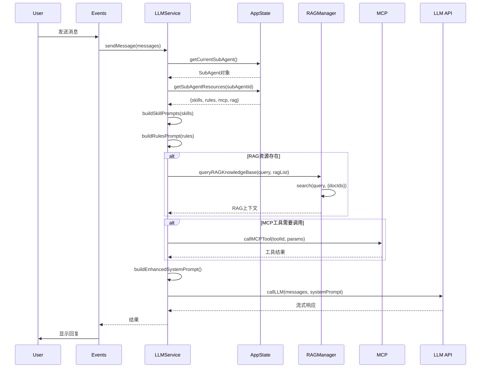

# AI Agent Pro 详细设计文档

**版本**: v8.1.0  
**日期**: 2026-03-01  
**文档类型**: 详细设计文档（可用于移动端复刻）

---

## 📋 目录

1. [设计思想](#1-设计思想)
2. [系统架构](#2-系统架构)
3. [UI/UX设计](#3-uiux设计)
4. [Agent调用资源逻辑](#4-agent调用资源逻辑)
5. [资源组织和向量化算法](#5-资源组织和向量化算法)
6. [数据模型](#6-数据模型)
7. [交互流程](#7-交互流程)
8. [移动端适配指南](#8-移动端适配指南)

---

## 1. 设计思想

### 1.1 核心设计理念

**"可配置的智能Agent系统"**

AI Agent Pro的设计核心是创建一个可配置、可扩展的智能助手系统，通过SubAgent机制和资源组合，实现不同场景下的专业化AI服务。

#### 设计原则

1. **模块化设计**
   - 每个功能模块独立，职责单一
   - 模块间通过标准接口通信
   - 易于扩展和维护

2. **资源驱动**
   - SubAgent通过配置资源（Skills、Rules、MCP、RAG）获得能力
   - 资源可复用、可组合
   - 支持动态加载和配置

3. **用户为中心**
   - 界面简洁直观
   - 操作流程顺畅
   - 响应式设计，适配多端

4. **性能优先**
   - 向量化算法优化
   - 缓存机制
   - 异步处理

### 1.2 架构设计思想

#### 分层架构

```
┌─────────────────────────────────────────┐
│         Presentation Layer               │
│  (UI Components, User Interactions)     │
└─────────────────────────────────────────┘
                    ↓
┌─────────────────────────────────────────┐
│         Application Layer                │
│  (State Management, Business Logic)      │
└─────────────────────────────────────────┘
                    ↓
┌─────────────────────────────────────────┐
│         Service Layer                    │
│  (LLM, RAG, Plan, Sync Services)         │
└─────────────────────────────────────────┘
                    ↓
┌─────────────────────────────────────────┐
│         Data Layer                       │
│  (LocalStorage, Memory State)            │
└─────────────────────────────────────────┘
```

#### 数据流设计

**单向数据流**：
1. 用户操作 → 事件处理
2. 事件处理 → 状态更新
3. 状态更新 → UI渲染
4. UI渲染 → 用户反馈

**异步处理**：
- 所有I/O操作异步化
- 使用Promise/async-await
- 流式响应处理

---

## 2. 系统架构

### 2.1 整体架构

```
AI Agent Pro
│
├── UI Layer (ui.js, events.js)
│   ├── 消息渲染系统
│   ├── 模态框管理系统
│   ├── 图表渲染系统
│   └── 事件处理系统
│
├── Application Layer (app.js)
│   ├── 状态管理 (AppState)
│   ├── 模型管理
│   ├── SubAgent管理
│   ├── 资源管理
│   └── 数据持久化
│
├── Service Layer
│   ├── LLMService (llm.js)
│   │   ├── 多模型API调用
│   │   ├── 流式响应处理
│   │   ├── 智能调用引擎
│   │   └── 多模态处理
│   │
│   ├── RAGManager (rag.js)
│   │   ├── 文档解析
│   │   ├── 向量化算法
│   │   ├── 语义检索
│   │   └── 外部数据源管理
│   │
│   ├── PlanManager (plan.js)
│   │   ├── 计划创建
│   │   ├── TODO生成
│   │   └── 计划执行
│   │
│   └── SyncService (sync.js)
│       ├── 数据同步
│       └── 备份恢复
│
└── Data Layer
    ├── LocalStorage持久化
    ├── 内存状态管理
    └── 向量存储
```

### 2.2 模块职责

#### UI Layer (`ui.js`, `events.js`)

**职责**：
- 渲染用户界面
- 处理用户交互
- 管理UI状态

**核心函数**：
- `renderMessages()` - 渲染消息列表
- `createMessageElement()` - 创建消息元素
- `renderMarkdown()` - Markdown渲染
- `streamMessageUpdate()` - 流式消息更新
- `finalizeStreamMessage()` - 完成流式消息

#### Application Layer (`app.js`)

**职责**：
- 全局状态管理
- 模型配置管理
- SubAgent配置管理
- 资源管理
- 数据持久化

**核心数据结构**：
```javascript
AppState = {
    version: string,
    currentChatId: string | null,
    currentMode: 'chat' | 'task' | 'plan' | 'creative' | 'writing',
    currentModel: string,
    currentSubAgent: string,
    messages: Message[],
    chats: Chat[],
    plans: Plan[],
    tasks: Task[],
    models: { [id: string]: Model },
    subAgents: { [id: string]: SubAgent },
    resources: {
        rag: RAG[],
        skills: Skill[],
        mcp: MCP[],
        rules: Rule[]
    },
    settings: Settings,
    ragVectors: { [docId: string]: Vector[] }
}
```

#### Service Layer

**LLMService (`llm.js`)**：
- 多模型API调用（DeepSeek、GLM、Kimi、Qwen等）
- 流式响应解析
- 智能模型选择
- 多模态输入输出处理

**RAGManager (`rag.js`)**：
- 文档解析（PDF、DOC、PPT、Excel、图片、URL）
- 向量化（TF-IDF + 语义哈希）
- 语义检索（余弦相似度）
- 缓存管理

**PlanManager (`plan.js`)**：
- 计划创建和管理
- AI辅助TODO生成
- 计划执行跟踪

---

## 3. UI/UX设计

### 3.1 界面布局

#### 桌面端布局

```
┌─────────────────────────────────────────────────────────┐
│  Header (56px)                                          │
│  [菜单] [Logo] [模型选择器] [设置] [工具]              │
├──────────┬──────────────────────────────────────────────┤
│          │                                              │
│ Sidebar  │  Main Content Area                           │
│ (280px)  │  ┌──────────────────────────────────────┐ │
│          │  │  Messages Container                    │ │
│ - Logo   │  │  (Welcome Screen / Message List)       │ │
│ - User   │  │                                        │ │
│ - Tabs   │  │                                        │ │
│ - History│  │                                        │ │
│          │  └──────────────────────────────────────┘ │
│          │  ┌──────────────────────────────────────┐ │
│          │  │  File Attachments (可选)            │ │
│          │  └──────────────────────────────────────┘ │
│          │  ┌──────────────────────────────────────┐ │
│          │  │  Input Area                           │ │
│          │  │  [模式选择器]                        │ │
│          │  │  [工具栏] [输入框] [发送]           │ │
│          │  └──────────────────────────────────────┘ │
└──────────┴──────────────────────────────────────────────┘
```

#### 移动端布局

```
┌─────────────────────────┐
│  Header (56px)           │
│  [菜单] [Logo] [设置]    │
├─────────────────────────┤
│                         │
│  Main Content           │
│  (Messages)             │
│                         │
│                         │
├─────────────────────────┤
│  File Attachments       │
│  (可选，有附件时显示)    │
├─────────────────────────┤
│  Input Area             │
│  [模式] [工具栏]        │
│  [输入框] [发送]        │
└─────────────────────────┘
```

### 3.2 组件设计规范

#### 颜色系统

**主色调**：
- Primary: `#00D4FF` (霓虹蓝)
- Secondary: `#B829F7` (霓虹紫)
- Accent: `#FF2D92` (霓虹粉)

**功能色**：
- Success: `#00E676` (绿色)
- Warning: `#FFD600` (黄色)
- Error: `#FF1744` (红色)
- Info: `#00B0FF` (信息蓝)

**背景色（深色主题）**：
- Primary: `#0A0A0F`
- Secondary: `#12121A`
- Tertiary: `#1A1A25`
- Elevated: `#222230`

**文字色（深色主题）**：
- Primary: `#FFFFFF` (100%不透明度)
- Secondary: `rgba(255, 255, 255, 0.7)` (70%不透明度)
- Tertiary: `rgba(255, 255, 255, 0.5)` (50%不透明度)

#### 尺寸规范

**间距系统**：
- XS: 4px
- SM: 8px
- MD: 16px
- LG: 24px
- XL: 32px

**圆角系统**：
- XS: 8px
- SM: 12px
- MD: 16px
- LG: 20px
- XL: 24px
- Full: 9999px

**字体大小**：
- XS: 11px
- SM: 13px
- Base: 14px
- MD: 15px
- LG: 16px
- XL: 18px

#### 组件尺寸

**按钮**：
- 小按钮: 24px × 24px
- 中按钮: 32px × 32px
- 大按钮: 40px × 40px

**输入框**：
- 高度: 40px (单行)
- 最大高度: 120px (多行)
- 内边距: 12px 16px

**消息气泡**：
- 最大宽度: 80% (桌面端)
- 最大宽度: 90% (移动端)
- 内边距: 12px 16px
- 圆角: 16px

### 3.3 交互设计

#### 启动流程

```
1. 显示启动页（Splash Screen）
   ├── Logo动画
   ├── 进度条（0% → 100%）
   ├── 加载步骤提示
   └── 功能特性展示

2. 初始化（3-4秒）
   ├── 加载模型配置 (10%)
   ├── 加载资源 (30%)
   ├── 加载助手 (50%)
   ├── 恢复状态 (70%)
   ├── 加载配置 (85%)
   └── 初始化界面 (95%)

3. 显示主界面
   ├── 隐藏启动页
   ├── 显示侧边栏和主内容区
   └── 渲染对话历史（如果有）
```

#### 消息发送流程

```
用户输入消息
  ↓
点击发送按钮 / 按Enter
  ↓
验证输入（非空或有附件）
  ↓
创建用户消息对象
  ↓
添加到AppState.messages
  ↓
清空输入框和附件
  ↓
渲染消息列表
  ↓
创建流式消息元素（占位符）
  ↓
调用LLMService.sendMessage()
  ├── 获取SubAgent资源
  ├── 构建系统提示词
  ├── 查询RAG知识库
  ├── 调用MCP工具（如需要）
  └── 调用LLM API
  ↓
流式响应处理
  ├── 实时更新消息内容
  ├── 显示思考过程（如支持）
  └── 滚动到底部
  ↓
完成流式消息
  ├── 添加操作按钮
  ├── 保存到AppState.messages
  └── 更新对话历史
```

#### 消息操作流程

```
用户悬停消息
  ↓
显示操作按钮（淡入动画）
  ├── 左侧：复制、下载
  └── 右侧：语音、重新生成、编辑、删除
  ↓
点击操作按钮
  ├── 复制：复制消息内容到剪贴板
  ├── 下载：显示格式选择对话框
  ├── 语音：使用Web Speech API播放
  ├── 重新生成：删除当前消息，重新调用LLM
  ├── 编辑：允许编辑消息内容
  └── 删除：从消息列表移除
```

### 3.4 动画和过渡

#### 动画规范

**过渡时间**：
- Fast: 150ms
- Normal: 250ms
- Slow: 400ms

**缓动函数**：
- 默认: `cubic-bezier(0.4, 0, 0.2, 1)`

#### 动画效果

**消息出现**：
```css
.message {
    animation: messageFadeIn 0.3s ease-out;
}

@keyframes messageFadeIn {
    from {
        opacity: 0;
        transform: translateY(10px);
    }
    to {
        opacity: 1;
        transform: translateY(0);
    }
}
```

**操作按钮显示**：
```css
.message-actions {
    opacity: 0;
    transition: opacity 0.15s;
}

.message:hover .message-actions {
    opacity: 1;
}
```

**模态框出现**：
```css
.modal {
    opacity: 0;
    visibility: hidden;
    transition: all 0.25s;
}

.modal.active {
    opacity: 1;
    visibility: visible;
}
```

---

## 4. Agent调用资源逻辑

### 4.1 SubAgent资源系统

#### 资源类型

1. **Skills（技能）**
   - 定义：预定义的专业能力模板
   - 格式：SKILL.md格式
   - 结构：
     ```javascript
     Skill = {
         id: string,
         name: string,
         description: string,
         prompt: string,
         skillMD: string,
         outputFormat: string,
         enabled: boolean
     }
     ```

2. **Rules（规则）**
   - 定义：AI回复的行为规范
   - 结构：
     ```javascript
     Rule = {
         id: string,
         name: string,
         description: string,
         content: string,
         priority: number,
         enabled: boolean
     }
     ```

3. **MCP（模型上下文协议）**
   - 定义：外部工具和服务
   - 结构：
     ```javascript
     MCP = {
         id: string,
         name: string,
         description: string,
         url: string,
         type: string,
         protocol: string,
         capabilities: string[],
         enabled: boolean
     }
     ```

4. **RAG（检索增强生成）**
   - 定义：知识库资源
   - 结构：
     ```javascript
     RAG = {
         id: string,
         name: string,
         description: string,
         documents: Document[],
         externalSources: ExternalSource[],
         defaultContent: string,
         enabled: boolean
     }
     ```

### 4.2 资源调用流程

#### 完整调用流程



#### 系统提示词构建逻辑

```javascript
function buildEnhancedSystemPrompt() {
    const subAgent = getCurrentSubAgent();
    const resources = getSubAgentResources(subAgent.id);
    
    let systemPrompt = '';
    
    // 1. SubAgent基础信息
    systemPrompt += `你是「${subAgent.name}」，${subAgent.description}\n\n`;
    systemPrompt += subAgent.systemPrompt + '\n\n';
    
    // 2. Rules（按优先级排序）
    if (resources.rules.length > 0) {
        const sortedRules = resources.rules.sort((a, b) => 
            (a.priority || 0) - (b.priority || 0)
        );
        systemPrompt += '【规则】\n';
        sortedRules.forEach(rule => {
            systemPrompt += `- ${rule.content}\n`;
        });
        systemPrompt += '\n';
    }
    
    // 3. Skills（根据任务类型筛选）
    if (resources.skills.length > 0) {
        const relevantSkills = filterSkillsByTask(resources.skills, taskType);
        systemPrompt += '【技能】\n';
        relevantSkills.forEach(skill => {
            systemPrompt += `- ${skill.name}: ${skill.prompt}\n`;
        });
        systemPrompt += '\n';
    }
    
    // 4. RAG上下文（通过向量搜索获取）
    if (resources.rag.length > 0) {
        const ragContext = await queryRAGKnowledgeBase(lastMessage, resources.rag);
        if (ragContext) {
            systemPrompt += '【知识库参考】\n';
            systemPrompt += ragContext + '\n\n';
        }
    }
    
    // 5. MCP工具信息
    if (resources.mcp.length > 0) {
        systemPrompt += '【可用工具】\n';
        resources.mcp.forEach(mcp => {
            systemPrompt += `- ${mcp.name}: ${mcp.description}\n`;
            systemPrompt += `  能力: ${mcp.capabilities.join(', ')}\n`;
        });
        systemPrompt += '\n';
    }
    
    // 6. 输出格式要求
    systemPrompt += `【输出格式】\n`;
    systemPrompt += `请使用${outputFormat}格式输出。\n\n`;
    
    return systemPrompt;
}
```

### 4.3 智能模型选择

```javascript
function autoSelectModel(messages, taskType) {
    const lastMessage = messages[messages.length - 1]?.content || '';
    
    // 1. 根据任务类型选择
    if (taskType === 'reasoning' || lastMessage.includes('推理') || lastMessage.includes('分析')) {
        if (hasValidAPIKey('deepseek-reasoner')) return 'deepseek-reasoner';
    }
    
    if (taskType === 'creative' || lastMessage.includes('创意') || lastMessage.includes('写作')) {
        if (hasValidAPIKey('glm-4-plus')) return 'glm-4-plus';
    }
    
    // 2. 根据SubAgent偏好选择
    const subAgent = getCurrentSubAgent();
    if (subAgent.modelPreference?.length > 0) {
        for (const modelId of subAgent.modelPreference) {
            if (hasValidAPIKey(modelId)) return modelId;
        }
    }
    
    // 3. 默认选择
    if (hasValidAPIKey('deepseek-chat')) return 'deepseek-chat';
    if (hasValidAPIKey('glm-4-flash')) return 'glm-4-flash';
    
    // 4. 返回第一个有API Key的模型
    for (const [id, model] of Object.entries(AppState.models)) {
        if (id !== 'auto' && hasValidAPIKey(id)) return id;
    }
    
    return 'deepseek-chat'; // 兜底
}
```

---

## 5. 资源组织和向量化算法

### 5.1 文档解析流程

#### 解析流程

```
文件上传
  ↓
识别文件类型（MIME类型 + 扩展名）
  ↓
选择解析方法
  ├── PDF → Jina AI API / 降级方案
  ├── DOC/DOCX → Jina AI API / 降级方案
  ├── PPT/PPTX → Jina AI API / 降级方案
  ├── Excel → Jina AI API / CSV降级
  ├── CSV → 直接读取
  ├── HTML/H5 → DOM解析
  ├── Markdown → 直接读取
  ├── TXT → 直接读取
  ├── 图片 → Jina AI API OCR
  └── URL → Jina AI API 网页抓取
  ↓
提取文本内容
  ↓
验证内容有效性
  ├── 检查是否为占位符
  ├── 检查内容长度（>50字符）
  └── 标记vectorized状态
  ↓
文档分块（chunkContent）
  ├── 按句子分割
  ├── 块大小：500字符
  └── 重叠：50字符
  ↓
提取元数据（extractMetadata）
  ├── 词数统计
  ├── 字符数统计
  ├── 行数统计
  ├── 语言检测
  └── 关键词提取
  ↓
向量化（generateVectors）
  ├── 批量处理（10个chunks/批）
  ├── enhancedEmbedding算法
  └── 保存向量到ragVectors
  ↓
保存文档信息
  ├── 保存到documents数组
  └── 持久化到LocalStorage
```

### 5.2 向量化算法详解

#### TF-IDF + 语义哈希算法

**算法步骤**：

1. **初始化256维向量**
   ```javascript
   const vector = new Array(256).fill(0);
   ```

2. **字符级特征提取**
   ```javascript
   for (let i = 0; i < text.length; i++) {
       const charCode = textLower.charCodeAt(i);
       vector[charCode % 256] += 1;
   }
   ```
   - 将每个字符的Unicode码映射到向量维度
   - 统计字符频率

3. **词级特征提取（分词）**
   ```javascript
   const words = tokenize(textLower);
   // 中文：按字符分割
   // 英文：按单词分割
   ```

4. **TF-IDF权重计算**
   ```javascript
   // TF (Term Frequency)
   const tf = wordFreq[word] / words.length;
   
   // IDF (Inverse Document Frequency)
   const docFreq = 统计该词在所有chunks中出现的文档数;
   const idf = Math.log(totalDocs / (docFreq[word] || 1));
   
   // TF-IDF
   const tfidf = tf * idf;
   ```

5. **权重映射到向量**
   ```javascript
   for (let j = 0; j < word.length; j++) {
       const charCode = word.charCodeAt(j);
       vector[charCode % 256] += tfidf;
   }
   ```

6. **向量归一化**
   ```javascript
   const magnitude = Math.sqrt(vector.reduce((sum, v) => sum + v * v, 0));
   return magnitude > 0 ? vector.map(v => v / magnitude) : vector;
   ```

#### 分词算法（支持中英文）

```javascript
function tokenize(text) {
    const tokens = [];
    let currentWord = '';
    
    for (let i = 0; i < text.length; i++) {
        const char = text[i];
        const charCode = char.charCodeAt(0);
        
        // 中文字符（Unicode: 0x4E00-0x9FFF）
        if (charCode >= 0x4E00 && charCode <= 0x9FFF) {
            if (currentWord) {
                tokens.push(currentWord);
                currentWord = '';
            }
            tokens.push(char);  // 中文按字符分割
        }
        // 英文字母或数字
        else if ((charCode >= 65 && charCode <= 90) || 
                 (charCode >= 97 && charCode <= 122) ||
                 (charCode >= 48 && charCode <= 57)) {
            currentWord += char;  // 英文按单词分割
        }
        // 其他字符（标点、空格等）
        else {
            if (currentWord) {
                tokens.push(currentWord);
                currentWord = '';
            }
        }
    }
    
    if (currentWord) tokens.push(currentWord);
    return tokens.filter(t => t.length > 0);
}
```

**特点**：
- 中文：按字符分割（每个汉字一个token）
- 英文：按单词分割（连续的字母数字为一个token）
- 标点符号：忽略

### 5.3 文档分块策略

#### 分块算法

```javascript
function chunkContent(content, chunkSize = 500, overlap = 50) {
    const chunks = [];
    // 按句子分割（支持中英文标点）
    const sentences = content.split(/(?<=[。！？.!?])\s+/);
    
    let currentChunk = '';
    let chunkIndex = 0;
    
    for (const sentence of sentences) {
        // 如果当前块 + 新句子超过chunkSize
        if (currentChunk.length + sentence.length > chunkSize) {
            if (currentChunk) {
                // 保存当前块
                chunks.push({
                    id: `chunk_${chunkIndex++}`,
                    text: currentChunk.trim(),
                    index: chunkIndex - 1
                });
                
                // 保留重叠部分（最后overlap个字符）
                const words = currentChunk.split('');
                currentChunk = words.slice(-overlap).join('') + sentence;
            } else {
                // 单句超过chunkSize，强制分割
                chunks.push({
                    id: `chunk_${chunkIndex++}`,
                    text: sentence.slice(0, chunkSize),
                    index: chunkIndex - 1
                });
                currentChunk = sentence.slice(chunkSize - overlap);
            }
        } else {
            currentChunk += sentence;
        }
    }
    
    // 保存最后一个块
    if (currentChunk.trim()) {
        chunks.push({
            id: `chunk_${chunkIndex}`,
            text: currentChunk.trim(),
            index: chunkIndex
        });
    }
    
    return chunks;
}
```

**分块参数**：
- `chunkSize`: 500字符（可配置）
- `overlap`: 50字符（可配置）
- 分割点：句子边界（。！？.!?）

**重叠策略**：
- 保留前一个块的最后50个字符
- 确保上下文连续性
- 避免重要信息被分割

### 5.4 语义检索算法

#### 余弦相似度搜索

```javascript
async function search(query, options = {}) {
    const {
        topK = 5,
        docIds = null,
        minScore = 0.3,
        useCache = true
    } = options;
    
    // 1. 查询缓存
    const cacheKey = `search_${query}_${topK}_${minScore}`;
    if (useCache && this.searchCache?.has(cacheKey)) {
        return this.searchCache.get(cacheKey);
    }
    
    // 2. 生成查询向量
    const queryVector = this.enhancedEmbedding(query);
    
    // 3. 确定目标文档
    const targetDocIds = docIds || Array.from(this.vectors.keys());
    
    // 4. 并行搜索所有文档
    const searchPromises = targetDocIds.map(async (docId) => {
        const docVectors = this.vectors.get(docId);
        if (!docVectors) return [];
        
        const docResults = [];
        for (const item of docVectors) {
            const score = this.cosineSimilarity(queryVector, item.vector);
            if (score >= minScore) {
                docResults.push({
                    docId,
                    docName: this.getDocName(docId),
                    chunkId: item.chunkId,
                    text: item.text,
                    score,
                    index: item.index
                });
            }
        }
        return docResults;
    });
    
    // 5. 合并结果并排序
    const allResults = await Promise.all(searchPromises);
    const results = allResults.flat();
    results.sort((a, b) => b.score - a.score);
    
    // 6. 缓存结果（LRU策略）
    if (useCache) {
        if (this.searchCache.size >= this.searchCacheMaxSize) {
            const firstKey = this.searchCache.keys().next().value;
            this.searchCache.delete(firstKey);
        }
        this.searchCache.set(cacheKey, results.slice(0, topK));
    }
    
    return results.slice(0, topK);
}

// 余弦相似度计算
function cosineSimilarity(a, b) {
    let dotProduct = 0;
    let normA = 0;
    let normB = 0;
    
    for (let i = 0; i < a.length; i++) {
        dotProduct += a[i] * b[i];
        normA += a[i] * a[i];
        normB += b[i] * b[i];
    }
    
    return dotProduct / (Math.sqrt(normA) * Math.sqrt(normB) + 1e-10);
}
```

**检索参数**：
- `topK`: 返回前K个结果（默认5）
- `minScore`: 最小相似度阈值（默认0.3）
- `docIds`: 指定文档ID列表（null表示搜索所有）

**性能优化**：
- 缓存机制（LRU，最大100条）
- 并行搜索多个文档
- 批量向量生成

### 5.5 RAG查询流程

#### 多源融合查询

```javascript
async function queryRAGKnowledgeBase(query, ragList) {
    const contextParts = [];
    
    // 并行查询所有RAG知识库
    const ragPromises = ragList.map(async (rag) => {
        // 1. 文档向量搜索（优先）
        if (rag.documents?.length > 0) {
            const docIds = rag.documents.map(d => d.id);
            const searchResults = await this.search(query, {
                topK: 3,
                minScore: 0.3,
                docIds
            });
            
            if (searchResults.length > 0) {
                return {
                    source: rag.name,
                    type: 'document',
                    content: searchResults.map(r => r.text).join('\n\n'),
                    matchScore: searchResults[0].score
                };
            }
        }
        
        // 2. 内置知识库（defaultContent）关键词匹配
        if (rag.defaultContent) {
            const queryKeywords = this.extractKeywords(query, 5);
            const contentKeywords = this.extractKeywords(rag.defaultContent, 20);
            const matchScore = this.calculateKeywordMatch(queryKeywords, contentKeywords);
            
            if (matchScore > 0.2) {
                return {
                    source: rag.name,
                    type: 'builtin',
                    content: rag.defaultContent,
                    matchScore
                };
            }
        }
        
        // 3. 外部数据源搜索
        if (rag.externalSources?.length > 0) {
            const externalResults = await this.searchExternalSources(query, rag.id);
            if (externalResults.length > 0) {
                return {
                    source: rag.name,
                    type: 'external',
                    content: externalResults.map(r => r.text).join('\n\n'),
                    matchScore: 0.5
                };
            }
        }
        
        return null;
    });
    
    const ragResults = await Promise.all(ragPromises);
    
    // 按相关性排序并构建上下文
    ragResults
        .filter(r => r !== null)
        .sort((a, b) => (b.matchScore || 1) - (a.matchScore || 1))
        .forEach(result => {
            contextParts.push(`\n【${result.source}】\n${result.content}\n`);
        });
    
    return contextParts.join('\n');
}
```

**查询优先级**：
1. 文档向量搜索（最准确）
2. 内置知识库关键词匹配
3. 外部数据源搜索

---

## 6. 数据模型

### 6.1 消息数据结构

```typescript
interface Message {
    id: string;                    // 'msg_' + Date.now()
    role: 'user' | 'assistant';
    content: string;              // 消息内容
    thinking?: string;            // 思考过程（可选）
    timestamp: number;             // 时间戳
    attachments?: Attachment[];    // 附件列表
    outputFormat?: string;         // 输出格式
}

interface Attachment {
    type: 'image' | 'file' | 'pdf' | 'doc' | 'csv' | 'excel' | 'ppt' | 'html';
    name: string;
    data?: string;                 // Base64数据（图片）
    content?: string;              // 文本内容（文档）
}
```

### 6.2 SubAgent数据结构

```typescript
interface SubAgent {
    id: string;
    name: string;
    description: string;
    icon: string;                  // Font Awesome图标类
    systemPrompt: string;         // 系统提示词
    capabilities: string[];       // 能力列表
    modelPreference: string[];    // 模型偏好 ['deepseek-reasoner', 'glm-4-plus']
    skills: string[];              // Skills ID列表
    rules: string[];               // Rules ID列表
    mcp: string[];                 // MCP ID列表
    rag: string[];                 // RAG ID列表
    color: string;                 // 主题色
    isCustom: boolean;             // 是否自定义
}
```

### 6.3 RAG文档数据结构

```typescript
interface Document {
    id: string;                    // 'doc_' + Date.now()
    name: string;                  // 文件名
    type: string;                  // MIME类型
    size: number;                  // 文件大小
    uploadedAt: number;             // 上传时间
    status: 'parsing' | 'parsed' | 'error';
    chunks: Chunk[];                // 文档块列表
    metadata: {
        wordCount: number;
        charCount: number;
        lineCount: number;
        language: 'zh' | 'en';
        keywords: string[];
        isValid?: boolean;
        reason?: string;
    };
    vectorized: boolean;           // 是否已向量化
    url?: string;                   // URL（如果是网页）
}

interface Chunk {
    id: string;                    // 'chunk_' + index
    text: string;                  // 块文本
    index: number;                 // 块索引
}

interface Vector {
    chunkId: string;
    vector: number[];              // 256维向量
    text: string;
    index: number;
}
```

### 6.4 计划数据结构

```typescript
interface Plan {
    id: string;                    // 'plan_' + Date.now()
    title: string;
    description: string;
    status: 'draft' | 'active' | 'completed' | 'cancelled';
    createdAt: number;
    updatedAt: number;
    todos: Todo[];
    resources: {
        subAgent: string;
        skills: string[];
        rules: string[];
        mcp: string[];
        rag: string[];
    };
    metadata: {
        taskType: string;
        progress: number;           // 0-100
        completedCount: number;
        totalCount: number;
    };
}

interface Todo {
    id: string;                    // 'todo_' + Date.now()
    title: string;
    description: string;
    priority: 'high' | 'medium' | 'low';
    status: 'pending' | 'in_progress' | 'completed' | 'cancelled';
    estimatedTime: number;          // 预计耗时（分钟）
    dependencies: string[];         // 依赖的todo id
    resources: string[];           // 需要调用的资源ID
    createdAt: number;
    completedAt: number | null;
    result: string | null;         // 执行结果
}
```

---

## 7. 交互流程

### 7.1 用户操作流程

#### 发送消息流程

```
1. 用户输入消息
   ├── 文本输入
   ├── 文件上传（可选）
   └── 图片上传（可选）

2. 点击发送按钮 / 按Enter
   ├── 验证输入（非空或有附件）
   └── 触发sendMessage()

3. 创建用户消息
   ├── 生成消息ID
   ├── 处理文件附件
   └── 添加到AppState.messages

4. 清空输入
   ├── 清空输入框
   ├── 清空附件列表
   └── 隐藏附件显示区域

5. 渲染消息
   ├── 调用renderMessages()
   └── 滚动到底部

6. 创建流式消息占位符
   ├── 调用createStreamMessageElement()
   └── 显示"正在思考..."状态

7. 调用LLM服务
   ├── 获取SubAgent资源
   ├── 构建系统提示词
   ├── 查询RAG知识库
   ├── 调用MCP工具（如需要）
   └── 调用LLM API

8. 流式响应处理
   ├── 实时更新消息内容
   ├── 显示思考过程（如支持）
   └── 滚动到底部

9. 完成流式消息
   ├── 添加操作按钮
   ├── 保存到AppState.messages
   └── 更新对话历史
```

#### SubAgent切换流程

```
1. 用户点击助手按钮
   ├── 显示SubAgent选择器模态框
   └── 列出所有可用助手

2. 用户选择助手
   ├── 更新AppState.currentSubAgent
   ├── 更新UI显示（助手名称）
   └── 保存状态

3. 下次发送消息时
   ├── 自动应用新助手的配置
   ├── 加载关联的资源
   └── 使用助手的系统提示词
```

### 7.2 UI交互细节

#### 消息操作按钮交互

**显示时机**：
- 鼠标悬停在消息上时显示（桌面端）
- 点击消息时显示（移动端）

**按钮布局**：
```
┌─────────────────────────────────────┐
│  [复制] [下载]    [语音] [重新生成] │
│                    [编辑] [删除]    │
└─────────────────────────────────────┘
```

**点击处理**：
- 使用事件委托机制
- 通过`data-action`和`data-message-id`识别操作
- 统一在messages-container上处理

#### 模态框交互

**打开模态框**：
```javascript
function openModal(modalId) {
    const modal = document.getElementById(modalId);
    if (modal) {
        modal.classList.add('active');
        document.body.style.overflow = 'hidden'; // 禁止背景滚动
    }
}
```

**关闭模态框**：
```javascript
function closeModal(modalId) {
    const modal = document.getElementById(modalId);
    if (modal) {
        modal.classList.remove('active');
        document.body.style.overflow = ''; // 恢复滚动
    }
}
```

**点击遮罩关闭**：
- 点击模态框外的区域关闭
- ESC键关闭

---

## 8. 移动端适配指南

### 8.1 布局适配

#### 响应式断点

```css
/* 移动端 */
@media (max-width: 768px) {
    /* 侧边栏隐藏，通过菜单按钮打开 */
    .sidebar {
        transform: translateX(-100%);
    }
    
    /* 消息容器全宽 */
    .messages-container {
        width: 100%;
    }
    
    /* 输入区域适配 */
    .input-area {
        padding-bottom: calc(10px + env(safe-area-inset-bottom));
    }
}
```

#### 触摸优化

**按钮尺寸**：
- 最小触摸目标：44px × 44px
- 按钮间距：至少8px

**滚动优化**：
```css
.messages-container {
    -webkit-overflow-scrolling: touch;
    overscroll-behavior: contain;
}
```

### 8.2 移动端交互

#### 手势支持

**侧边栏**：
- 左滑打开侧边栏
- 右滑关闭侧边栏

**消息操作**：
- 长按消息显示操作菜单
- 滑动删除消息（可选）

#### 键盘处理

**输入框聚焦**：
- 自动滚动到输入框
- 调整视口避免键盘遮挡

**发送快捷键**：
- Enter：发送
- Shift+Enter：换行

### 8.3 移动端复刻指南

#### Android/iOS复刻要点

**1. 布局结构**
```
Activity/ViewController
├── Sidebar (Drawer/Sidebar)
│   ├── Logo
│   ├── User Info
│   ├── Tabs
│   └── Chat History
│
├── Main Content
│   ├── Header (Toolbar)
│   │   ├── Menu Button
│   │   ├── Model Selector
│   │   └── Settings Button
│   │
│   ├── Messages List (RecyclerView/UITableView)
│   │   ├── Welcome Screen
│   │   └── Message Items
│   │
│   └── Input Area (Bottom Sheet)
│       ├── Mode Selector
│       ├── Toolbar
│       ├── File Attachments
│       └── Input Box + Send Button
│
└── Modals (Dialog/Bottom Sheet)
    ├── Settings Modal
    ├── SubAgent Selector
    ├── Model Selector
    └── Format Selector
```

**2. 状态管理**
- Android: ViewModel + LiveData / StateFlow
- iOS: ObservableObject / @State / @Published
- 统一状态结构（参考AppState）

**3. 数据持久化**
- Android: SharedPreferences / Room Database
- iOS: UserDefaults / Core Data
- 向量存储：SQLite + BLOB

**4. 网络请求**
- Android: Retrofit / OkHttp
- iOS: URLSession / Alamofire
- 流式响应：使用SSE或WebSocket

**5. UI组件**
- Android: Material Design Components
- iOS: UIKit / SwiftUI
- 保持相同的视觉风格和交互逻辑

**6. 动画效果**
- Android: Animator / MotionLayout
- iOS: UIView Animation / SwiftUI Animation
- 保持相同的动画时长和缓动函数

---

## 9. 性能优化策略

### 9.1 向量化性能优化

**批量处理**：
```javascript
const batchSize = 10;
for (let i = 0; i < chunks.length; i += batchSize) {
    const batch = chunks.slice(i, i + batchSize);
    const batchVectors = await Promise.all(
        batch.map(chunk => this.enhancedEmbedding(chunk.text, chunks))
    );
    // 处理批量结果
}
```

**并行查询**：
```javascript
const ragPromises = ragList.map(async (rag) => {
    // 查询逻辑
});
const ragResults = await Promise.all(ragPromises);
```

### 9.2 缓存策略

**搜索缓存（LRU）**：
```javascript
// 缓存键格式
const cacheKey = `search_${query}_${topK}_${minScore}`;

// LRU管理
if (this.searchCache.size >= this.searchCacheMaxSize) {
    const firstKey = this.searchCache.keys().next().value;
    this.searchCache.delete(firstKey);
}
```

**状态保存防抖**：
```javascript
let saveTimeout = null;
const SAVE_DELAY = 500;

function debouncedSave() {
    if (saveTimeout) {
        clearTimeout(saveTimeout);
    }
    saveTimeout = setTimeout(() => {
        saveState();
    }, SAVE_DELAY);
}
```

### 9.3 DOM优化

**事件委托**：
```javascript
// 统一在容器上处理事件
messagesContainer.addEventListener('click', (e) => {
    const btn = e.target.closest('.msg-action-btn');
    if (btn) {
        // 处理按钮点击
    }
});
```

**虚拟滚动**（建议）：
- 长列表使用虚拟滚动
- 只渲染可见区域的消息
- 减少DOM节点数量

---

## 10. 安全考虑

### 10.1 XSS防护

**HTML转义**：
```javascript
function escapeHtml(text) {
    if (!text) return '';
    const div = document.createElement('div');
    div.textContent = text;
    return div.innerHTML;
}
```

**使用textContent**：
```javascript
// 安全
element.textContent = userInput;

// 不安全
element.innerHTML = userInput;
```

### 10.2 API密钥安全

**用户配置**：
- API密钥存储在用户本地
- 不硬编码在代码中
- 支持用户自行配置

**传输安全**：
- 使用HTTPS传输
- API密钥不记录在日志中

---

## 11. 扩展性设计

### 11.1 添加新模型

```javascript
// 1. 在BUILTIN_MODELS中添加配置
const BUILTIN_MODELS = {
    'new-model': {
        id: 'new-model',
        name: 'New Model',
        provider: 'new-provider',
        url: 'https://api.example.com/v1/chat',
        // ...
    }
};

// 2. 在LLMService中添加API调用方法
async callNewProviderStream(messages, model, onStream) {
    // 实现API调用逻辑
}
```

### 11.2 添加新资源类型

```javascript
// 1. 定义资源结构
interface NewResource {
    id: string;
    name: string;
    // ...
}

// 2. 添加到resources
AppState.resources.newResource = [];

// 3. 在SubAgent中关联
subAgent.newResource = ['resource-id-1', 'resource-id-2'];
```

### 11.3 添加新输出格式

```javascript
// 1. 在detectOutputFormat中添加检测逻辑
if (content.match(/新格式特征/)) {
    return 'new-format';
}

// 2. 添加渲染函数
function renderNewFormat(content) {
    // 渲染逻辑
}

// 3. 在renderContentByFormat中添加处理
case 'new-format':
    return renderNewFormat(content);
```

---

## 12. 测试策略

### 12.1 单元测试

**测试范围**：
- 向量化算法
- 分词算法
- 余弦相似度计算
- 文档分块算法

### 12.2 集成测试

**测试范围**：
- RAG查询流程
- SubAgent资源调用
- LLM API调用
- 状态管理

### 12.3 E2E测试

**测试范围**：
- 用户操作流程
- 消息发送和接收
- 文件上传和处理
- 设置配置

---

## 附录

### A. 代码示例

#### 完整的消息发送流程

```javascript
async function sendMessage() {
    // 1. 获取输入
    const input = document.getElementById('message-input');
    const content = input.value.trim();
    
    // 2. 验证输入
    if (!content && (!uploadedFiles || uploadedFiles.length === 0)) return;
    
    // 3. 创建用户消息
    const userMessage = {
        id: 'msg_' + Date.now(),
        role: 'user',
        content: content,
        attachments: processAttachments(uploadedFiles),
        timestamp: Date.now()
    };
    
    // 4. 添加到状态
    AppState.messages.push(userMessage);
    
    // 5. 更新UI
    renderMessages();
    clearInput();
    
    // 6. 调用LLM
    const response = await LLMService.sendMessage(
        AppState.messages,
        AppState.currentModel,
        AppState.settings.webSearchEnabled
    );
    
    // 7. 保存AI回复
    const aiMessage = {
        id: 'msg_' + Date.now(),
        role: 'assistant',
        content: response.content,
        thinking: response.thinking,
        timestamp: Date.now()
    };
    
    AppState.messages.push(aiMessage);
    saveState();
}
```

### B. 移动端复刻检查清单

- [ ] 布局结构一致
- [ ] 颜色系统一致
- [ ] 字体大小一致
- [ ] 间距系统一致
- [ ] 动画效果一致
- [ ] 交互流程一致
- [ ] 数据模型一致
- [ ] API调用逻辑一致
- [ ] 向量化算法一致
- [ ] 检索算法一致

---

**文档版本**: v8.1.0  
**最后更新**: 2026-03-01  
**维护者**: AI Agent Pro Team
