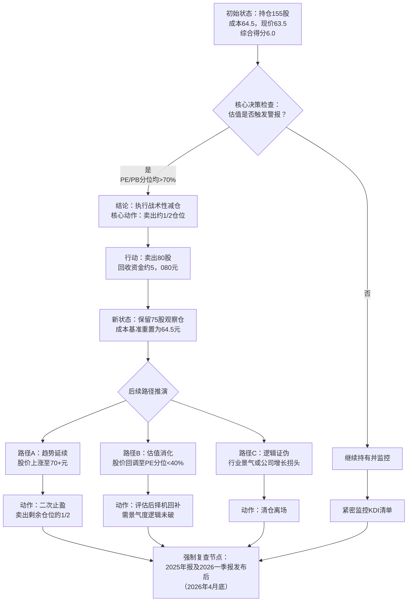

### **量化幻方矩阵投资决策报告【V4.0钻石标准】**
**报告主题：** 生益科技（600183）持仓分析与操作建议
**报告日期：** 2026年3月19日
**对应仓位状态：** 用户尝试性持仓（成本64.5元，当前市价63.5元）
**仓库应用版本（文档对齐）：** **v8.6.0**（本样例协议栈仍为 **V4.0 全栈**；与 `docs/DESIGN_QUANT_MAGIC_SQUARE.md`、CHANGELOG **[8.6.0]** 同步）

> **V4.0 说明**：本样例对应 systemPrompt **〇·5～〇·8** 与 RAG「七～十」层协议，须在真实报告中逐项落地。**〇·5** 专业级增强（逻辑锚定、魔鬼代言人+反驳证据、历史分位、个性化冲击、禁止动作、数据加工、动态情绪因子、现金流专节、**3×3 估值矩阵**、时间止损等）；**〇·6** 期望值与工程化，且 **第一节「行为概率」与情景母概率强制同一套数**（见下「概率口径统一规则」）；**〇·7** 霍华德·马克斯/橡树资本四要点；**〇·8** 输出稳定性检查清单与决策流管道。具体数值与标的仅为方法论示例。

---

### **一、核心结论（概率-结论 + 即时行动指令 · 〇·5 / 〇·8）**

基于截至2026年3月18日的实时数据，生益科技呈现 **“高景气、高增长、高估值”** 的典型特征。公司基本面受AI算力驱动强劲，但估值已严重透支预期，安全边际匮乏。

*   **即时行动指令（报告生成日可执行，非开放式建议）：** 在**未出现新的重大利好公告**的前提下，**于下一交易时段内启动战术性减仓**：先行卖出约 **1/2 仓位（示例：80 股）**，与第七节「阶梯0」一致；不得因「浮亏轻微」拖延执行。**〇·6 量化依据：** 在当前 (p_B,p_N,p_O) 与 **精确 r_i（由第六节 P_i 与成本 64.5 反推）** 下 **E[r|全仓]≈−2.56%**，**E[r|减半]≈−1.28%**，**期望损失收窄 ΔE≈+1.28 个百分点**（见下「期望值→具体决策映射」）。
*   **最终操作结论：** 建议执行 **“战术性减仓”** ，以兑现部分利润并管理高估值风险。
#### **概率口径统一规则（V4.0 强制 · 〇·6）**

1. **唯一母概率：** 全报告只允许使用**一组**互斥且完备的三情景概率：**p_B（悲观）、p_N（中性）、p_O（乐观）**，满足 **p_B + p_N + p_O = 100%**。**禁止**另写一套与母概率不一致的「行为百分比」。
2. **派生行为概率（本样例映射，须与母概率同次更新）：**
   * **「执行减仓／止盈（纪律性压降暴露）」** ≡ 世界状态 ∈ {悲观, 中性} → **P = p_B + p_N**。（叙事：高估值警报下，悲观与中性路径均以**控回撤、压暴露**为主逻辑。）
   * **「谨慎持有观察（保留仓位博取趋势延续）」** ≡ 世界状态 ∈ {乐观} → **P = p_O**。（叙事：仅当乐观情景兑现时，**高暴露**才与叙事一致；对应第七节「观察仓」所押的尾部。）
3. **与「即时行动指令」的关系：** 在 **PE 分位 >70%** 已触发时，**阶梯0（减半）为确定执行**，不因主观概率而「抛硬币」；**p_B、p_N、p_O** 表达的是对**未来基本面路径的信念权重**，用于 **E 值、沟通口径与复盘**，不是「明天是否下单」的随机律。
4. **与 KDI 联动（摘要）：** 第五节中「悲观概率 +X%」「减仓概率 +Y%」**不得**与母概率表**口头并列**；须按下节 **「KDI→母概率再归一化程序」** 落地为**唯一一组** (p_B, p_N, p_O)，并**同步重算**派生 **60%/40%**、**E[r]**、**E[r']**。

#### **KDI→母概率再归一化程序（〇·6 / 〇·5 强制；对齐第 2 点）**

*以下 **Δ** 均为**小数**（例：「+10%」→ **Δ=0.10**）。**ε** 为乐观尾保留下限（建议 **ε=0.05**，避免 p_O 被扣至 0）。*

**类型 A ——「悲观概率 +Δ」**（KDI 明确写悲观/左尾，如板块弱、OCF 恶化）：**提高 p_B**，自乐观侧让渡质量。

1. **p_B^* ← min(1−ε, p_B + Δ)**。  
2. 令 **S = p_N + p_O**。若 **S>0**，则 **p_N^* ← (1 − p_B^*) × p_N / S**，**p_O^* ← (1 − p_B^*) × p_O / S**；若 **S=0**（退化情形）则人工重赋三概率。  
3. 输出 **(p_B^*, p_N^*, p_O^*)** 作为新母概率；**派生** **p_B^*+p_N^*** 与 **p_O^***，重算 **E[r]、E[r']**。

**类型 B ——「减仓概率 +Δ」**（与派生 **「执行减仓/止盈 = p_B+p_N」** 对齐）：**提高 (p_B+p_N)**，自 **p_O** 让渡，**保持 p_B : p_N 不变**。

1. 记 **T = p_B + p_N**。要求 **T^* = min(1−ε, T + Δ)**。  
2. **p_O^* ← 1 − T^***。  
3. **p_B^* ← T^* × (p_B / T)**，**p_N^* ← T^* × (p_N / T)**（若 **T=0** 则须人工重赋）。  
4. 同上，重算派生与 **E[r]、E[r']**。

**算例（自本报告初值出发）：** 初值 **(0.25, 0.35, 0.40)**。  
* **类型 A，Δ=0.10：** **p_B^*=0.35**，**1−p_B^*=0.65**，**S=0.75** → **p_N^*=0.65×0.35/0.75≈0.303**，**p_O^*=0.65×0.40/0.75≈0.347**；派生 **减仓侧 ≈65.3%**。  
* **类型 B，Δ=0.10：** **T^*=0.70**，**p_O^*=0.30**，**p_B^*=0.70×0.25/0.6≈0.292**，**p_N^*=0.70×0.35/0.6≈0.408**；派生 **减仓侧=70%**，**观察=30%**（与「灵敏度」手工设定可对照校验）。

**多条 KDI 同时触发：** **按事件时间顺序逐条**套用 A 或 B（须先**归类**每条属于 A 还是 B），**每步输出一组新母概率**；**禁止**把多条「+10%」**直接相加**成 +30% 一次到位而不写中间态（除非显式声明「跳跃更新」并给出最终三元组）。

*   **情景概率量化（已由母概率派生，与下表同一组数）：**
    *   **母概率（本例）：** p_B=**25%**，p_N=**35%**，p_O=**40%**（悲观不轻不重、中性仍具相当权重、乐观略高以反映产业景气仍强但定价已透支）。
    *   **执行减仓／止盈概率：p_B + p_N = 25% + 35% = 60%**。
    *   **谨慎持有观察概率：p_O = 40%**。
*   **强观点：** 您的买入成本（64.5元）已接近市场乐观预期下的合理价位，**在当前估值水平下继续持有的风险收益比不佳**。纪律性部分止盈是当前最优策略。

#### **〇·6 期望值思维与范围管理（强化）**

*   **定义（须写清口径）：** 对单一动作 *a*（如「全仓持有」「减半减仓」），**期望值** **E[ΔW|a] = Σ (p_i × r_i)**，其中 *p_i* 仅取 **p_B、p_N、p_O**（Σp_i=1），*r_i* 为该情景下**相对决策基准价**的示意收益率（%）——**本例与第六节一维表一致，基准取持仓成本 64.5 元**（非现价 63.5，避免与「相对成本」列脱节）；**非预测、仅作决策框架**。
*   **情景与主观概率（与第一节母概率强制一致，须随复盘同改）：**

| 情景 | 母概率 p_i | 目标价 P_i（第六节，元） | **r_i = (P_i−64.5)/64.5**（精确%，四舍五入两位） | p_i×r_i |
| :--- | :---: | :---: | :---: | :---: |
| 悲观（盈利停滞 + PE 压缩至 ~35×） | **p_B = 25%** | **47** | **−27.13%** | −6.78% |
| 中性（+20% 盈利 + PE ~45×） | **p_N = 35%** | **58** | **−10.08%** | −3.53% |
| 乐观（+40% 盈利 + PE 维持 ~54×） | **p_O = 40%** | **77** | **+19.38%** | +7.75% |
| **合计** | **100%** | — | — | **E[r|全仓持有] ≈ −2.56%** |

*   **口径说明：** *r_i* 与第六节「测算股价」**代数恒等**：**r_i = (P_i − C) / C**，**C=64.5**；表中 **−27% / −10% / +19%** 为展示用**约数**，**期望计算以本表两位小数 r_i 为准**。

*   **动作对比（同一组 p_i）：**
    *   **全仓持有：** **E[r]≈−2.56%**；**上行保留完整**（乐观腿单路径 **+19.38%**）。
    *   **减半减仓（阶梯0）：** 现金段 0、股票段同分布 → **E[r|减半] ≈ ½×(−2.56%) ≈ −1.28%**（相对**减仓前**整笔持仓市值）；代价是乐观情景下股票腿仅 **≈+9.69%**。
*   **单侧乐观的机会成本（可量化）：** 乐观单路径全仓 **+19.38%** vs 减半后股票腿 **+9.69%**，差额 **≈9.69 个百分点** 视为「保费」；是否接受由 **p_O=40%** 与风险厌恶决定；**PE 分位>70%** 下优先**买保障**（减半）。

#### **期望值 → 具体决策映射（〇·6 可执行，须与第七节同读）**

*记 **ΔE = E[r|动作 b] − E[r|动作 a]**；**数值为正**表示 **b** 优于 **a**（期望损失更小或期望收益更高）。**注意：** **A～D** 的 E[r] 口径为 **相对成本 64.5** 的 *r_i* 与暴露 *w*；**E～F** 为 **阶梯3 语境**，E[r'] 口径为 **相对 P₀=70 的剩余仓市值**，**ΔE 为 F 相对 E**，**不与 A 直接相减**。*

| 可选动作（示意） | E[r] 或 E[r']（本例读数） | **ΔE（基准见上说明）** | **映射到第七节** |
| :--- | :--- | :--- | :--- |
| **A：全仓维持** | **E[r]≈−2.56%** | 0（对 A 的基准） | 违反阶梯0纪律；高估值警报下**不推荐** |
| **B：减半（w=50%）** | **E[r]≈−1.28%** | **对 A：≈+1.28 pp** | **→ 阶梯0**（示例 **80 股≈51.6%**；严格半数约 77～78 股） |
| **C：减至 25% 暴露** | **E[r]≈−0.64%** | **对 A：≈+1.92 pp** | 未单独开阶时，可由**时间止损/阶梯4 前**的加减仓近似逼近；**须在更新报告中重算 E[r]** |
| **D：清仓（w=0）** | **E[r]=0%**（现金段） | **对 A：≈+2.56 pp** | **→ 阶梯4**（逻辑证伪时）；平时**过度保守**，故日常用 **B** 而非直接 **D** |
| **E：阶梯3—继续持有剩余仓** | **E[r']≈−10.21%**（**P₀=70**，*P_i* 同第六节） | 0（对 E 的基准） | **→ 触发价≥70 却拒不止盈** |
| **F：阶梯3—再卖剩余约 1/2** | **E[r']≈−5.11%** | **对 E：≈+5.10 pp** | **→ 阶梯3**（卖约 38 股） |

**决策规则（模板，可与估值硬闸并用）：**

1. **阶梯0（减半）的 EV 含义：** 若 **E[r|全仓]<0** 且存在 **暴露降低** 的动作使 **E[r|动作] > E[r|全仓]**，则在 **PE 分位>70%** 已触发时，**至少执行最小充分减仓**（本例 **B：w=50%**），使期望结果**优于全仓**；**不得**用「故事」覆盖该不等式方向。（**E[r]** 所用 *r_i* 须与第六节 **P_i、C** 同链，见上表。）
2. **阶梯2（回补）的 EV 门槛：** 回补后暴露上升，**仅当**（**i**）**PE-TTM 分位<40%** 等硬规则满足，**且**（**ii**）用**更新后的** (p_B,p_N,p_O) 与 r_i 重算后 **E[r|回补后仓位] ≥ E[r|维持当前较低暴露]**（或明确写明「估值修复使左尾 r_i 上移」），**方可**动用回收资金；否则 **EV 与硬规则双重否決**。
3. **阶梯3（止盈）的 EV 含义 —— E[r'|止盈后] 与 E[r'|继续持有]：**  
   * **计价口径：** 以 **阶梯3 触发时点**的**剩余股票市值**为尺度；**P₀** 为触发参考价（本例 **P₀=70 元**，与第七节一致；实务以**触发日收盘价**重算）。**r'_i 与第六节一维情景表同一组目标价 P_i 对齐**，不另拍脑袋：  

     **r'_i = (P_i − P₀) / P₀** ，其中 **P_悲=47、P_中=58、P_乐=77**（单位：元，与第六节「测算股价」列一致）。仍用**同一组母概率** (p_B,p_N,p_O)。  

   * **持有期与路径约定（对齐第 3 点）：**  
     - **H（持有期）**：与**第八节「下一次强制复查节点」**或显式 **6～12 个月** 对齐；本例逻辑上指 **至 2026-04-30 复查前视窗**，**一维表 P_i 表示在 H 末、对应基本面情景下的条件目标价**（非日内路径价）。  
     - **路径简化**：**E[r']** 为 **单期、终点到价** 模型，**不含**路径期权与分红再投；若 H 内**未逼近**某情景 *P_i*，应在复查时**重估 P_i 与 p_i**，**禁止**用过期 *P_i* 续算 *r'_i*。  
     - **与 *r_i* 互算校验（同一 P_i、双基准）**：记成本 **C=64.5**、阶梯3参考起点 **P₀**。则 **r_i=(P_i−C)/C**，**r'_i=(P_i−P₀)/P₀**；可由 **P_i = C(1+r_i) = P₀(1+r'_i)** 交叉核对（允许四舍五入误差）。本例 **P₀=70** 时与表内 **r'_i** 一致。  
   * **本例数值（P₀=70 锁定）：**

| 情景 | p_i | 目标价 P_i（第六节） | **r'_i = (P_i−P₀)/P₀** | p_i×r'_i |
| :--- | :---: | :---: | :---: | :---: |
| 悲观 | 25% | **47** | **(47−70)/70 ≈ −32.86%** | −8.21% |
| 中性 | 35% | **58** | **(58−70)/70 ≈ −17.14%** | −6.00% |
| 乐观 | 40% | **77** | **(77−70)/70 = +10.00%** | +4.00% |
| **合计** | 100% | — | — | **E[r'|继续持有] ≈ −10.21%** |

   * **止盈动作（卖剩余约 1/2，现金段 0）：** **E[r'|止盈后] ≈ ½×E[r'|继续持有] ≈ ½×(−10.21%) ≈ −5.11%**（相对**止盈前那一块剩余股票市值**）。  
   * **差分：** **ΔE = E[r'|止盈后] − E[r'|继续持有] ≈ +5.10 个百分点** → **与阶梯0 同构**：在 **E[r'|继续持有]<0** 时，**降低暴露**提高期望；**代价**是乐观路径上仅享受**一半**剩余仓的涨幅（乐观腿 **+10%** 时，止盈侧股票腿仅 **+5%**）。  
   * **与硬闸关系：** **P≥70** 为触发器；**EV 为同向补强**。若一维表 **P_i** 或现场 **P₀** 变更，**先改第六节表再重算本段**；若重算后 **E[r'|继续持有]≥0**，仍须**优先服从**估值/KDI 硬规则，**不得**仅用 EV 否定止盈纪律。
4. **阶梯4（清仓）的 EV 含义：** 当逻辑证伪导致 **r_i 左尾显著下移** 或 **p_B 大幅上升** 时，**E[r|任何正股票暴露]** 多为负且**继续持有可能劣于现金**，则 **D 优于 B** → **立即清仓**。
5. **复盘：** 任一 **p_i 或 r_i / r'_i** 调整 → **整表重算 E[r]、E[r']** → **对照上表检查当前阶梯是否仍为 EV 弱最优**。

*   **期望值结论（与纪律挂钩）：** 本例 **E[r|减半] > E[r|全仓]**，与 **阶梯0** 一致；**阶梯3** 在 **P₀=70**、**P_i** 同源、**H 末到价** 约定下 **E[r'|止盈后] > E[r'|继续持有]**（**≈−5.11%** vs **≈−10.21%**，**ΔE≈+5.10pp**）；**硬闸优先，EV 补强**。
*   **灵敏度（工程化，须同步重算派生行为概率）：**  
    - **情景 S1（手工三元组，T^*=p_B+p_N=0.75）：** **(0.35, 0.40, 0.25)** → **E[r|全仓] ≈ −8.68%**，派生 **减仓侧 75% / 观察 25%**。  
    - **情景 S2（自初值走类型 B、Δ=0.10）：** **T^*=0.70** → **≈(29.2%, 40.8%, 30.0%)** → **E[r|全仓] ≈ −6.22%**（与 S1 **不可混用**；**类型 B 算例**见上节）。  
    **母概率与派生概率每次只取一套**，并注明**来源：手工 / 类型 A / 类型 B**。
*   **核心假设上下界：** 2026 年盈利增速假设区间 **0%～40%**；PE 中枢假设 **35～54 倍**；*p_i* 或 *r_i* 超出可信范围须重跑矩阵、3×3 与本表。
*   **单一最关键依据：** **PE-TTM 历史分位 >70% 已触发**，价格维度评分被公式封顶（见第三节 P 维动态调整）。

### **二、数据层与溯源（〇·3 溯源 + 〇·5 数据加工透明度）**

所有关键数据均来自用户本次提供的实时信息，经交叉验证逻辑一致性后采用。**下表「加工说明」列体现推算步骤与口径（〇·5 要求）。**

| 数据类别 | 关键指标 | 数值 | 来源/备注 | **加工说明（数据如何得来）** |
| :--- | :--- | :--- | :--- | :--- |
| **持仓与行情** | 当前股价（2026-03-18） | 63.50元 | 用户提供（同花顺/雪球） | 直接引用，未重算 |
| | 用户持仓成本 | 64.50元 | 用户提供 | 直接引用 |
| | 当前持仓市值 | 9，842.5元 | 计算（63.5元 * 155股） | 股价×股数，股数由用户提供 |
| | 浮动盈亏 | -1.55% | 计算 | (现价-成本)/成本 |
| **估值指标** | PE（TTM） | 54.90 | 用户提供（同花顺） | 行情软件 TTM 口径 |
| | PE（LYR） | 86.45 | 用户提供 | LYR 与 TTM 差异已用于风险提示 |
| | PB（MRQ） | 9.93 | 用户提供（同花顺） | MRQ 净资产口径 |
| | 股息率 | 0.63% | 根据分红方案与股价测算 | 每股分红/股价，方案来源已核对 |
| | **PE-TTM近3年历史分位** | **71.9%** | 用户提供（听风剪影/同花顺） | **历史估值分位（〇·5）**，用于诊断引擎阈值 |
| | **PB近3年历史分位** | **~85%** | 用户提供 | 与 PE 分位交叉验证「估值极端」 |
| **财务指标** | 2025年归母净利润（快报） | 33.34亿元（+91.76%） | 用户提供 | 快报口径，正式年报发布后须更新 |
| | 2025年前三季度营收 | 206.14亿元（+39.80%） | 用户提供 | 用于景气与 3×3 营收假设锚点 |
| | 2025年第三季度毛利率 | 28.14% | 用户提供 | KDI 业务质量监控 |
| | 2025年第三季度净利率 | 15.64% | 用户提供 | 盈利结构 |
| | 2025年全年ROE（快报） | 21.25% | 用户提供 | 可比 ROE-PB 矩阵 |
| | 2025年前三季度OCF/净利润 | 1.30 | 计算（31.76/24.43） | **现金流质量核心比（〇·5 现金流分析）**，分子分母均为三季报现金流量表/利润表 |
| **行业与可比** | 高端CCL近期价格动向 | 涨价10%-20% | 用户提供（行业新闻） | **宏观/产业链因子（〇·5）**，影响毛利率假设 |
| | AI相关产线稼动率 | 95%-100% | 用户提供 | 景气高频佐证 |
| | 可比公司PE（TTM）：金安国纪/南亚新材 | 229.17 / 524.32 | 用户提供 | **同业动态估值对比** |
| | **PEG 对比（示例）** | 生益 PEG≈1.83（假设 2026 净利增速 30%） | 推算 | PE/ g ，g 为假设须披露敏感性 |
| | **市值/研发投入比（示例）** | 待财报附注 | 若可得则补表 | **〇·5 可比成长指标** |

#### **二·1 现金流与盈利质量专节（〇·5 必须体现）**

| 项目 | 数值/判断 | 来源与加工 | 结论 |
| :--- | :--- | :--- | :--- |
| 经营活动现金流净额 OCF（前三季度） | 31.76 亿元 | 2025 三季报现金流量表 | 相对净利润覆盖充足 |
| 净利润（前三季度参考） | 24.43 亿元 | 利润表 | 与 OCF 匹配度见 OCF/净利 **1.30** |
| 资本开支 Capex 节奏 | （示例：扩产披露） | 公告「重大投资」章节 | 压制远期 FCF 预期，已计入 M 维扣分 |
| 营运资本变动 | 简要判断「占用或释放」 | 现金流量表附表逻辑 | 未出现异常背离 |
| 自由现金流 FCF（示意） | OCF - Capex（精确值待年报） | 推算框架 | **不得仅用利润表叙事**；年报后须更新 FCF/市值 |

**风险警示（〇·5 强度）：** 在高估值分位下，**盈利增速若低于预期，OCF/净利比下滑至 <0.9 将同步触发减仓概率上调**（与第五节 KDI 公式联动）。

### **三、立体分析与量化矩阵**

**1. 立体交叉验证框架定位**
*   **X轴（行业景气度）：强势向上。** AI算力基建（“人工智能+”国策）驱动高端覆铜板结构性供需紧张，出现明确涨价信号，此为最强贝塔。
*   **Y轴（公司相对优势）：突出且已验证。** 内资CCL龙头，高阶产品（M7/M8/M9、IC载板）技术领先，深度绑定头部客户。盈利增速（+91.76%）与现金流质量（OCF比率1.3）双高，阿尔法属性显著。
*   **Z轴（市场系统性风险）：估值风险极高。** PE与PB均处于近3年历史分位高端（>70%），市场已计入极度乐观的持续高增长预期。此为该标的最大风险来源，对负面信息敏感。

**2. 量化决策矩阵评分（BMP框架）**

| 维度 | 权重 | 关键指标与数据 | 评分逻辑与量化锚定 | 得分 |
| :--- | :--- | :--- | :--- | :--- |
| **B(业务)** | 40% | 1. 行业景气（AI驱动、涨价） 2. 增长（净利+91.76%） 3. 盈利质量（毛利率28.14%） 4. 技术壁垒（高阶扩产） | **逻辑锚定：** 行业贝塔强劲（+2分）；增长超50%得满分（+2分）；毛利率环比提升显示结构优化（+1.5分）；技术领先战略清晰（+1.5分）。扣分项：无。 | **7.0** |
| **M(管理)** | 20% | 1. 治理与诚信（历史记录） 2. 战略执行（扩产匹配需求） 3. 股东回报（低股息率） | **逻辑锚定：** 战略前瞻且执行力强（+1.5分）。但大规模资本开支可能压制远期自由现金流（-0.5分）；当前股息率缺乏吸引力（-0.5分）。 | **6.5** |
| **P(价格)** | 40% | 1. **PE 54.9（分位71.9%）** 2. **PB 9.93（分位~85%）** 3. PEG（假设2026增速30%≈1.83） 4. 相对估值（比同行“便宜”） | **逻辑锚定：** **核心风险维度。** PE/PB双高，安全边际为负。**动态调整公式：** 当PE分位>70%时，价格维度评分上限为5.0；PEG>1.5时，每增加0.2则减0.5分。当前仅因同行泡沫更甚而得分。 | **4.0** |
| **综合得分** | **100%** | **计算公式：7.0*0.4 + 6.5*0.2 + 4.0*0.4 = 6.0** | **结论：** 落入“持有观察区”（5.0-7.0），**高业务分被极高估值分拖累**，投资吸引力大降。 | **6.0** |

**3. PE-Band 与内在价值锚定（〇·5 模型深度，示例）**
*   **PE-Band：** 当前 PE-TTM **54.9×** 处于近 **3 年上轨～上轨上方（分位 71.9%）**，Band 结论：**价格运行在乐观假设区间上沿**，安全边际为负；若盈利增速不及预期，Band 下轨下移将带来戴维斯双杀。
*   **DCF/内在价值（示意，非投资建议）：** 在 **WACC 8%～10%**、永续增长 **2%～3%** 下，粗略测算内在价值区间显著**低于**当前市值隐含预期，**须依赖未来 5 年极高复合增速才能贴近现价**——与「减仓纪律」一致。（精确 DCF 须年报后更新自由现金流预测。）

**4. 同业 PEG 与 ROE-PB 矩阵摘要（〇·5 可比细化）**

| 标的 | PE(TTM) | PEG（g 为假设） | ROE(快报) | PB | 备注 |
| :--- | :--- | :--- | :--- | :--- | :--- |
| **生益科技** | 54.9 | ~1.83（g=30%） | 21.25% | 9.93 | 高 ROE 但高 PB，定价的是持续高增 |
| 金安国纪 | 229+ | — | — | — | 异常高 PE，仅作行业情绪参照 |
| 南亚新材 | 524+ | — | — | — | 同上 |

**5. 组合视角（〇·5）**
*   本标的若占您**总金融资产 >15%**，则本次减仓后仍建议**继续压降至单票上限内**；与沪深300/电子板块**短期相关性偏高**，系统性回调时**同跌概率大**，不宜用「分散」自我安慰。

**6. 霍华德·马克斯 / 橡树资本视角（〇·7，须与数据结合）**
*   **第二层次思维：** 共识看多 AI+CCL 景气已充分体现在 **70%+ 估值分位**；本报告与共识的差异在于——**承认景气的同时，对定价已透支给出减仓指令**。
*   **周期与钟摆：** 当前更接近**风险偏好与盈利预期的乐观端**；若景气证伪，钟摆回摆速度和幅度可能大于线性预期。
*   **风险 = 永久资本损失：** 主要风险非日内波动，而是 **估值压缩 + 增速下修** 的复利伤害。
*   **安全边际：** 当前安全边际**不足**；减仓回收现金即是**重建安全边际**的第一步。

**7. 技术面与筹码（〇·5 技术面强化，示例）**
*   **量价：** 若反弹**缩量**、下跌**放量**，强化减仓与阶梯0执行。  
*   **RSI/KDJ：** 超买区反复**顶背离**时，与估值分位**双高**形成共振风险。  
*   **筹码：** 股东户数**骤增**且机构持仓**集中度下降**时，压制估值修复概率（数据待定期报告验证）。

**8. 动态回测说明（〇·5，可选模块）**  
*   若具备历史数据，建议对「**PE 分位 >70% 后 6 个月超额收益**」「**KDI 警报触发后最大回撤**」做简单回测，用于**校验**当前权重与公式；本样例从略，结论方向与**减仓纪律**一致。

### **四、决策路径图**

基于综合得分6.0分及“高估值警报”已触发的状态，决策流程如下：

### **五、KDI监控与自动警报清单**

*表中「悲观概率 +X%」「减仓概率 +Y%」**仅描述触发方向**；**数值落地**必须执行第一节 **「KDI→母概率再归一化程序」**（**类型 A / 类型 B**），输出**新三元组**后再算 **E[r]、E[r']**。*

| 关键驱动指标 | 当前值 | 健康线 | 警报线 | **逻辑量化锚定与调整公式** |
| :--- | :--- | :--- | :--- | :--- |
| **估值核心** | | | | |
| PE-TTM历史分位 | 71.9% | < 50% | **> 70% (已触发)** | **触发即锁定**价格(P)维度评分≤5.0；**若>80%**，则综合评分直接降至5.5以下，减仓概率+20%。 |
| **财务质量** | | | | |
| 单季度毛利率 | 28.14% (Q3) | > 26% | < 24% | 跌破警报线→业务(B)评分降1.0分，市场可能质疑盈利能力持续性。 |
| OCF/净利润 | 1.30 | > 0.9 | < 0.7 | 跌破警报线→盈利质量风险显性化，管理(M)评分降1.0分，悲观概率+15%。 |
| **行业信号** | | | | |
| 高端CCL价格 | 涨价10-20% | 持稳或缓涨 | 明确降价 | **核心逻辑警报！** 若触发→行业贝塔逆转，业务(B)评分骤降3.0分，悲观概率+40%，启动清仓预案。 |
| **市场技术** | | | | |
| 股价 vs 200日均线 | 待查 | 之上 | 之下且偏离>10% | 跌破且偏离→技术动能转弱，可能反映资金态度变化，加强减仓决策。 |
| **动态情绪因子（〇·5，本轮须注明来源与时间）** | | | | |
| 科创50/电子板块 5 日强弱 | 偏弱（示例） | 不弱于大盘 | 连续弱于大盘 3 日 | **悲观概率 +10%**；加强减仓执行纪律。 |
| 北向资金（示例：近5日累计） | 净流出 / 数据待查 | 平稳或净流入 | 持续净流出 | **减仓概率 +10%**，与估值警报**叠加**时优先执行阶梯0。 |
| 两市融资余额变化 | 数据待查 | 不骤降 | 单周降幅>3% | **风险偏好收缩信号**，压缩加仓权限直至数据修复。 |
| 期权隐含波动率 IV（指数期权，示例） | 中等偏高 | 低位 | 骤升 | IV 飙升→**情绪恐慌或对冲需求上升**，技术止损与减仓纪律同步收紧。 |

### **六、压力测试**

#### **AI魔鬼代言人：对“AI高景气持续”的核心假设进行致命反驳**
1.  **反驳点（需求前置与泡沫）**：当前AI算力投资可能是“军备竞赛”下的需求前置，而非可持续的稳态需求。一旦主要云厂商意识到算力过剩或投资回报率下降，资本开支将锐减，高端CCL需求将断崖式下跌。Resonac的涨价可能是短期供应链博弈，而非长期趋势。
    *   **若成立对结论的影响**：当前高估值的根基崩塌，股价将面临“戴维斯双杀”。
    *   **反驳所需证据**：需要未来2-3个季度，全球TOP5云厂商的AI资本开支指引**连续环比增长**，以及生益科技来自这些客户的**长协订单占比**超过50%。
2.  **反驳点（竞争格局恶化）**：**板块景气期偏高毛利率**与旺盛需求将驱使玩家扩产。当前“供需紧平衡”将在18个月内转为“严重过剩”。生益科技的扩产计划届时将从增长引擎变为负担，引发价格战和资产减值。
    *   **若成立对结论的影响**：公司周期属性凸显，估值中枢将大幅下移至传统制造业水平（PE 15-25倍）。
    *   **反驳所需证据**：需要证明公司在**更高代际材料（如M10+）上的技术代差至少2年**，且客户认证壁垒极高，新产能无法轻易进入其核心客户供应链。
3.  **反驳点（估值永久性提升是幻觉）**：历史无数次证明，硬件科技股的极高估值（PE>50）都是周期顶点。市场误将周期性景气当作永久性成长，一旦增速放缓，估值压缩将异常惨烈。
    *   **若成立对结论的影响**：当前股价至少包含30%的“估值泡沫”成分。
    *   **反驳所需证据**：需要证明公司通过商业模式转变（如服务化、软件化）或市场空间巨量打开，使其**可预见未来的净利润复合增速能持续高于35%**，以支撑当前PEG。

#### **3×3 估值压力测试矩阵（〇·5 硬性；营收增速 × 净利率情景）**
*说明：以下为**盈利结果**与**估值倍数**组合的 9 宫格，用于鲁棒性检验；股价为示意，须随最新总股本与净利润基数更新。*

| 情景 \\ 净利率假设 | **悲观（净利率承压）** | **中性（维持当前结构）** | **乐观（结构继续优化）** |
| :--- | :--- | :--- | :--- |
| **2026 营收增速悲观（+10%）** | EPS 下修，PE>50× → **显著高估** | EPS 弱增，PE≈45× → **高估** | EPS 略增，PE≈40× → **仍偏高** |
| **2026 营收增速中性（+20%）** | PE≈45× → **高估** | **接近当前隐含假设** | PE≈35～40× → **合理偏高** |
| **2026 营收增速乐观（+35%+）** | PE≈40× → **合理偏高** | PE≈35× → **合理** | PE≈30～32× → **具备吸引力** |

**矩阵结论（冲击力）：** 9 格中**多数仍落在「高估～合理偏高」**；仅当**营收高增 + 净利率乐观 + 估值不压缩**同时成立时，当前价位才舒适——**与您成本 64.5 元对照：安全垫极薄，符合「成本价仅在乐观情景上缘」判断。**

#### **一维情景表（与成本 64.5 元对照，保留作个性化冲击表述）**
| 情景 | 2026年盈利增长假设 | PE估值假设 | 测算股价 | 相对成本(64.5元) | **对用户的冲击力评估** |
| :--- | :--- | :--- | :--- | :--- | :--- |
| **乐观** | +40% (达46.68亿) | 维持54倍 | **~77元** | **+19%** | 盈利空间尚可，但实现需同时满足高增长和高估值维持，难度极大。 |
| **中性** | +20% (达40.0亿) | 回落至45倍 | **~58元** | **-10%** | **最可能路径。** 即便增长不错，估值正常化也会导致亏损。 |
| **悲观** | 0%增长 (33.34亿) | 压缩至35倍 | **~47元** | **-27%** | **您的成本价仅在乐观情景上缘。** 中性及以下情景均面临亏损，安全垫几乎为零。 |

*本列「相对成本」为**约数**；与第一节 **E[r]** 严格对齐时采用 **r_i=(P_i−64.5)/64.5** 的**两位小数**收益率（见第一节期望表）。*

**与第一节 〇·6（阶梯3）口径联动（强制对齐）：**  
- **P_i**：**47 / 58 / 77** 与本表「测算股价」一致；**C=64.5** 时 **r_i=(P_i−C)/C** 与第一节期望表同源。  
- **P₀**：阶梯3 触发参考价（本例 **70 元**），实务以**触发日收盘价**为准；**r'_i=(P_i−P₀)/P₀**。  
- **H（持有期）**：与**第八节强制复查日**或报告声明的展望窗一致；**P_i 表示 H 末条件目标价**（见第一节规则 3「路径约定」）。  
- **任一侧变更**（**P_i、P₀、C** 或 **p_i**）须**联动重算** **r_i、r'_i、E[r]、E[r']**，不得脱节。

### **七、行动清单**

**阶梯式交易执行手册与禁止动作条款**（与第一节 **〇·6「期望值→具体决策映射」** 对照：**阶梯0/2/3/4** 分别对应 **EV 改善、回补双门槛、止盈场景下 E[r'|止盈后] vs E[r'|继续持有]、清仓弱最优**。）

| 阶梯 | 触发条件 | 具体行动 | **禁止动作** |
| :--- | :--- | :--- | :--- |
| **阶梯0：立即执行** | 报告生成日，综合得分6.0且估值警报触发 | **卖出80股（约1/2仓位）**，回收约5080元资金。 | **禁止**因“浮亏轻微”或“看好长期”而拒绝执行。 |
| **阶梯1：观察持仓管理** | 完成减仓后，持有75股观察仓 | 无视股价在**50-70元**间的日常波动，仅监控KDI。 | **禁止**在PE分位未降至40%以下前进行任何补仓。 |
| **阶梯2：加仓回补** | 股价回调至 **PE-TTM分位<40%** （约对应PE<35） | 可动用回收资金的**不超过50%** 分批回补。 | **禁止**一次性全仓买回，必须分批。 |
| **阶梯3：剩余仓位止盈** | 股价上涨至**70元**以上 | 卖出剩余75股中的**1/2（约38股）**。**〇·6：** 见第一节规则 **3**；**r'_i** 与第六节目标价 **47/58/77**、**P₀=70** 对齐，**E[r'|继续持有]≈−10.21%**、**E[r'|止盈后]≈−5.11%**（**ΔE≈+5.10pp**）；**P₀ 或一维表更新须同步重算**。 | **禁止**因“趋势很强”而推迟止盈。高估值下兑现利润是铁律。 |
| **阶梯4：清仓离场** | **行业逻辑证伪**（如高端CCL连续降价）**或** **公司单季增速转负** | **立即清空**所有剩余仓位。 | **禁止**抱有“反弹再走”的幻想。逻辑破，即离场。 |
| **时间止损（〇·5）** | **2026 年 4 月 30 日后第 15 个交易日**止，若股价仍低于 **65 元**且无新的基本面催化剂（订单/涨价/业绩超预期） | **再减持剩余仓位的 1/3**（示例），或转现金观望；并**强制更新**矩阵与 3×3。 | **禁止**以“再等一等”跨越该节点而不复盘。 |

### **八、报告元信息**

*   **报告生成/更新时间：** 2026年3月19日
*   **报告状态：** A级（数据完备，结论有效）
*   **适用对象：** 持仓成本64.5元、尝试性买入生益科技的投资者
*   **核心建议回顾：** **战术性减仓一半，将持仓转为“观察仓”，以应对高估值风险，等待更佳时机。**
*   **下一次强制复查节点：** **2026年4月30日**（预计2025年年报及2026年一季报披露完毕后）。届时需根据最新财务数据、管理层展望及估值变化，重新进行矩阵评分与决策。
*   **免责声明：** 本报告依据量化幻方矩阵（QHFM）方法论生成，所有分析与结论均基于特定时点的公开信息和数据模型，旨在提供理性的决策框架，不构成任何具体的投资买卖建议。投资者应独立判断并承担相应风险。

#### **报告使用指南**

**决策链总览（衔接顺序）：** **②数据层与加工** → **③BMP 矩阵与 P 维公式**（分位>70% 触发）→ **④路径图**（状态机）→ **⑤KDI**（触发后**类型 A/B 再归一化**得新 *p_i*）→ **⑥3×3 + 一维情景**（*P_i*→*r_i*，与 *C*；*P₀*→*r'_i*）→ **①〇·6**（**E[r]**、**E[r']**、映射表）→ **⑦阶梯表**（硬闸优先，EV 同向补强）→ **⑧元信息/复盘**。任一节数据变更，应**沿链回扫**重算期望与阶梯适配性。

1. **第一节**：每日开盘前复读**即时行动指令**、**母概率 (p_B,p_N,p_O)** 及派生 **60%/40%** 是否仍成立；**E[r]** 基准为**成本 64.5**，**E[r']** 基准为 **P₀**，**勿混用**。  
2. **第四节路径图**：对照当前状态处于哪一支路。  
3. **第五节 KDI**：将警报线录入行情/日历；**动态情绪因子**至少每周更新一轮取值；触发「概率 +X%」后须**落实为新 (p_B,p_N,p_O)**（见第一节规则 4）。  
4. **第七节**：仅当触发条件满足时执行对应阶梯，**禁止跳级抄底**；**时间止损**与 **阶梯3** 并行独立，先到先评估。

#### **版本更新日志**
*   **V4.0（本版）**：对齐 〇·5～〇·8；增加**数据加工说明列**、**现金流专节**、**3×3 矩阵**、**动态情绪因子**、**时间止损（阶梯表）**、**PE-Band/DCF 摘要**、**ROE-PB/PEG 可比**、**组合视角**、**霍华德·马克斯专段**、**技术面与筹码**、**动态回测说明（可选）**、**〇·6：r_i 与 P_i/C 代数对齐、KDI→类型A/B 再归一化程序与算例**、**阶梯3：H 与路径约定、r_i↔r'_i 校验**、**概率口径统一（母概率→派生 60/40）**、**期望值→阶梯映射**、**输出前检查清单**。

#### **V4.0 输出前检查清单（〇·8，须逐项勾选）**
- [ ] 8 段结构齐全（一至八及委员会+署名）。  
- [ ] 核心结论含 **概率-结论** + **即时行动指令**（本例：减仓 half）。  
- [ ] **〇·6**：含 **E=Σ(p_i×r_i)** + **r_i 与 P_i、C 代数一致** + **唯一母概率** + **派生 60/40** + **KDI→类型A/B 再归一化程序与算例** + **全仓 vs 减半** + **映射表** + **阶梯2 双门槛** + **阶梯3：H、路径约定、r_i↔r'_i 校验** + **E[r'|止盈 vs 持有]**。  
- [ ] 矩阵与 KDI 含 **动态调整公式**（非空话）。  
- [ ] 数据层含 **现金流专节** + **溯源/加工说明**。  
- [ ] 压力测试含 **魔鬼代言人+反驳所需证据** + **3×3** + **个性化成本冲击**。  
- [ ] 行动手册含 **阶梯0**、**禁止动作**、**时间止损**。  
- [ ] **标准委员会** + 有效期 + **「量化幻方矩阵 呈上」**。

#### **决策流管道自证（〇·8 第二层）**
`输入 → 诊断(分位>70%) → BMP矩阵(6.0分) → 3×3+一维表(P_i,C,H) → KDI事件→类型A/B再归一化→(p_B,p_N,p_O) → r_i=(P_i−C)/C → E[r] → (阶梯3)P₀,r'_i → E[r'|持有/止盈] → 阶梯模板输出`。

---
### **量化幻方矩阵标准委员会签署**

*   **最终认证与归档：** 本报告严格遵守 **V4.0 全栈协议**，完成了从数据溯源、立体交叉验证、量化矩阵评分、到情景压力测试与程序化操作清单的全流程分析。逻辑链条严谨，结论清晰可操作。
*   **认证结果：** **予以通过，准予归档。**
*   **归档编号：** QHFM-Archive-600183-Full-20260319
*   **有效期限：** 至 **2026年4月30日**。到期后或在此之前发生重大事件（如业绩预告大幅偏离、行业政策急转），本报告结论自动失效，需重新评估。
*   **委员会署名：** 量化幻方矩阵标准委员会
*   **最后声明：** 投资本质是认知的变现。本报告是系统化认知的载体，而非预测未来的水晶球。请坚持纪律，管理风险。

---

### **量化幻方矩阵 呈上**

*本报告由 **量化幻方矩阵** 系统生成并署名；方法论与输出稳定性要求见项目内 V4.0 协议与 `test/输出稳定性升级.txt`；仓库发布版本见 **v8.6.0**（`CHANGELOG.md` / `docs/RELEASES.md` v8.6.0 节）。*
